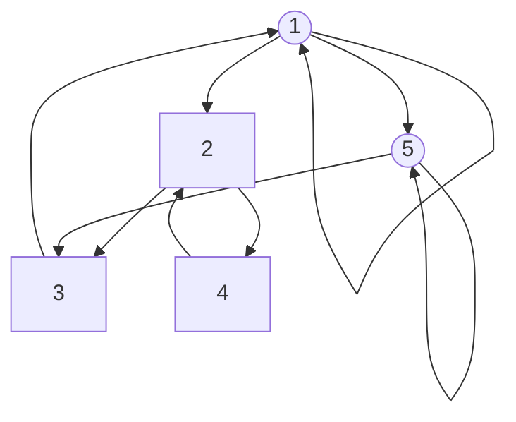
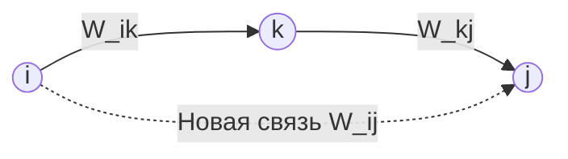

# Лекция 4: Бинарные отношения

### Оглавление
1. [Понятие бинарного отношения и способы представления](#1-понятие-бинарного-отношения-и-способы-представления)
2. [Особые отношения на множестве](#2-особые-отношения-на-множестве)
3. [Свойства бинарных отношений](#3-свойства-бинарных-отношений)
4. [Операции над отношениями: обратное отношение и композиция](#4-операции-над-отношениями-обратное-отношение-и-композиция)
5. [Степени отношений и пути в графах](#5-степени-отношений-и-пути-в-графах)
6. [Замыкания отношений](#6-замыкания-отношений)
7. [Алгоритм Уоршелла для вычисления транзитивного замыкания](#7-алгоритм-уоршелла-для-вычисления-транзитивного-замыкания)
8. [Применения в программировании и базах данных](#8-применения-в-программировании-и-базах-данных)
9. [Ответы на вопросы для самопроверки](#9-ответы-на-вопросы-для-самопроверки)

---

## 1. Понятие бинарного отношения и способы представления

Множества описывают элементы сами по себе («что есть»), в то время как отношения задают связи между объектами («как связано»). 

> **Определение 1 (Бинарное отношение)**: Подмножество $R \subseteq A \times B$ называется **бинарным отношением** между множествами $A$ и $B$. Если $B = A$, отношение $R \subseteq A \times A$ называется **отношением на множестве $A$**.
> 
> Утверждение о том, что пара $(a, b)$ принадлежит отношению $R$, записывается инфиксно: $a R b \iff (a, b) \in R$.

**Пример:**
Отношение делимости на множестве натуральных чисел $\mathbb{N}$:
$$ R = \{(a, b) \in \mathbb{N} \times \mathbb{N} \mid a \text{ делит } b\} $$
В этом случае пара $(2, 6) \in R$ (так как $2 \mid 6$, то есть $2 R 6$), но пара $(3, 8) \notin R$.

---

### Эквивалентные способы задания отношений

Бинарное отношение $R$ на конечном множестве $A = \{a_1, a_2, \dots, a_n\}$ полностью определяется любым из трёх эквивалентных способов:

1. **Множество упорядоченных пар**:
   $$ R = \{(a_{i_1}, a_{j_1}), (a_{i_2}, a_{j_2}), \dots\} \subseteq A \times A $$
2. **Матрица смежности (булева матрица)** $M$ размера $n \times n$:
   $$ M_{ij} = \begin{cases} 1, & \text{если } (a_i, a_j) \in R, \\ 0, & \text{если } (a_i, a_j) \notin R. \end{cases} $$
   * Строка $i$ перечисляет элементы, к которым ведут связи из $a_i$.
   * Столбец $j$ перечисляет элементы, от которых ведут связи к $a_j$.
3. **Ориентированный граф (орграф)** $G = (V, E)$:
   * Множество вершин $V = A$.
   * Множество ориентированных рёбер (дуг) $E = R$, где дуга $a_i \to a_j$ проводится тогда и только тогда, когда $(a_i, a_j) \in R$.

**Пример:**
На множестве $A = \{1, 2, 3, 4, 5\}$ задано отношение:
$$ R = \{(1, 1), (1, 2), (1, 5), (2, 3), (2, 4), (3, 1), (4, 2), (5, 3), (5, 5)\} $$

Соответствующая матрица смежности $M$:
$$ M = \begin{pmatrix} 
1 & 1 & 0 & 0 & 1 \\ 
0 & 0 & 1 & 1 & 0 \\ 
1 & 0 & 0 & 0 & 0 \\ 
0 & 1 & 0 & 0 & 0 \\ 
0 & 0 & 1 & 0 & 1 
\end{pmatrix} $$

Представление в виде ориентированного графа:



---

## 2. Особые отношения на множестве

На любом множестве $A$ три отношения существуют всегда:

> **Определение 2 (Особые отношения)**:
> 1. **Пустое отношение** $\emptyset \subseteq A \times A$: ни один элемент не связан ни с каким другим.
> 2. **Тождественное отношение (отношение равенства)** $\text{id}_A$:
>    $$ \text{id}_A = \{(a, a) \mid a \in A\} $$
> 3. **Полное (универсальное) отношение** $A \times A$: каждый элемент связан со всеми элементами множества.

> 💡 **Интуиция / Идея:** Тождественное отношение $\text{id}_A$ задаёт обычное равенство на $A$: $a \, \text{id}_A \, b \iff a = b$. Его матрица смежности — единичная матрица $I$, а в графе присутствуют только петли у каждой вершины.

**Пример:**
На множестве $A = \{1, 2\}$:
* Пустое отношение: $\emptyset$.
* Тождественное отношение: $\text{id}_A = \{(1, 1), (2, 2)\}$.
* Полное отношение: $A \times A = \{(1, 1), (1, 2), (2, 1), (2, 2)\}$.

---

## 3. Свойства бинарных отношений

Свойства классифицируют структуры связей. Каждое свойство имеет чёткое отражение во всех трёх представлениях отношения.

### 3.1. Рефлексивность и иррефлексивность

> **Определение 3 (Рефлексивность)**: Отношение $R \subseteq A \times A$ называется **рефлексивным**, если каждый элемент множества $A$ находится в отношении с самим собой:
> $$ \forall a \in A \quad (a R a) $$

* **Матрица смежности**: главная диагональ состоит исключительно из единиц ($\forall i : M_{ii} = 1$).
* **Орграф**: у каждой вершины есть петля.

> **Определение 4 (Иррефлексивность)**: Отношение $R \subseteq A \times A$ называется **иррефлексивным**, если ни один элемент не находится в отношении с самим собой:
> $$ \forall a \in A \quad \neg(a R a) $$

* **Матрица смежности**: главная диагональ состоит исключительно из нулей ($\forall i : M_{ii} = 0$).
* **Орграф**: у вершин полностью отсутствуют петли.

> ⚠️ **Замечание:** Иррефлексивность — это **не** просто логическое отрицание рефлексивности:
> * Отношение **не рефлексивно**: $\exists a \in A \; \neg(a R a)$ (допускает петли у части элементов).
> * Отношение **иррефлексивно**: $\forall a \in A \; \neg(a R a)$ (запрещает любые петли).

**Пример:**
* Отношение делимости на $\mathbb{N}$ рефлексивно: $\forall a \in \mathbb{N} \; (a \mid a)$.
* Отношение строгого порядка «$<$» на $\mathbb{R}$ иррефлексивно: $\forall a \in \mathbb{R} \; \neg(a < a)$.

---

### 3.2. Симметричность, антисимметричность и асимметричность

> **Определение 5 (Симметричность)**: Отношение $R \subseteq A \times A$ называется **симметричным**, если для любых элементов $a, b \in A$ из наличия связи $a R b$ следует обратная связь $b R a$:
> $$ \forall a, b \in A \quad (a R b \implies b R a) $$

* **Матрица смежности**: матрица симметрична относительно главной диагонали ($M = M^T$, то есть $M_{ij} = M_{ji}$).
* **Орграф**: каждое ребро между различными вершинами является двунаправленным (парой встречных дуг).

> **Определение 6 (Антисимметричность)**: Отношение $R \subseteq A \times A$ называется **антисимметричным**, если взаимная связь между двумя элементами возможна только в случае их совпадения:
> $$ \forall a, b \in A \quad (a R b \land b R a \implies a = b) $$
> 
> *Контрапозиция условия:* $\forall a, b \in A \, (a \neq b \implies \neg(a R b \land b R a))$.

* **Матрица смежности**: вне главной диагонали отсутствуют симметричные единицы ($M_{ij} = 1 \land i \neq j \implies M_{ji} = 0$).
* **Орграф**: между любыми двумя различными вершинами существует не более одной дуги. Наличие петель допускается.

> **Определение 7 (Асимметричность)**: Отношение $R \subseteq A \times A$ называется **асимметричным**, если для любых элементов $a, b \in A$ из $a R b$ следует $\neg(b R a)$:
> $$ \forall a, b \in A \quad (a R b \implies \neg(b R a)) $$

* **Матрица смежности**: нули на главной диагонали и отсутствие симметричных единиц вне диагонали.
* **Орграф**: полностью отсутствуют петли и встречные дуги.

> 💡 **Интуиция / Идея:** Асимметричность представляет собой конъюнкцию антисимметричности и иррефлексивности:
> $$ \text{Асимметричность} \iff \text{Антисимметричность} \land \text{Иррефлексивность} $$
> Антисимметричность допускает наличие петель (например, $R = \{(1, 1), (1, 2)\}$ антисимметрично, но не асимметрично), в то время как асимметричность запрещает петли полностью.

---

### 3.3. Транзитивность

> **Определение 8 (Транзитивность)**: Отношение $R \subseteq A \times A$ называется **транзитивным**, если для любых $a, b, c \in A$ из наличия связей $a R b$ и $b R c$ следует наличие связи $a R c$:
> $$ \forall a, b, c \in A \quad (a R b \land b R c \implies a R c) $$

* **Интерпретация**: правило «два шага обязывают к прямому шагу». В орграфе для любого пути длины 2 между вершинами $a$ и $c$ обязана существовать обходная прямая дуга $a \to c$.

**Пример:**
* Отношение «быть предком» транзитивно: если $a$ — предок $b$, а $b$ — предок $c$, то $a$ — предок $c$.
* Отношение «сосед по комнате» на множестве $\{1, 2, 3\}$ не транзитивно: $1 R 2$ и $2 R 3$, но $1$ и $3$ могут не являться соседями.

---

### Сводная таблица проявления свойств в различных представлениях

| Свойство | Матрица смежности $M$ | Ориентированный граф $G$ |
| :--- | :--- | :--- |
| **Рефлексивность** | Единицы на главной диагонали ($M_{ii} = 1$) | Петля у каждой вершины |
| **Иррефлексивность** | Нули на главной диагонали ($M_{ii} = 0$) | Отсутствие петель у всех вершин |
| **Симметричность** | Симметрична относительно диагонали ($M = M^T$) | Каждое ребро между $a \neq b$ двунаправлено |
| **Антисимметричность** | Вне диагонали нет пар $M_{ij} = M_{ji} = 1$ | Нет встречных дуг между $a \neq b$ (петли разрешены) |
| **Асимметричность** | Нули на диагонали и нет пар $M_{ij} = M_{ji} = 1$ | Нет петель и нет встречных дуг |
| **Транзитивность** | $M^2 \le M$ (в булевой матричной алгебре) | Любой путь длины 2 замыкается прямой дугой |

---

## 4. Операции над отношениями: обратное отношение и композиция

### 4.1. Обратное отношение

> **Определение 9 (Обратное отношение)**: Для бинарного отношения $R \subseteq A \times B$ **обратным отношением** называется отношение $R^{-1} \subseteq B \times A$, определяемое как:
> $$ R^{-1} = \{(b, a) \in B \times A \mid (a, b) \in R\} $$

* **Матрица смежности**: матрица обратного отношения является транспонированной матрицей исходного отношения:
  $$ M_{R^{-1}} = (M_R)^T $$
* **Орграф**: граф обратного отношения получается инверсией (разворотом) направления всех дуг исходного графа.

**Пример:**
Если $R$ — отношение «родитель» на множестве людей, то $R^{-1}$ — отношение «ребёнок».
Для $R = \{(1, 2), (3, 2)\}$ имеем $R^{-1} = \{(2, 1), (2, 3)\}$.

---

### 4.2. Композиция отношений

> **Определение 10 (Композиция отношений)**: Пусть $R \subseteq A \times B$ и $S \subseteq B \times C$. **Композицией отношений** $R$ и $S$ называется отношение $S \circ R \subseteq A \times C$, определяемое как:
> $$ S \circ R = \{(a, c) \in A \times C \mid \exists b \in B : (a, b) \in R \land (b, c) \in S\} $$

> ⚠️ **Замечание:** Порядок записи $S \circ R$ читается **справа налево**: сначала применяется отношение $R$, затем отношение $S$. Порядок принят по аналогии с композицией функций $(g \circ f)(x) = g(f(x))$.

**Пример:**
Если $R$ — отношение «быть родителем», то $R \circ R$ — отношение «быть дедушкой или бабушкой».
Для множества пар $R = \{(1, 2), (2, 3), (3, 4)\}$ имеем:
$$ R \circ R = \{(1, 3), (2, 4)\} $$

* **Вычисление через матрицы смежности**:
  Булева матрица композиции $M_{S \circ R}$ вычисляется как булево произведение матриц $M_R$ и $M_S$:
  $$ (M_{S \circ R})_{ij} = \bigvee_{k} \left( (M_R)_{ik} \land (M_S)_{kj} \right) $$

---

## 5. Степени отношений и пути в графах

> **Определение 11 (Степени отношения)**: Для отношения $R \subseteq A \times A$ его **степени** $R^k$ определяются рекуррентно:
> $$ R^1 = R, \quad R^{k+1} = R^k \circ R $$

> **Теорема 1 (Степени отношения и длины путей)**: Пара $(a, c) \in R^k$ тогда и только тогда, когда в ориентированном графе отношения $R$ существует ориентированный путь от вершины $a$ к вершине $c$, состоящий ровно из $k$ рёбер:
> $$ (a, c) \in R^k \iff \exists x_0, x_1, \dots, x_k \in A \quad (a = x_0 \land x_k = c \land \forall i \in \{0, \dots, k-1\} : x_i R x_{i+1}) $$

**Доказательство:**
Проведём индукцию по показателю степени $k$:
* **База ($k=1$):** $(a, c) \in R^1 = R$ по определению означает существование пути длины 1 (одной дуги $a \to c$).
* **Шаг индукции:** Пусть утверждение верно для $k$. По определению композиции, $(a, c) \in R^{k+1} = R^k \circ R \iff \exists b \in A : (a, b) \in R \land (b, c) \in R^k$.
По предположению индукции, $(b, c) \in R^k$ означает наличие пути длины $k$ от $b$ к $c$: $b = x_1 \to x_2 \to \dots \to x_{k+1} = c$. Добавляя в начало этого пути ребро $(a, b) \in R$ (то есть $a = x_0 \to x_1$), получаем путь длины $k+1$ от $a$ к $c$. $\blacksquare$

---

## 6. Замыкания отношений

Если отношение $R$ не обладает некоторым свойством $P$ (рефлексивностью, симметричностью, транзитивностью), его можно дополнить минимальным количеством пар до получения требуемого свойства.

> **Определение 12 (Рефлексивное замыкание)**: **Рефлексивным замыканием** отношения $R \subseteq A \times A$ называется минимальное рефлексивное отношение $R^=$, содержащее $R$:
> $$ R^= = R \cup \text{id}_A = R \cup \{(a, a) \mid a \in A\} $$

> **Определение 13 (Симметричное замыкание)**: **Симметричным замыканием** отношения $R \subseteq A \times A$ называется минимальное симметричное отношение $R^\leftrightarrow$, содержащее $R$:
> $$ R^\leftrightarrow = R \cup R^{-1} $$

> **Определение 14 (Транзитивное замыкание)**: **Транзитивным замыканием** отношения $R \subseteq A \times A$ называется минимальное транзитивное отношение $R^+$, содержащее $R$:
> $$ R^+ = \bigcup_{k=1}^{\infty} R^k $$
> 
> **Рефлексивно-транзитивным замыканием** называется отношение $R^*$:
> $$ R^* = R^+ \cup \text{id}_A = \bigcup_{k=0}^{\infty} R^k \quad (\text{где } R^0 = \text{id}_A) $$

> 💡 **Интуиция / Идея:** Транзитивное замыкание $R^+$ выражает отношение **достижимости** в графе: пара $(a, b) \in R^+$ тогда и только тогда, когда от вершины $a$ можно дойти до вершины $b$ по дугам графа за один или более шагов.

---

### Недостаточность одного прохода при построении $R^+$

Для построения транзитивного замыкания нельзя просто добавить пары $(a, c)$ для текущих путей длины 2. Новые добавленные рёбра могут образовать новые пути длины 2, требующие повторных проходов.

**Пример:**
Пусть $R = \{(1, 2), (2, 3), (3, 4)\}$.
* **Проход 1**: добавление пар для путей $1 \to 2 \to 3$ и $2 \to 3 \to 4$ даёт пары $(1, 3)$ и $(2, 4)$.
* **Проход 2**: созданная пара $(1, 3)$ вместе с исходной парой $(3, 4)$ образует новый путь $1 \to 3 \to 4$, требующий добавления пары $(1, 4)$.

Для конечного множества мощности $|A| = n$ длина любого простого пути не превосходит $n-1$, поэтому объединение достаточно ограничить $n$ степенями:
$$ R^+ = \bigcup_{k=1}^{n} R^k $$

---

## 7. Алгоритм Уоршелла для вычисления транзитивного замыкания

Прямое вычисление степеней матриц $M_R, M_R^2, \dots, M_R^n$ требует $O(n^4)$ операций. **Алгоритм Уоршелла (Warshall's algorithm)** вычисляет матрицу транзитивного замыкания за время $O(n^3)$ методом динамического программирования.

### Идея алгоритма

Пусть вершины множества $A$ пронумерованы числами от $1$ до $n$. Обозначим за $W^{(k)}_{ij}$ булево значение ($1$ или $0$), отвечающее на вопрос: «Существует ли путь от вершины $i$ к вершине $j$, все **промежуточные** вершины которого принадлежат множеству $\{1, 2, \dots, k\}$?».

**Рекуррентное соотношение:**
1. **База ($k=0$):** $W^{(0)} = M_R$ (матрица смежности исходных рёбер без промежуточных вершин).
2. **Шаг ($k$ от $1$ до $n$):** Путь от $i$ к $j$ с промежуточными вершинами из $\{1, \dots, k\}$ существует в одном из двух случаев:
   * Путь уже существовал без использования вершины $k$ (то есть $W^{(k-1)}_{ij} = 1$).
   * Путь проходит через вершину $k$, то есть существуют путь от $i$ к $k$ и путь от $k$ к $j$, промежуточные вершины которых принадлежат $\{1, \dots, k-1\}$:
   $$ W^{(k)}_{ij} = W^{(k-1)}_{ij} \lor \left( W^{(k-1)}_{ik} \land W^{(k-1)}_{kj} \right) $$



---

### Реализация алгоритма Уоршелла (C++)

```cpp
#include <vector>

// Принимает матрицу смежности M размера n x n, 
// модифицирует её in-place, вычисляя транзитивное замыкание R+
void warshall(std::vector<std::vector<bool>>& M) {
    int n = M.size();
    for (int k = 0; k < n; ++k) {
        for (int i = 0; i < n; ++i) {
            for (int j = 0; j < n; ++j) {
                M[i][j] = M[i][j] || (M[i][k] && M[k][j]);
            }
        }
    }
}
```

> **Теорема 2 (Сложность алгоритма Уоршелла)**: Алгоритм Уоршелла вычисляет транзитивное замыкание бинарного отношения на множестве мощности $n$ за время $\Theta(n^3)$ и требует $O(1)$ дополнительной памяти (при модификации матрицы `in-place`).

---

## 8. Применения в программировании и базах данных

1. **Графы и достижимость**:
   Транзитивное замыкание $R^+$ задаёт матрицу достижимости ориентированного графа. Алгоритм Уоршелла является алгоритмической основой для алгоритма Флойда–Уоршелла поиска кратчайших путей во взвешенных графах.
2. **Системы рекомендаций и соцсети**:
   Если $a R b$ обозначает подписку пользователя $a$ на $b$, то элементы множества $R^2 \setminus R$ определяют друзей второго порядка — кандидатов для алгоритмов рекомендаций.
3. **Рекурсивные запросы в SQL (CTE)**:
   Вычисление транзитивного замыкания иерархических связей в базах данных (например, «найти всех предков сотрудника или категории») реализуется с помощью рекурсивного табличного выражения `WITH RECURSIVE`:

```sql
WITH RECURSIVE Ancestors AS (
    -- База рекурсии: непосредственные родители (R^1)
    SELECT parent_id, child_id FROM Relations
    UNION
    -- Шаг рекурсии: композиция с отношением R
    SELECT R.parent_id, A.child_id
    FROM Relations R
    JOIN Ancestors A ON R.child_id = A.parent_id
)
SELECT * FROM Ancestors;
```

---

## 9. Ответы на вопросы для самопроверки

#### Задача 1
Для $R = \{(1, 2), (2, 3), (3, 1)\}$ на множестве $A = \{1, 2, 3\}$ проверьте рефлексивность, симметричность и транзитивность.

**Решение:**
1. **Рефлексивность:** Не выполняется. Элементы $(1, 1), (2, 2), (3, 3) \notin R$ (отношение является иррефлексивным).
2. **Симметричность:** Не выполняется. Пара $(1, 2) \in R$, однако обратная пара $(2, 1) \notin R$.
3. **Транзитивность:** Не выполняется. Присутствуют пары $(1, 2) \in R$ и $(2, 3) \in R$, однако замыкающая пара $(1, 3) \notin R$. $\blacksquare$

---

#### Задача 2
Постройте отношение на $\{1, 2, 3\}$, рефлексивное и симметричное, но не транзитивное. Выпишите его матрицу.

**Решение:**
Рассмотрим отношение $R = \{(1, 1), (2, 2), (3, 3), (1, 2), (2, 1), (2, 3), (3, 2)\}$.
* **Рефлексивность:** присутствуют все петли $(1, 1), (2, 2), (3, 3)$.
* **Симметричность:** для каждой пары $(a, b)$ есть обратная пара $(b, a)$.
* **Отсутствие транзитивности:** пары $(1, 2) \in R$ и $(2, 3) \in R$ требуют наличия пары $(1, 3)$, которая отсутствует в $R$.

Соответствующая матрица смежности $M$:
$$ M = \begin{pmatrix} 
1 & 1 & 0 \\ 
1 & 1 & 1 \\ 
0 & 1 & 1 
\end{pmatrix} \quad \blacksquare $$

---

#### Задача 3
Чем антисимметричность отличается от асимметричности? Приведите пример отношения, антисимметричного, но не асимметричного.

**Решение:**
Различие заключается в допустимости диагональных элементов (петель $a R a$):
* **Антисимметричность** допускает петли ($a R a$ не нарушает условие $a R b \land b R a \implies a = b$, так как $a = a$).
* **Асимметричность** строго запрещает любые петли ($\forall a \; a R a \implies \neg(a R a)$, что приводит к противоречию), являясь конъюнкцией антисимметричности и иррефлексивности.

**Пример:**
Отношение $R = \{(1, 1), (1, 2)\}$ на множестве $\{1, 2\}$.
Оно антисимметрично (нет различных $a \neq b$ со встречными рёбрами), но не асимметрично из-за наличия петли $(1, 1) \in R$. $\blacksquare$

---

#### Задача 4
Постройте транзитивное замыкание для $R = \{(a, b), (b, c), (c, d), (d, b)\}$.

**Решение:**
Орграф отношения состоит из вершины $a$, ведущей в цикл $b \to c \to d \to b$.
1. Из вершины $a$ достижимы вершины $b, c, d$.
2. Из каждой вершины цикла $\{b, c, d\}$ достижима любая вершина этого же цикла $\{b, c, d\}$ (включая саму себя через полный оборот по циклу).

Транзитивное замыкание $R^+$ имеет следующий вид:
$$ R^+ = \{(a, b), (a, c), (a, d), (b, b), (b, c), (b, d), (c, b), (c, c), (c, d), (d, b), (d, c), (d, d)\} \quad \blacksquare $$

---

#### Задача 5
Почему одного прохода добавления пар для транзитивного замыкания недостаточно?

**Решение:**
Один проход анализирует только пути длины 2 исходного графа $R$ и добавляет хорды для них. Однако вновь добавленная дуга $(a, c)$ вместе с существующей дугой $(c, d)$ образует новый путь длины 2 ($a \to c \to d$), создавая потребность в добавлении дуги $(a, d)$, что невозможно учесть без следующего шага. Число требуемых итераций возрастает с увеличением длины самого длинного простого пути в графе. $\blacksquare$

---

#### Задача 6
Как по матрице смежности увидеть, что отношение симметрично?

**Решение:**
Матрица смежности $M$ симметричного отношения является симметричной матрицей относительно своей главной диагонали, то есть совпадает со своей транспонированной матрицей:
$$ M = M^T \iff \forall i, j \in \{1, \dots, n\} \quad (M_{ij} = M_{ji}) \quad \blacksquare $$