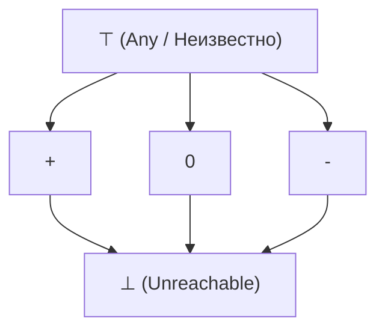

# Лекция 6: Частичный порядок

### Ключевые вопросы лекции
- Понятие отношения частичного порядка и ЧУМ.
- Классификация отношений: предпорядок, порядок, эквивалентность.
- Экстремальные элементы ЧУМ: минимальные/максимальные vs наименьшие/наибольшие.
- Верхние и нижние грани: супремум ($\sup$) и инфимум ($\inf$).
- Решётки и дистрибутивные решётки.
- Топологическая сортировка и моделирование зависимостей.

---

## 1. Отношение порядка и ЧУМ

В отличие от отношения эквивалентности, которое группирует элементы в классы, отношение порядка задает зависимости и иерархию между элементами. В общем случае два произвольных элемента могут оказаться несравнимыми.

> **Определение 1 (Частичный порядок)**: Бинарное отношение $\preceq$ на множестве $A$ называется *частичным порядком* (или *нестрогим частичным порядком*), если оно удовлетворяет следующим аксиомам:
> 1. **Рефлексивность**: $\forall a \in A \quad a \preceq a$.
> 2. **Антисимметричность**: $\forall a, b \in A \quad (a \preceq b \land b \preceq a) \implies a = b$.
> 3. **Транзитивность**: $\forall a, b, c \in A \quad (a \preceq b \land b \preceq c) \implies a \preceq c$.
>
> Пара $(A, \preceq)$ называется *частично упорядоченным множеством* (ЧУМ, англ. *poset* — *partially ordered set*).

> 💡 **Интуиция / Связь с программированием:**  
> В стандартных библиотеках современных языков программирования (например, в Rust) частичный порядок выражается трейтом `PartialOrd`, где метод `partial_cmp` возвращает тип `Option<Ordering>`. Значение `None` соответствует математической несравнимости элементов.  
> Трейт `Ord` требует выполнения дополнительного свойства *тотальности* (линейности): $\forall a, b \in A \; (a \preceq b \lor b \preceq a)$, гарантируя сравнимость любой пары элементов.

---

## 2. Сравнение классов отношений

Комбинации фундаментальных свойств бинарных отношений порождают различные алгебраические структуры:

- **Рефлексивность + Транзитивность + Симметричность** $\implies$ **Отношение эквивалентности**.
- **Рефлексивность + Транзитивность + Антисимметричность** $\implies$ **Частичный порядок**.
- **Рефлексивность + Транзитивность** (без антисимметричности) $\implies$ **Предпорядок** (квазипорядок).

### Примеры отношений:

1. **Линейный порядок**: Отношение $\le$ на $\mathbb{N}$ рефлексивно, антисимметрично и транзитивно. Поскольку любые два числа сравнимы ($\forall a, b \in \mathbb{N} \colon a \le b \lor b \le a$), данный порядок является линейным (тотальным).
2. **Частичный порядок**: Отношение делимости $a \mid b$ на $\mathbb{N}$. Элементы $2$ и $3$ несравнимы ($2 \nmid 3$ и $3 \nmid 2$), следовательно, порядок частичный.
3. **Отношение включения**: Отношение подмножества $\subseteq$ на булеане $\mathcal{P}(A)$ образует частичный порядок (например, $\{1\} \not\subseteq \{2\}$ и $\{2\} \not\subseteq \{1\}$).
4. **Отношение эквивалентности**: Отношение сравнения по модулю на $\mathbb{Z}$ ($a \equiv b \pmod 3 \iff 3 \mid (a - b)$) — рефлексивно, симметрично и транзитивно.
5. **Предпорядок**: Отношение взаимной совместимости версий пакетов в пакетных менеджерах — рефлексивно и транзитивно, но не антисимметрично (две не равные друг другу версии пакета могут быть взаимно совместимы).

---

## 3. Экстремальные элементы ЧУМ

Экстремальные элементы разделяются на **локальные** (минимальные / максимальные) и **глобальные** (наименьшие / наибольшие).

> **Определение 2 (Минимальный и максимальный элементы)**:  
> Пусть $(A, \preceq)$ — ЧУМ.
> - Элемент $m \in A$ называется **минимальным**, если строго меньших элементов в $A$ не существует:
>   $$\nexists a \in A \colon a \prec m$$
> - Элемент $m \in A$ называется **максимальным**, если строго больших элементов в $A$ не существует:
>   $$\nexists a \in A \colon m \prec a$$

> ⚠️ **Замечание:**  
> Свойства минимальности и максимальности локальны. Минимальный элемент не обязан быть меньше всех остальных элементов множества — он может быть просто несравним с ними.

> **Определение 3 (Наименьший и наибольший элементы)**:  
> Пусть $(A, \preceq)$ — ЧУМ.
> - Элемент $m \in A$ называется **наименьшим** ($\bot$, bottom), если он нестрого меньше любого элемента множества:
>   $$\forall a \in A \colon m \preceq a$$
> - Элемент $m \in A$ называется **наибольшим** ($\top$, top), если он нестрого больше любого элемента множества:
>   $$\forall a \in A \colon a \preceq m$$

> 💡 **Интуиция:**  
> Свойства наибольшего и наименьшего элементов глобальны: такой элемент обязан быть сравним абсолютно со всеми элементами множества $A$.

### Сводная таблица характеристик экстремальных элементов

| Понятие | Единственность | Существование в конечном ЧУМ | Сравнимость со всеми элементами |
| :--- | :---: | :---: | :---: |
| **Минимальный** | Нет (может быть несколько) | Да (хотя бы один) | Нет |
| **Максимальный** | Нет (может быть несколько) | Да (хотя бы один) | Нет |
| **Наименьший** | Да (если существует) | Не гарантирован | Да |
| **Наибольший** | Да (если существует) | Не гарантирован | Да |

**Пример:**  
Рассмотрим множество $A = \{2, 3, 4, 6, 12\}$ с отношением делимости $\mid$:
- **Минимальные элементы**: $2$ и $3$ (нет элементов, делящих $2$ или $3$).
- **Максимальный элемент**: $12$.
- **Наименьший элемент**: отсутствует (так как $2 \nmid 3$ и $3 \nmid 2$).
- **Наибольший элемент**: $12$ (делится на все элементы множества $A$).

---

## 4. Грани подмножеств: Супремум и Инфимум

В отличие от экстремальных элементов, характеризующих всё ЧУМ, понятие граней формулируется для произвольного подмножества $S \subseteq A$.

> **Определение 4 (Верхняя и нижняя грани)**:  
> Пусть $(A, \preceq)$ — ЧУМ и $S \subseteq A$.
> - Элемент $u \in A$ называется **верхней гранью** (*upper bound*) множества $S$, если:
>   $$\forall s \in S \quad s \preceq u$$
> - Элемент $l \in A$ называется **нижней гранью** (*lower bound*) множества $S$, если:
>   $$\forall s \in S \quad l \preceq s$$

> **Определение 5 (Супремум и инфимум)**:  
> Пусть $(A, \preceq)$ — ЧУМ и $S \subseteq A$.
> - **Супремум** множества $S$ ($\sup S$, точная верхняя грань, *join*, $\bigvee S$) — наименьший элемент множества всех верхних граней $S$.
> - **Инфимум** множества $S$ ($\inf S$, точная нижняя грань, *meet*, $\bigwedge S$) — наибольший элемент множества всех нижних граней $S$.

> ⚠️ **Замечание:**
> 1. Супремум и инфимум единственны, если они существуют (в силу антисимметричности отношения $\preceq$).
> 2. Супремум не тождествен максимуму: максимум обязан принадлежать самому множеству ($\max S \in S$), тогда как супремум является наилучшей внешней/внутренней границей и может лежать вне множества $S$.
> 3. В бесконечных множествах наименьший элемент может отсутствовать при наличии инфимума: например, для множества $S = \left\{ \frac{1}{n} \;\middle|\; n \in \mathbb{N}_{\ge 1} \right\} \subset \mathbb{R}$ наименьшего элемента нет, однако $\inf S = 0$.
> 4. Для множества $S = \{q \in \mathbb{Q} \mid q^2 < 2\}$ в упорядоченном поле $(\mathbb{R}, \le)$ существует $\sup S = \sqrt{2}$, однако в поле $(\mathbb{Q}, \le)$ супремум не существует (фундаментальное свойство дедекиндовой полноты $\mathbb{R}$ в сравнении со счетным всюду плотным $\mathbb{Q}$).

---

## 5. Решётки

> **Определение 6 (Решётка / Lattice)**:  
> ЧУМ $(A, \preceq)$ называется **решёткой**, если для любой пары элементов $a, b \in A$ существуют:
> - точная верхняя грань (join): $a \vee b = \sup\{a, b\}$;
> - точная нижняя грань (meet): $a \wedge b = \inf\{a, b\}$.

### Примеры решёток:
- **Булеан с включением** $(\mathcal{P}(U), \subseteq)$:
  $$a \vee b = a \cup b, \quad a \wedge b = a \cap b$$
- **Натуральные числа с отношением делимости** $(\mathbb{N}, \mid)$:
  $$a \vee b = \mathrm{НОК}(a, b), \quad a \wedge b = \mathrm{НОД}(a, b)$$
- **Линейно упорядоченное множество** $(A, \le)$:
  $$a \vee b = \max(a, b), \quad a \wedge b = \min(a, b)$$

**Контрпример:**  
Множество $A = \{2, 3, 4, 6, 12\}$ с отношением делимости $\mid$ решёткой не является, поскольку у пары $\{2, 3\}$ нет нижней грани в $A$ ($\mathrm{НОД}(2, 3) = 1 \notin A$). Добавление элемента $1$ превращает данное множество в решётку делителей $D_{12}$.

> **Определение 7 (Дистрибутивная решётка)**:  
> Решётка $(A, \preceq)$ называется **дистрибутивной**, если операция $\wedge$ дистрибутивна относительно $\vee$ (и наоборот) для любых элементов:
> $$a \wedge (b \vee c) = (a \wedge b) \vee (a \wedge c) \quad \forall a, b, c \in A$$

> 💡 **Применение в Static Analysis (Абстрактная интерпретация):**  
> Свойства состояний программы моделируются элементами абстрактной решётки (например, решётка знаков: $\bot, -, 0, +, \top$). При слиянии непересекающихся путей выполнения (ветви оператора `if-else`) вычисляется супремум $\vee$ состояний переменных.  
> Если статический анализатор после слияния ветвей гарантирует, что переменная принадлежит подрешётке $\{+, -\}$, операция деления на эту переменную статически безопасна (гарантировано отсутствие ошибки Division By Zero).

---

## 6. Топологическая сортировка

Частичный порядок формализует отношение зависимостей (графы задач, пайплайны сборки, разрешение зависимостей пакетов). Несравнимость элементов в ЧУМ означает их взаимную независимость, что позволяет выполнять соответствующие задачи параллельно.

> **Определение 8 (Топологическая сортировка)**:  
> Линейный порядок $\le$ на множестве $A$ называется **топологической сортировкой** ЧУМ $(A, \preceq)$, если он согласован с частичным порядком:
> $$a \preceq b \implies a \le b \quad \forall a, b \in A$$

> **Теорема 1 (О существовании топологической сортировки)**:  
> Любое конечное частично упорядоченное множество имеет хотя бы одну топологическую сортировку.

**Доказательство:**  
Проведем конструктивное доказательство методом математической индукции по мощности множества $|A| = n$.

- **База индукции ($n = 1$):** Для одноэлементного множества тривиально.
- **Индукционный переход ($n \to n + 1$):**
  1. Всякое непустое конечное ЧУМ содержит хотя бы один минимальный элемент. Пусть $m \in A$ — такой минимальный элемент.
  2. Поместим $m$ на текущую первую свободную позицию результирующей линейной последовательности.
  3. Удалим $m$ из рассмотрения: $A' = A \setminus \{m\}$. Множество $A'$ с индуцированным порядком $\preceq$ является ЧУМ мощности $|A'| = n$.
  4. По индукционному предположению для $A'$ существует согласованный линейный порядок $\le'$.
  5. Так как $m$ был минимальным в $A$, не существует $x \in A'$, для которого $x \prec m$. Следовательно, добавление $m$ перед всеми элементами $A'$ не нарушает согласованности:
     $$\forall x \in A' \colon m \preceq x \implies m \le x$$
  Порядок $m < x_1 < x_2 < \dots < x_n$ является искомой топологической сортировкой множества $A$.

На ориентированных ациклических графах зависимостей (DAG) данный конструктивный процесс реализуется **алгоритмом Кана** с вычислительной сложностью $O(|V| + |E|)$. $\blacksquare$

> ⚠️ **Замечание:**  
> При наличии несравнимых элементов топологическая сортировка неоднозначна: порядок независимых элементов в линейной последовательности определяется конкретной эвристикой или реализацией алгоритма обхода.