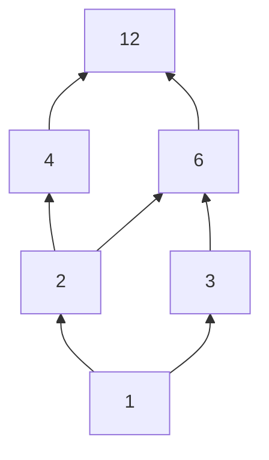
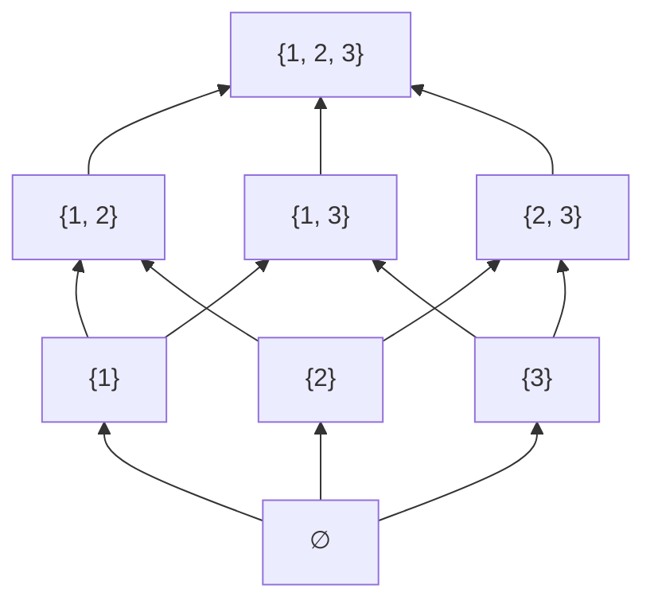
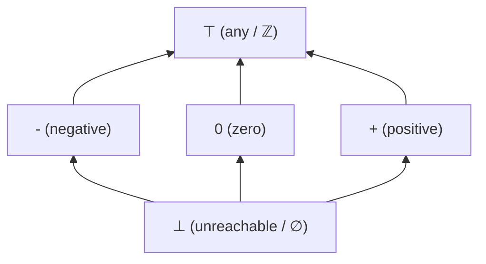

# Лекция 6: Частичный порядок, диаграммы Хассе и решётки

> *«Порядок — первый закон небес.»*  
> — Александр Поуп

### Ключевые вопросы лекции
- Понятие отношения частичного порядка и ЧУМ. Классификация бинарных отношений.
- Экстремальные элементы: локальные (минимальные / максимальные) и глобальные (наименьший / наибольший).
- Грани подмножеств: супремум ($\sup$) и инфимум ($\inf$).
- Отношение непосредственного покрытия и транзитивное сокращение.
- Диаграммы Хассе: алгоритм построения и канонические примеры ($D_{12}$, булевы алгебры $B_2$ и $B_3$).
- Алгебраические решётки и дистрибутивность.
- Применение в Computer Science: абстрактная интерпретация и статический анализ кода.
- Линеаризация частичного порядка: теорема о существовании топологической сортировки, алгоритм Кана и параллелизм.

---

## 1. Отношение порядка и ЧУМ

В отличие от отношения эквивалентности, разбивающего множество на непересекающиеся классы схожих объектов, отношение порядка формализует концепцию иерархии, приоритета и зависимости. В общем случае элементы множества не обязаны быть сравнимы между собой.

> **Определение 1 (Частичный порядок)**:  
> Бинарное отношение $\preceq$ на множестве $A$ называется **нестрогим частичным порядком**, если оно удовлетворяет следующим трём аксиомам:
> 1. **Рефлексивность**: $\forall a \in A \implies a \preceq a$.
> 2. **Антисимметричность**: $\forall a, b \in A \implies (a \preceq b \;\land\; b \preceq a) \implies a = b$.
> 3. **Транзитивность**: $\forall a, b, c \in A \implies (a \preceq b \;\land\; b \preceq c) \implies a \preceq c$.
>
> Пара $(A, \preceq)$ называется **частично упорядоченным множеством** (ЧУМ; англ. *partially ordered set*, *poset*).

> **Определение 2 (Строгий частичный порядок)**:  
> Отношение $\prec$ называется **строгим частичным порядком**, если оно антирефлексивно ($\forall a \in A \implies a \not\prec a$), асимметрично ($\forall a, b \in A \implies a \prec b \implies b \not\prec a$) и транзитивно.  
> Связь между строгим и нестрогим порядком задаётся соотношением:
> $$a \prec b \iff (a \preceq b \;\land\; a \neq b)$$

Два элемента $a, b \in A$ называются **сравнимыми**, если $a \preceq b$ или $b \preceq a$. В противном случае элементы называют **несравнимыми** (обозначается $a \parallel b$):
$$a \parallel b \iff (a \not\preceq b \;\land\; b \not\preceq a)$$

Если в ЧУМ любые два элемента сравнимы ($\forall a, b \in A \implies a \preceq b \lor b \preceq a$), порядок называется **линейным** (или **тотальным**), а само множество — цепью (*chain*).

> 💡 **Интуиция / Связь с программированием:**  
> В стандартных библиотеках языков со строгой типизацией (например, в Rust) частичный порядок выражается трейтом `PartialOrd`, где метод `partial_cmp` возвращает тип `Option<Ordering>`. Значение `None` моделирует математическую несравнимость элементов ($a \parallel b$, например, при сравнении чисел с плавающей точкой `NaN` в стандарте IEEE 754).  
> Трейт `Ord` требует дополнительного свойства тотальности: метод `cmp` возвращает `Ordering` напрямую, гарантируя сравнимость любых двух значений.

---

## 2. Классификация бинарных отношений

Комбинации фундаментальных свойств бинарных отношений определяют структуру математических пространств:

- **Рефлексивность + Транзитивность + Симметричность** $\implies$ **Отношение эквивалентности**.
- **Рефлексивность + Транзитивность + Антисимметричность** $\implies$ **Частичный порядок**.
- **Рефлексивность + Транзитивность** (без антисимметричности) $\implies$ **Предпорядок** (квазипорядок).
- **Частичный порядок + Сравнимость любых двух элементов** $\implies$ **Линейный (тотальный) порядок**.

### Примеры отношений:
1. **Линейный порядок**: Отношение $\le$ на $\mathbb{N}$ рефлексивно, антисимметрично, транзитивно и полно ($\forall a, b \in \mathbb{N} \implies a \le b \lor b \le a$).
2. **Частичный порядок**: Отношение делимости $a \mid b$ на $\mathbb{N}$. Числа $2$ и $3$ несравнимы ($2 \nmid 3$ и $3 \nmid 2$).
3. **Отношение включения**: Отношение подмножества $\subseteq$ на булеане $\mathcal{P}(X)$ образует канонический частичный порядок (например, $\{1\} \not\subseteq \{2\}$ и $\{2\} \not\subseteq \{1\}$).
4. **Отношение эквивалентности**: Отношение сравнения по модулю на $\mathbb{Z}$ ($a \equiv b \pmod m \iff m \mid (a - b)$) рефлексивно, симметрично и транзитивно.
5. **Предпорядок**: Отношение взаимной совместимости версий библиотек в пакетных менеджерах: рефлексивно и транзитивно, но не антисимметрично (две различные версии пакета могут быть взаимно совместимы).

---

## 3. Экстремальные элементы ЧУМ

В частично упорядоченных множествах экстремальные элементы разделяются на **локальные** (минимальные / максимальные) и **глобальные** (наименьший / наибольший).

> **Определение 3 (Минимальный и максимальный элементы)**:  
> Пусть $(A, \preceq)$ — ЧУМ, и $S \subseteq A$.
> - Элемент $m \in S$ называется **минимальным** в $S$, если в $S$ нет элементов, строго меньших него:
>   $$\nexists a \in S : a \prec m$$
> - Элемент $M \in S$ называется **максимальным** в $S$, если в $S$ нет элементов, строго больших него:
>   $$\nexists a \in S : M \prec a$$

> **Определение 4 (Наименьший и наибольший элементы)**:  
> Пусть $(A, \preceq)$ — ЧУМ, и $S \subseteq A$.
> - Элемент $x_0 \in S$ называется **наименьшим** ($\bot$, *bottom*, нуль порядка) в $S$, если он нестрого меньше любого элемента подмножества:
>   $$\forall a \in S : x_0 \preceq a$$
> - Элемент $y_0 \in S$ называется **наибольшим** ($\top$, *top*, единица порядка) в $S$, если он нестрого больше любого элемента подмножества:
>   $$\forall a \in S : a \preceq y_0$$

> ⚠️ **Замечание:**  
> - Свойства минимальности и максимальности локальны: минимальный элемент не обязан быть меньше всех элементов множества — ему достаточно быть несравнимым с ними.
> - Свойства наименьшего и наибольшего элементов глобальны: такой элемент обязан быть сравним абсолютно со всеми элементами $S$.

### Сравнительный анализ экстремальных элементов

| Критерий | Минимальный / Максимальный | Наименьший / Наибольший |
| :--- | :---: | :---: |
| **Единственность** | Не гарантирована (может быть несколько) | Строго единственен (если существует) |
| **Существование в конечном $S \neq \emptyset$** | Гарантировано (хотя бы один) | Не гарантировано |
| **Сравнимость со всеми элементами** | Не требуется | Обязательна ($\forall a \in S$) |

> **Утверждение 1 (Единственность глобального экстремума)**:  
> Если в ЧУМ $(A, \preceq)$ существует наименьший (наибольший) элемент, то он единственен.

**Доказательство:**  
Пусть $x_1, x_2 \in A$ — два наименьших элемента.
1. По определению наименьшего для $x_1$: так как $x_2 \in A$, то $x_1 \preceq x_2$.
2. По определению наименьшего для $x_2$: так как $x_1 \in A$, то $x_2 \preceq x_1$.
3. В силу аксиомы антисимметричности порядка: $(x_1 \preceq x_2 \;\land\; x_2 \preceq x_1) \implies x_1 = x_2$. $\blacksquare$

**Пример:**  
Рассмотрим множество $A = \{2, 3, 4, 6, 12\}$ с отношением делимости $\mid$:
- **Минимальные элементы**: $2$ и $3$ (в $A$ нет чисел, делящих $2$ или $3$).
- **Максимальный элемент**: $12$.
- **Наименьший элемент**: отсутствует (так как $2 \nmid 3$ и $3 \nmid 2$, ни $2$, ни $3$ не делят все элементы множества).
- **Наибольший элемент**: $12$ (делится на все числа из $A$).

---

## 4. Грани подмножеств: Супремум и Инфимум

Понятия верхней и нижней граней формулируются относительно некоторого подмножества $S \subseteq A$ внутри объемлющего ЧУМ $(A, \preceq)$.

> **Определение 5 (Верхняя и нижняя грани)**:  
> Пусть $(A, \preceq)$ — ЧУМ и $S \subseteq A$.
> - Элемент $u \in A$ называется **верхней гранью** (*upper bound*) множества $S$, если:
>   $$\forall s \in S \implies s \preceq u$$
> - Элемент $l \in A$ называется **нижней гранью** (*lower bound*) множества $S$, если:
>   $$\forall s \in S \implies l \preceq s$$

> **Определение 6 (Супремум и инфимум)**:  
> Пусть $(A, \preceq)$ — ЧУМ и $S \subseteq A$.
> - **Супремум** множества $S$ ($\sup S$, точная верхняя грань, *join*, $\bigvee S$) — наименьший элемент в множестве всех верхних граней $S$:
>   $$u^* = \sup S \iff (\forall s \in S \implies s \preceq u^*) \;\land\; (\forall u \in A : (\forall s \in S \implies s \preceq u) \implies u^* \preceq u)$$
> - **Инфимум** множества $S$ ($\inf S$, точная нижняя грань, *meet*, $\bigwedge S$) — наибольший элемент в множестве всех нижних граней $S$:
>   $$l^* = \inf S \iff (\forall s \in S \implies l^* \preceq s) \;\land\; (\forall l \in A : (\forall s \in S \implies l \preceq s) \implies l \preceq l^*)$$

> ⚠️ **Замечание:**
> 1. Супремум и инфимум единственны, если они существуют (в силу антисимметричности порядка).
> 2. $\sup S$ и $\inf S$ не обязаны принадлежать самому подмножеству $S$. Если $\sup S \in S$, то $\sup S = \max S$.
> 3. В анализе и топологии дедекиндова полнота упорядоченного поля $\mathbb{R}$ постулирует существование $\sup S$ для любого непустого ограниченного сверху множества. В поле $\mathbb{Q}$ это не выполняется: для $S = \{q \in \mathbb{Q} \mid q^2 < 2\}$ супремум в $\mathbb{Q}$ отсутствует, но в $\mathbb{R}$ равен $\sqrt{2}$.

---

## 5. Отношение покрытия и построение диаграмм Хассе

Представление конечного ЧУМ $(A, \preceq)$ в виде ориентированного графа отношений избыточно: граф загроможден петлями $a \preceq a$ и транзитивными хордами $(a \preceq b \land b \preceq c \implies a \preceq c)$. Минимальный информативный остов порядка описывается **отношением непосредственного покрытия**.

> **Определение 7 (Отношение покрытия)**:  
> Элемент $a \in A$ **покрывает** элемент $b \in A$ (обозначается $b \lessdot a$), если $b \prec a$ и между ними не существует промежуточных элементов:
> $$b \lessdot a \iff \big(b \prec a \;\land\; \nexists c \in A : (b \prec c \prec a)\big)$$

Отношение покрытия $\lessdot$ состоит в точности из тех пар, зависимость между которыми нельзя вывести по транзитивности.

> **Определение 8 (Диаграмма Хассе)**:  
> **Диаграмма Хассе** — графовая визуализация транзитивного сокращения (*transitive reduction*) конечного частичного порядка, полученная по следующим правилам:
> 1. **Исключение петель**: устраняются все рефлексивные дуги $(a, a)$, так как $a \preceq a$ предполагается по умолчанию.
> 2. **Исключение транзитивных хорд**: удаляются все рёбра $(b, a)$, для которых существует промежуточный путь длины $\ge 2$. В графе остаются только пары $b \lessdot a$.
> 3. **Вертикальная ориентация**: если $b \prec a$, вершина $a$ размещается геометрически выше вершины $b$ на плоскости ($\operatorname{coord}_y(a) > \operatorname{coord}_y(b)$).
> 4. **Соединение**: элементы $b$ и $a$ соединяются ненаправленным отрезком тогда и только тогда, когда $b \lessdot a$. Направление порядка считывается снизу вверх.

> 💡 **Интуиция:**  
> Исходный частичный порядок $(A, \preceq)$ взаимно однозначно восстанавливается по диаграмме Хассе путём взятия рефлексивно-транзитивного замыкания отношения рёбер графа.

---

## 6. Примеры классических диаграмм Хассе

### Множество делителей числа 12 ($D_{12}$)

Рассмотрим множество делителей числа $12$: $D_{12} = \{1, 2, 3, 4, 6, 12\}$ с отношением делимости ($a \preceq b \iff a \mid b$).
- Элемент $1$ делит все числа и занимает нижний уровень ($\bot = 1$).
- Элемент $12$ делится на все числа и занимает верхний уровень ($\top = 12$).
- Связи $1 \mid 4$ и $1 \mid 6$ транзитивны, поэтому рёбра $(1, 4)$ и $(1, 6)$ опущены.



### Булевы решётки ($\mathcal{P}(X), \subseteq$)

В булеане множества отношение непосредственного покрытия означает строгое расширение подмножества ровно на один элемент:
$$A \lessdot B \iff B = A \cup \{x\}, \quad \text{где } x \notin A$$

- Диаграмма $\mathcal{P}(\{1, 2\})$ формирует квадрат $B_2$.
- Диаграмма $\mathcal{P}(\{1, 2, 3\})$ формирует трёхмерный куб $B_3$.



---

## 7. Решётки и дистрибутивность

> **Определение 9 (Решётка / Lattice)**:  
> ЧУМ $(A, \preceq)$ называется **алгебраической решёткой**, если для любой пары элементов $a, b \in A$ существуют:
> - точная верхняя грань (*join*): $a \vee b = \sup\{a, b\}$;
> - точная нижняя грань (*meet*): $a \wedge b = \inf\{a, b\}$.

### Канонические примеры решёток:
1. **Булеан с включением** $(\mathcal{P}(U), \subseteq)$:
   $$a \vee b = a \cup b, \quad a \wedge b = a \cap b$$
2. **Натуральные числа с отношением делимости** $(\mathbb{N}, \mid)$:
   $$a \vee b = \operatorname{НОК}(a, b), \quad a \wedge b = \operatorname{НОД}(a, b)$$
3. **Линейно упорядоченное множество** $(A, \le)$:
   $$a \vee b = \max(a, b), \quad a \wedge b = \min(a, b)$$

**Контрпример:**  
Множество $A = \{2, 3, 4, 6, 12\}$ с отношением делимости $\mid$ решёткой не является: у пары $\{2, 3\}$ нет нижней грани в $A$, так как $\operatorname{НОД}(2, 3) = 1 \notin A$. Добавление элемента $1$ превращает данное ЧУМ в полноценную решётку $D_{12}$.

> **Определение 10 (Дистрибутивная решётка)**:  
> Решётка $(A, \preceq)$ называется **дистрибутивной**, если операции $\wedge$ и $\vee$ взаимно дистрибутивны:
> $$\forall a, b, c \in A \implies a \wedge (b \vee c) = (a \wedge b) \vee (a \wedge c)$$
> (Эквивалентно: $a \vee (b \wedge c) = (a \vee b) \wedge (a \vee c)$).

---

## 8. Применение: Абстрактная интерпретация в статическом анализе

В теории оптимизирующих компиляторов свойства программы на этапе трансляции моделируются элементами полных решёток (фреймворк Кузо — Патрика Кузо, *Cousot & Cousot*).

Канонический пример — **решётка знаков переменных** $\mathcal{L}_{\text{sign}} = \langle \{\bot, -, 0, +, \top\}, \sqsubseteq \rangle$:
- $\bot$ (*bottom*) — недостижимая точка программы или неопределённость (пустое множество возможных значений $\emptyset$);
- $-, 0, +$ — доказанные статические факты о знаках чисел ($x < 0$, $x = 0$, $x > 0$);
- $\top$ (*top*) — неопределённое/произвольное значение ($\mathbb{Z}$, состояние переполнения или отсутствие информации).



### Слияние потоков управления (Control-Flow Join)
В точке слияния ветвей ветвления `if-else` компилятор вычисляет абстрактное значение переменной как точную верхнюю грань (**супремум**, join, $\sqcup$):

$$s_{\text{res}} = s_{\text{then}} \sqcup s_{\text{else}}$$

$$\begin{aligned}
+ \sqcup + &= + \\
+ \sqcup - &= \top \\
0 \sqcup \bot &= 0
\end{aligned}$$

**Оптимизация:** если в результате статического анализа для знаменателя $y$ выведено значение $y \in \{+, -\}$, компилятор строго доказывает, что $y \neq 0$. На основе этого из генерируемого машинного кода элиминируются инструкции динамической проверки деления на ноль (`div-by-zero check`), повышая производительность без потери корректности.

---

## 9. Линеаризация частичного порядка и алгоритм Кана

Отношение частичного порядка моделирует ориентированные ациклические графы зависимостей (DAG), возникающие при выполнении задач: отношение $u \prec v$ задаёт требование «задача $u$ должна строго завершиться до старта $v$».

- **Параллелизм**: несравнимость $u \parallel v$ означает отсутствие информационной взаимосвязи между ветвями вычислений, что позволяет исполнять $u$ и $v$ параллельно на различных вычислительных ядрах.
- **Линеаризация**: разворачивание частичного порядка в тотальный порядок выполнения.

> **Определение 11 (Топологическая сортировка)**:  
> Линейный порядок $\le$ на множестве $A$ называется **топологической сортировкой** ЧУМ $(A, \preceq)$, если он согласован с частичным порядком:
> $$\forall a, b \in A \implies (a \prec b \implies a < b)$$

> **Теорема 2 (О существовании топологической сортировки)**:  
> Любое конечное непустое частично упорядоченное множество допускает хотя бы одну топологическую сортировку.

**Доказательство:**  
Проведём конструктивное доказательство методом математической индукции по мощности множества $|A| = n$.

- **База индукции ($n = 1$):** Для одноэлементного множества $A = \{a_1\}$ порядок тривиален: $a_1$.
- **Индукционный переход ($n \to n + 1$):**
  1. Всякое конечное непустое ЧУМ содержит хотя бы один минимальный элемент. Пусть $m \in A$ — такой элемент (в графе зависимостей у $m$ отсутствуют предшественники).
  2. Поместим $m$ на первую свободную позицию результирующей линейной последовательности.
  3. Удалим $m$ из множества: $A' = A \setminus \{m\}$. Мощность $|A'| = n$.
  4. По предположению индукции для конечного ЧУМ $A'$ существует согласованный линейный порядок $\le'$.
  5. Так как $m$ минимален в $A$, не существует $x \in A'$, для которого выполнялось бы $x \prec m$. Следовательно, добавление $m$ перед всеми элементами $A'$ не нарушает соотношений исходного порядка:
     $$\forall x \in A' \implies (m \prec x \implies m < x)$$
  Итоговая последовательность $m < x_1 < x_2 < \dots < x_n$ является корректной топологической сортировкой множества $A$. $\blacksquare$

### Алгоритм Кана (Kahn's Algorithm)

Алгоритм Кана реализует поиск топологического порядка ориентированного ациклического графа зависимостей $G = (V, E)$ путём динамического отслеживания полустепеней захода вершин ($\operatorname{in-degree}$).

#### Псевдокод алгоритма

```pseudo
Algorithm KahnTopologicalSort(V, E):
    Input:  Ориентированный граф G = (V, E)
    Output: Линеаризованный список L либо ошибка циклической зависимости

    in_degree = массив размера |V|, инициализированный нулями
    for each (u, v) in E:
        in_degree[v] += 1

    Queue Q = пустая очередь
    for each v in V:
        if in_degree[v] == 0:
            Q.push(v)

    List L = пустой список

    while not Q.empty():
        u = Q.pop()
        L.append(u)

        for each neighbor v of u:
            in_degree[v] -= 1
            if in_degree[v] == 0:
                Q.push(v)

    if L.size() != |V|:
        throw CyclicDependencyException("Граф содержит ориентированный цикл: топологический порядок не существует")

    return L
```

### Сложность и применение в индустрии

- **Временная сложность**: $\mathcal{O}(|V| + |E|)$, так как каждая вершина и каждое ориентированное ребро обрабатываются ровно один раз.
- **Пространственная сложность**: $\mathcal{O}(|V|)$ для хранения очереди и счётчиков входящих степеней.
- **Обнаружение циклов**: условие $|L| < |V|$ свидетельствует о наличии направленного цикла, препятствующего топологической линеаризации.
- **Сферы применения**:
  - Высокопроизводительные системы сборки (`Make`, `Ninja`, `Bazel`) — параллельная компиляция независимых единиц трансляции.
  - Менеджеры пакетов (`Cargo`, `npm`, `pip`) — бесконфликтное разрешение деревьев зависимостей.
  - Планировщики задач распределённых систем (`Apache Airflow`, `Temporal`) и CI/CD пайплайны.