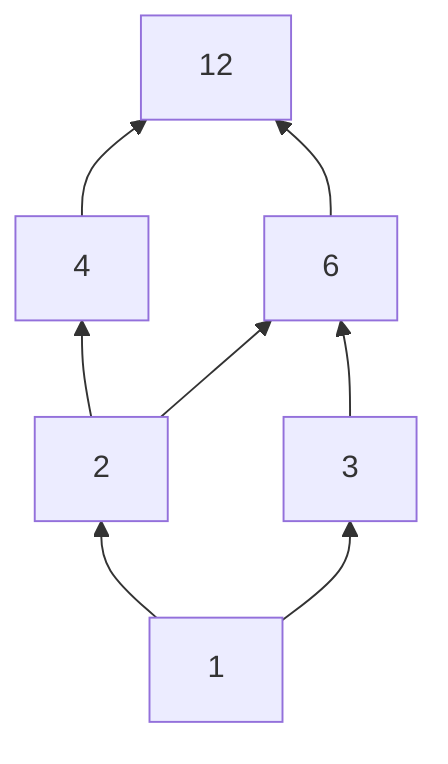
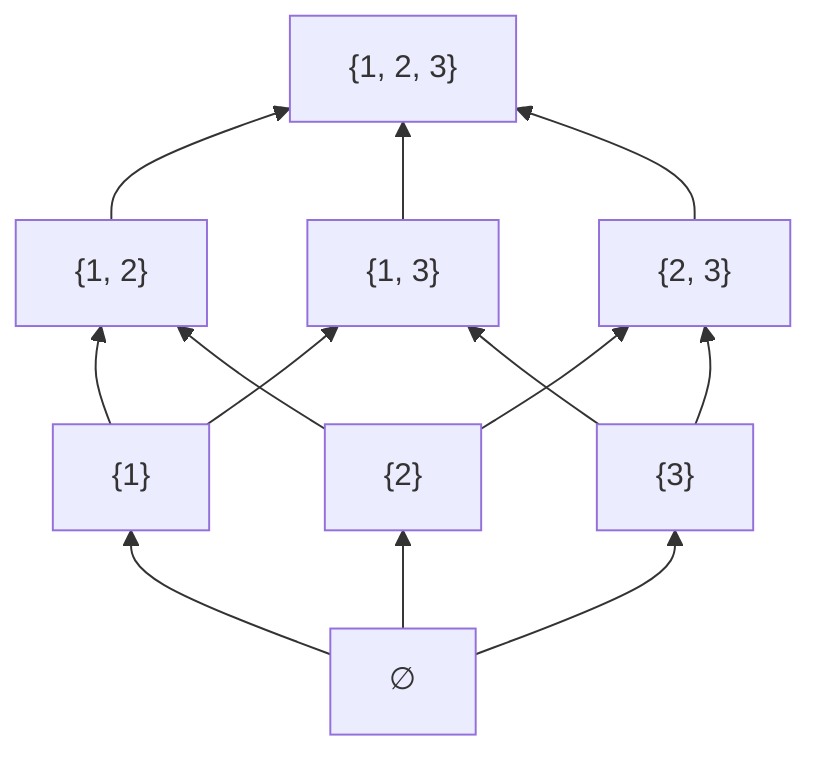

# Дискретная математика

> Сводный конспект по папке `Дискра/`. Источники: 26.09.09 «Высказывания и связки», 26.09.16 «Предикаты и доказательства» (лектор — Константин Чухарев), 26.09.23 «Множества», 26.09.30 «Бинарные отношения» (лекция 4), 26.10.07 «Частичный порядок, диаграммы Хассе и решётки» (лекция 6).
> ⚠️ Конспекта лекции 5 в папке нет (судя по нумерации, между «Бинарными отношениями» и «Частичным порядком»). Отношения эквивалентности здесь затронуты только в рамках классификации отношений; подробно они разобраны в конспекте «Линейная алгебра» → «Теория множеств».
> Пометка **[Дополнение]** — пояснение, которого нет в исходных конспектах.

## Содержание
1. [Логика высказываний](#1-логика-высказываний)
2. [Логика предикатов и кванторы](#2-логика-предикатов-и-кванторы)
3. [Методы математических доказательств](#3-методы-математических-доказательств)
4. [Математическая индукция](#4-математическая-индукция)
5. [Множества](#5-множества)
6. [Бинарные отношения](#6-бинарные-отношения)
7. [Частичный порядок, диаграммы Хассе и решётки](#7-частичный-порядок-диаграммы-хассе-и-решётки)

**Связи между темами:** логика высказываний (§1) → кванторы (§2) → доказательства (§3–4). Теория множеств (§5) — прямое приложение логики: операции над множествами = логические связки над предикатом $x \in A$. Отношения (§6) — подмножества декартова произведения (§5). Порядки (§7) — отношения с особым набором свойств (§6).

---

# 1. Логика высказываний

## Основные понятия

**Зачем нужна формальная логика.** Естественный язык многозначен. Фраза *«Каждый студент знает хотя бы один язык программирования»* может означать:
1. у каждого студента есть какой-то свой язык ($\forall x\, \exists y$);
2. существует один общий язык, который знают все ($\exists y\, \forall x$).

**Математическая логика** даёт строгий аппарат, где рассуждения однозначны, алгоритмически проверяемы и сводятся к вычислениям над формулами.

**Применение в Computer Science:**
* **верификация ПО** — доказательство отсутствия багов (дедлоков, утечек памяти);
* **системы типов** (изоморфизм Карри — Говарда): «тип $\leftrightarrow$ утверждение», «программа $\leftrightarrow$ доказательство»;
* **базы данных** — условия `WHERE`, `HAVING` являются логическими формулами;
* **схемотехника** — синтез цифровых схем на вентилях AND, OR, NOT;
* **интерактивные пруверы**: Coq, Lean, Isabelle;
* **SAT/SMT-солверы** — автоматический поиск решений задач выполнимости.

## Определения

**Высказывание (proposition)** — повествовательное утверждение, о котором можно однозначно сказать, истинно оно (**1 / True / T**) или ложно (**0 / False / F**). Высказывание — неделимый «атом» логики высказываний.

* **Являются высказываниями:** $2 + 2 = 4$ (истинно); $5 < 3$ (ложно); «Сейчас идёт дождь» (при фиксированных времени и месте — истинно или ложно).
* **Не являются:** «Который час?» (вопрос); «Закрой дверь!» (побуждение); $x > 5$ (**предикат** — истинность зависит от свободной переменной $x$, см. [§2](#2-логика-предикатов-и-кванторы)).

**Интерпретация (оценка)** $\nu: V \to \{0, 1\}$ сопоставляет переменным значения $0$ или $1$. Из атомарных высказываний с помощью **связок** строятся составные формулы.

## Логические связки

| Связка | Название | Обозначение | Семантика | Алгебраически $\nu(\dots)$ |
| :--- | :--- | :---: | :--- | :--- |
| **НЕ** | отрицание (NOT) | $\neg P$, $\overline{P}$ | инвертирует значение | $1 - \nu(P)$ |
| **И** | конъюнкция (AND) | $P \land Q$ | истинно $\iff$ **оба** истинны | $\nu(P) \cdot \nu(Q)$ |
| **ИЛИ** | дизъюнкция (OR) | $P \lor Q$ | истинно $\iff$ **хотя бы один** истинен (включающее «или») | $\max(\nu(P), \nu(Q))$ |
| **ЕСЛИ…ТО** | импликация | $P \to Q$ | ложно $\iff P = 1,\ Q = 0$ | $\max(1 - \nu(P), \nu(Q))$ |
| **ТТТ** | эквивалентность | $P \leftrightarrow Q$ | истинно $\iff$ значения совпадают | $1 - \lvert \nu(P) - \nu(Q) \rvert$ |

**Сводная таблица истинности:**

| $P$ | $Q$ | $\neg P$ | $P \land Q$ | $P \lor Q$ | $P \to Q$ | $P \leftrightarrow Q$ |
| :-: | :-: | :-: | :-: | :-: | :-: | :-: |
| 0 | 0 | 1 | 0 | 0 | **1** | 1 |
| 0 | 1 | 1 | 0 | 1 | **1** | 0 |
| 1 | 0 | 0 | 0 | 1 | **0** | 0 |
| 1 | 1 | 0 | 1 | 1 | **1** | 1 |

### Тонкости и частые ошибки

1. **Вакуумная истинность (vacuous truth).** Если посылка $P$ ложна, импликация $P \to Q$ **автоматически истинна**. *Пример:* «Если $2 + 2 = 5$, то Луна сделана из сыра» — истинное утверждение.
2. **Отрицание импликации:**
   $$\neg(P \to Q) \equiv P \land \neg Q$$
   (частая ошибка — писать $P \to \neg Q$).
3. **Эквивалентность как две импликации:**
   $$P \leftrightarrow Q \equiv (P \to Q) \land (Q \to P)$$

### Приоритет связок

1. $\neg$ (наивысший); 2. $\land$; 3. $\lor$; 4. $\to$; 5. $\leftrightarrow$ (наинизший).

Скобки имеют абсолютный приоритет: в $(P \lor Q) \land \neg P$ сначала считается $(P \lor Q)$, затем $\neg P$, затем $\land$.

## Классификация формул

Для формулы от $n$ переменных таблица истинности содержит **$2^n$ строк**.

* **Тавтология (общезначимая):** истинна на **всех** интерпретациях. *Пример:* $P \lor \neg P$ (закон исключённого третьего).
* **Противоречие (тождественно ложная):** ложна на **всех** интерпретациях. *Пример:* $P \land \neg P$.
* **Выполнимая:** истинна **хотя бы на одной** интерпретации. Такая интерпретация называется **моделью** формулы.

## Логическая эквивалентность и семантическое следствие

**Логическая эквивалентность:**
$$A \equiv B \iff A \leftrightarrow B \text{ — тавтология}$$
Эквивалентные подформулы можно заменять друг на друга.

**Семантическое следствие** $A_1, \dots, A_n \models B$: на **любой** интерпретации, где истинны все посылки, истинно и $B$.

* **Modus Ponens:** $P \to Q,\ P \models Q$.
* **Теорема о дедукции (семантическая):**
  $$A_1, \dots, A_n \models B \iff (A_1 \land \dots \land A_n) \to B \text{ — тавтология}$$

## Теоремы и свойства: законы алгебры логики

| Закон | Для $\land$ | Для $\lor$ |
| :--- | :--- | :--- |
| Идемпотентность | $P \land P \equiv P$ | $P \lor P \equiv P$ |
| Коммутативность | $P \land Q \equiv Q \land P$ | $P \lor Q \equiv Q \lor P$ |
| Ассоциативность | $(P \land Q) \land R \equiv P \land (Q \land R)$ | $(P \lor Q) \lor R \equiv P \lor (Q \lor R)$ |
| Дистрибутивность | $P \land (Q \lor R) \equiv (P \land Q) \lor (P \land R)$ | $P \lor (Q \land R) \equiv (P \lor Q) \land (P \lor R)$ |
| Поглощение | $P \land (P \lor Q) \equiv P$ | $P \lor (P \land Q) \equiv P$ |
| Тождество (нейтральный элемент) | $P \land \top \equiv P$ | $P \lor \bot \equiv P$ |
| Доминирование | $P \land \bot \equiv \bot$ | $P \lor \top \equiv \top$ |
| Дополнение | $P \land \neg P \equiv \bot$ | $P \lor \neg P \equiv \top$ |
| Двойное отрицание | $\neg \neg P \equiv P$ | |
| Законы де Моргана | $\neg(P \land Q) \equiv \neg P \lor \neg Q$ | $\neg(P \lor Q) \equiv \neg P \land \neg Q$ |

Здесь $\top \equiv$ True/1, $\bot \equiv$ False/0.

## Примеры и задачи

### Остров рыцарей и лжецов

Рыцари говорят только правду, лжецы всегда лгут. Житель $A$ говорит: *«Мы оба лжецы»*.

* $A$ — «A — рыцарь», $B$ — «B — рыцарь». Слова $A$: $\neg A \land \neg B$. Истинность слов совпадает с типом говорящего: $A \leftrightarrow (\neg A \land \neg B)$.
* Если $A = 1$, то $\neg A \land \neg B = 1 \implies A = 0$ — противоречие. Значит, **$A = 0$ (лжец)**.
* Высказывание ложно: $\neg(\neg A \land \neg B) \equiv A \lor B = 1$; при $A = 0$ получаем **$B = 1$ (рыцарь)**.

### Парадокс лжеца

$S$: «Это высказывание ложно» $\implies S \leftrightarrow \neg S$ — формула невыполнима. Самореференция такого рода иллюстрирует фундаментальные ограничения логических систем (теорема Гёделя о неполноте).

### Задача 1. Таблица истинности $(P \to Q) \land \neg Q$

| $P$ | $Q$ | $P \to Q$ | $\neg Q$ | результат |
| :-: | :-: | :-: | :-: | :-: |
| 0 | 0 | 1 | 1 | **1** |
| 0 | 1 | 1 | 0 | **0** |
| 1 | 0 | 0 | 1 | **0** |
| 1 | 1 | 1 | 0 | **0** |

Результат эквивалентен $\neg P \land \neg Q$.

### Задача 2. Является ли $(P \land Q) \to P$ тавтологией?

| $P$ | $Q$ | $P \land Q$ | $(P \land Q) \to P$ |
| :-: | :-: | :-: | :-: |
| 0 | 0 | 0 | **1** |
| 0 | 1 | 0 | **1** |
| 1 | 0 | 0 | **1** |
| 1 | 1 | 1 | **1** |

Да — **тавтология** (закон элиминации конъюнкции).

### Задача 3. Упростить $\neg(P \lor Q) \lor P$

1. Де Морган: $\neg(P \lor Q) \lor P \equiv (\neg P \land \neg Q) \lor P$.
2. Дистрибутивность: $\equiv (P \lor \neg P) \land (P \lor \neg Q)$.
3. Исключённое третье: $\equiv \top \land (P \lor \neg Q) \equiv P \lor \neg Q$.

**Ответ:** $P \lor \neg Q \equiv Q \to P$. Формула **выполнима, но не тавтология и не противоречие** (равна 0 только при $P = 0, Q = 1$).

### Задача 4. Отрицание условия `x >= 0 and x <= 100`

$\neg((x \ge 0) \land (x \le 100)) \equiv \neg(x \ge 0) \lor \neg(x \le 100) \equiv$ **`x < 0 or x > 100`**.

---

# 2. Логика предикатов и кванторы

## Определения

* **Предикат $P(x)$** — высказывательная форма (шаблон), истинность которой зависит от значения переменной (или нескольких). Предикат не является высказыванием, пока в него не подставлено значение.
* **Предметная область (domain of discourse)** — множество допустимых значений переменной.
* **Связанная переменная** — находится под действием квантора ($x$ в $\exists x.\,(P(x) \land Q(y))$).
* **Свободная переменная** — не связана квантором ($y$ в том же примере). Формула со свободными переменными остаётся предикатом.

## Кванторы

1. **Всеобщности** $\forall$: $\forall x.\,P(x)$ — «для всех $x$ истинно $P(x)$».
   > $\forall x \in \varnothing.\,P(x)$ **всегда истинно** (в пустой аудитории некому нарушить утверждение).
2. **Существования** $\exists$: $\exists x.\,P(x)$ — «существует (хотя бы один) $x$, для которого $P(x)$».
3. **Единственности** $\exists!$:
   $$\exists! x.\,P(x) \equiv \exists x.\,\Big(P(x) \land \forall y.\,(P(y) \to y = x)\Big)$$

## Теоремы и свойства

### Отрицание кванторов (законы де Моргана для кванторов)

Отрицание «проносится» через квантор, инвертируя его:
$$\neg(\forall x.\,P(x)) \equiv \exists x.\,\neg P(x) \qquad \neg(\exists x.\,P(x)) \equiv \forall x.\,\neg P(x)$$

> **«Не все» $\neq$ «все не»:** «Не все сдали» — $\exists x.\,\neg S(x)$; «Все не сдали» — $\forall x.\,\neg S(x)$.

### Порядок кванторов

Порядок разнотипных кванторов **критически важен**:
* $\forall x\, \exists y.\,P(x, y)$ — для каждого $x$ свой $y$ (выбор $y$ может зависеть от $x$);
* $\exists y\, \forall x.\,P(x, y)$ — один общий $y$ для всех $x$.

$$\exists y\, \forall x.\,P(x, y) \implies \forall x\, \exists y.\,P(x, y), \quad \text{обратное в общем случае неверно.}$$

*Пример:* $\forall x\, \exists y.\,(y > x)$ — истинно на $\mathbb{N}$ ($y = x + 1$); $\exists y\, \forall x.\,(y > x)$ — ложно на $\mathbb{N}$.

### Ограниченные кванторы

$$\forall x \in A.\,P(x) \iff \forall x.\,(x \in A \to P(x))$$
(вне $A$ посылка ложна — импликация автоматически истинна, от объекта ничего не требуется)

$$\exists x \in A.\,P(x) \iff \exists x.\,(x \in A \land P(x))$$
(объект обязан и принадлежать $A$, и обладать $P$)

**Отрицание сохраняет область:**
$$\neg(\forall x \in A.\,P(x)) \equiv \exists x \in A.\,\neg P(x), \qquad \neg(\exists x \in A.\,P(x)) \equiv \forall x \in A.\,\neg P(x)$$

## Методы: формализация естественного языка

* **Слово «только»** меняет направление импликации:
  * «Все отличники ($O$) получают стипендию ($S$)»: $\forall x.\,(O(x) \to S(x))$;
  * «**Только** отличники получают стипендию»: $\forall x.\,(S(x) \to O(x))$.
* **«Массив $a$ длины $n$ отсортирован по возрастанию»:**
  $$\forall i \in \{1, \dots, n-1\}.\,(a_i \le a_{i+1}) \quad \text{или} \quad \forall i.\,(1 \le i \le n-1 \to a_i \le a_{i+1})$$

**Аналогия с программированием:** $\forall \leftrightarrow$ `.all()` (останавливается на первом `false`), $\exists \leftrightarrow$ `.any()` (останавливается на первом `true`).

```rust
// Rust
a.iter().all(|&v| v > 0);   // ∀i. a[i] > 0
a.iter().any(|&v| v <= 0);  // ∃i. ¬(a[i] > 0)
```

## Примеры и задачи

1. **«В любом классе есть отличник».** $C$ — классы, $S(c)$ — ученики класса $c$, $E(x)$ — «$x$ — отличник»:
   $$\forall c \in C.\ \exists x \in S(c).\ E(x)$$
2. **Отрицание $\neg(\exists x \in A.\,P(x))$:** $\equiv \forall x \in A.\,\neg P(x)$ — «ни один элемент $A$ не обладает свойством $P$».
3. **Чем $\forall x \exists y.\,P$ отличается от $\exists y \forall x.\,P$** — см. «Порядок кванторов» выше.
4. **«Только отличники получают стипендию» и отрицание.** $\forall x.\,(S(x) \to E(x))$. Отрицание:
   $$\neg\Big(\forall x.\,(S(x) \to E(x))\Big) \equiv \exists x.\,\neg(S(x) \to E(x)) \equiv \exists x.\,(S(x) \land \neg E(x))$$
   — существует студент со стипендией, не являющийся отличником.

---

# 3. Методы математических доказательств

## Определения

**Доказательство** — проверяемая цепочка логических шагов, выводящая заключение из аксиом, определений и ранее доказанных теорем.

## Методы

| Метод | Суть | Пример / схема |
| :--- | :--- | :--- |
| **Прямое** | предполагаем $P$, строим цепочку к $Q$ | $n$ чётно $\implies n = 2k \implies n^2 = 4k^2 = 2(2k^2)$ — чётно |
| **Через контрапозицию** | доказываем эквивалентное $\neg Q \to \neg P$ | «$n^2$ нечётно $\to n$ нечётно» ⇐ «$n$ чётно $\to n^2$ чётно» |
| **От противного** | предполагаем $\neg P$, приходим к противоречию $R \land \neg R$ | иррациональность $\sqrt{2}$ |
| **Разбор случаев** | все возможности разбиваются на конечное число непересекающихся случаев | $\lvert x \rvert \cdot \lvert y \rvert = \lvert xy \rvert$: нули, одинаковые знаки, разные знаки |
| **Эквивалентность** | $P \leftrightarrow Q$ — доказываем $P \to Q$ и $Q \to P$ | $n$ чётно $\iff n^2$ чётно (прямое + контрапозиция) |
| **Контрпример** | чтобы опровергнуть $\forall x.\,P(x)$, достаточно одного $x_0$ с $\neg P(x_0)$ | «все простые нечётны» — опровергается числом $2$ |
| **Математическая индукция** | см. [§4](#4-математическая-индукция) | |

## Логические ошибки

1. **Утверждение следствия (affirming the consequent):** из $P \to Q$ и $Q$ выводить $P$. *«Если идёт дождь, земля мокрая». Земля мокрая $\not\Rightarrow$ был дождь (могли полить).*
2. **Отрицание антецедента (denying the antecedent):** из $P \to Q$ и $\neg P$ выводить $\neg Q$. *Дождя нет $\not\Rightarrow$ земля сухая.*

## Примеры

### Если $n^2$ делится на 3, то $n$ делится на 3

Контрапозиция: если $n$ не делится на 3, то $n^2$ не делится на 3.
* $n = 3k + 1$: $n^2 = 9k^2 + 6k + 1 = 3(3k^2 + 2k) + 1$ — остаток 1.
* $n = 3k + 2$: $n^2 = 9k^2 + 12k + 4 = 3(3k^2 + 4k + 1) + 1$ — остаток 1.

В обоих случаях $n^2 \not\equiv 0 \pmod 3$. $\blacksquare$

### Контрпример к «все нечётные числа простые»

$9 = 2 \cdot 4 + 1$ — нечётное, но $9 = 3 \cdot 3$ — составное (также $15, 21, 25, \dots$).

---

# 4. Математическая индукция

## Основные понятия

Принцип домино: если падает первая кость и каждая упавшая роняет следующую — упадут все.

## Методы

### Классическая индукция

Для доказательства $\forall n \ge n_0.\,P(n)$:
1. **База:** проверить $P(n_0)$.
2. **Переход:** доказать $\forall k \ge n_0:\ P(k) \implies P(k+1)$.

### Сильная (полная) индукция

В переходе предполагаем истинность **для всех** значений от базы до текущего:
* **База:** $P(n_0)$.
* **Шаг:** $\Big(\forall i \in [n_0, k).\,P(i)\Big) \implies P(k)$.

> **Пример применения:** основная теорема арифметики (любое $n > 1$ раскладывается в произведение простых). При $k = a \cdot b$ о сомножителях известно лишь, что они строго меньше $k$, поэтому предположения только для $k - 1$ недостаточно.

### Принцип наименьшего числа (Well-Ordering Principle)

> Всякое непустое подмножество $\mathbb{N}$ содержит наименьший элемент.

Принцип **логически эквивалентен** индукции. Типичное применение — доказательство от противного: «предположим, утверждение неверно; выберем **минимальный контрпример** $m$…».

## Индукция в Computer Science

* **Инвариант цикла** — предикат, истинный перед циклом и сохраняющийся после каждой итерации; корректность цикла доказывается индукцией по номеру итерации.
* **Рекурсия** — индуктивное построение алгоритма: базовый случай = база индукции, рекурсивный вызов = переход.

## Частая ошибка: «парадокс лошадей»

В софизме «все лошади одного цвета» переход $k \to k+1$ опирается на непустое пересечение двух подгрупп по $k$ лошадей. При $k = 1 \to 2$ размер пересечения $2 - 2 = 0$ — оно пусто, цвет перенести нельзя. Доказательство ломается именно на переходе $1 \to 2$.

## Примеры

### $1 + 3 + 5 + \dots + (2n - 1) = n^2$

* **База ($n = 1$):** $2 \cdot 1 - 1 = 1 = 1^2$.
* **Переход:** пусть $1 + 3 + \dots + (2k - 1) = k^2$. Тогда
  $$\underbrace{1 + 3 + \dots + (2k - 1)}_{= k^2} + (2(k + 1) - 1) = k^2 + 2k + 1 = (k + 1)^2. \quad \blacksquare$$

---

# 5. Множества

## Основные понятия

* **Теория множеств — приложение логики:** операции над множествами и отношения между ними — прямое выражение логических связок и предикатов.
* **Предикат принадлежности** $x \in A$ — базовое понятие теории.
* **Универсум $U$** — множество всех объектов, рассматриваемых в текущем контексте.
* **Аксиома объёмности (экстенсиональности):** множество полностью определяется своим составом:
  $$A = B \iff \forall x\,(x \in A \iff x \in B)$$
* **Порядок и повторы не важны:** $\{1, 2\} = \{2, 1\} = \{1, 2, 2\}$.

## Способы задания множеств

1. **Перечисление:** $\{1, 2, 3\}$, $\{\alpha, \beta, \gamma\}$.
2. **Порождающее свойство (set-builder notation):** $\{x \in \mathbb{N} \mid x \text{ чётно}\}$, $\{x \in \mathbb{R} \mid x^2 = 2\}$.
3. **Рекурсивный (индуктивный) способ:** **база** + **шаг**. *Пример (неотрицательные чётные $E$):* $0 \in E$; если $n \in E$, то $n + 2 \in E$. Так задаются синтаксические конструкции, формальные языки, грамматики, рекурсивные структуры данных (списки, деревья).

## Определения

### Пустое множество и мощность

* **Пустое множество** $\emptyset = \{\}$. По аксиоме объёмности оно **единственно**.
* **Мощность конечного множества** $\lvert A \rvert$ — число уникальных элементов:
  * $\lvert \{2, 2, 3\} \rvert = 2$;
  * $\lvert \emptyset \rvert = 0$, но $\lvert \{\emptyset\} \rvert = 1$;
  * $\emptyset \in \{\emptyset\}$ и $\emptyset \subseteq \{\emptyset\}$ — оба верны;
  * $\emptyset \ne \{\emptyset\}$ (левое пусто, правое содержит один элемент).

### Натуральные числа по фон Нейману

Все объекты сводятся к множествам; каждое число — множество всех предшествующих:
$$0 = \emptyset,\quad 1 = \{0\} = \{\emptyset\},\quad 2 = \{0, 1\} = \{\emptyset, \{\emptyset\}\},\quad n = \{0, 1, \dots, n - 1\}$$
$$n + 1 = n \cup \{n\}$$
Это позволяет формализовать арифметику Пеано средствами теории множеств и отношения $\in$.

### Включение

* **Подмножество:** $A \subseteq B \iff \forall x\,(x \in A \to x \in B)$.
* **$\emptyset \subseteq A$ для любого $A$** — вакуумная истинность: посылка $x \in \emptyset$ всегда ложна.
* **Собственное подмножество** $A \subset B$ ($A \subsetneq B$): $A \subseteq B$ и $A \ne B$.
* **$\in$ vs $\subseteq$:** $1 \in \{1, 2\}$ — принадлежность элемента; $\{1\} \subseteq \{1, 2\}$ — включение множеств; $1 \subseteq \{1, 2\}$ — некорректно, если $1$ не рассматривается как множество.

### Операции над множествами

| Операция | Обозначение | Предикат | Связка |
| :--- | :--- | :--- | :--- |
| Объединение | $A \cup B$ | $x \in A \lor x \in B$ | $\lor$ |
| Пересечение | $A \cap B$ | $x \in A \land x \in B$ | $\land$ |
| Разность | $A \setminus B$ | $x \in A \land x \notin B$ | $\neg(x \in A \to x \in B)$ |
| Дополнение | $\overline{A}$, $A^c$ | $x \in U \land x \notin A$ | $\neg$ |
| Симметрическая разность | $A \Delta B$ | $(x \in A) \oplus (x \in B)$ | XOR $\oplus$ |

**Изоморфизм логики высказываний и алгебры множеств:** $\lor \mapsto \cup$, $\land \mapsto \cap$, $\neg \mapsto \overline{(\cdot)}$ — все законы из [§1](#теоремы-и-свойства-законы-алгебры-логики) переносятся на множества.

### Булеан

**Булеан** (степенное множество, power set):
$$\mathcal{P}(A) = 2^A = \{S \mid S \subseteq A\}$$

* $\mathcal{P}(\{a, b\}) = \{\emptyset, \{a\}, \{b\}, \{a, b\}\}$;
* $\mathcal{P}(\emptyset) = \{\emptyset\}$ (мощность $2^0 = 1$);
* $\mathcal{P}(\{\emptyset\}) = \{\emptyset, \{\emptyset\}\}$ (мощность $2^1 = 2$).

### Декартово произведение и пары

* $A \times B = \{(a, b) \mid a \in A \land b \in B\}$, $\ \lvert A \times B \rvert = \lvert A \rvert \cdot \lvert B \rvert$.
* **Кортежи длины $n$** — элементы $A_1 \times \dots \times A_n$.
* **Пара по Куратовскому:** $(a, b) = \{\{a\}, \{a, b\}\}$.
  * Характеристическое свойство: $(a, b) = (c, d) \iff a = c \land b = d$.
  * $(a, b) \in \mathcal{P}(\mathcal{P}(A \cup B))$, следовательно $A \times B \subseteq \mathcal{P}(\mathcal{P}(A \cup B))$.

### Разбиения

**Разбиение** множества $X$ — семейство $\{A_i\}_{i \in I}$ такое, что:
1. $\forall i:\ A_i \ne \emptyset$;
2. $\forall i \ne j:\ A_i \cap A_j = \emptyset$;
3. $\bigcup_{i \in I} A_i = X$.

* $\{\{2k\}, \{2k + 1\}\}_{k \in \mathbb{Z}}$ — разбиение $\mathbb{Z}$ на чётные и нечётные.
* Число разбиений $n$-элементного множества — **число Белла** $B_n$. Для $\{1, 2, 3\}$: $B_3 = 5$:
  $\{\{1, 2, 3\}\}$, $\{\{1, 2\}, \{3\}\}$, $\{\{1, 3\}, \{2\}\}$, $\{\{2, 3\}, \{1\}\}$, $\{\{1\}, \{2\}, \{3\}\}$.

## Теоремы и свойства

### Теорема 1 (равенство через взаимное включение)

$$A = B \iff (A \subseteq B \land B \subseteq A)$$

*Доказательство.* ($\Rightarrow$) По аксиоме объёмности $\forall x\,(x \in A \iff x \in B)$; эквивалентность распадается на две импликации — это и есть $A \subseteq B$ и $B \subseteq A$. ($\Leftarrow$) Из двух импликаций следует $\forall x\,(x \in A \iff x \in B)$, то есть $A = B$. $\blacksquare$

Это стандартный метод доказательства равенства множеств.

### Теорема 2 (симметрическая разность)

$$A \Delta B = (A \cup B) \setminus (A \cap B)$$

*Доказательство:*
$$\begin{aligned}
x \in A \Delta B &\iff (x \in A \land x \notin B) \lor (x \notin A \land x \in B) \\
&\iff (x \in A \lor x \in B) \land \neg(x \in A \land x \in B) \\
&\iff x \in (A \cup B) \land x \notin (A \cap B) \iff x \in (A \cup B) \setminus (A \cap B). \ \blacksquare
\end{aligned}$$

**Свойства $\Delta$:** $A \Delta A = \emptyset$; $A \Delta (A \Delta B) = B$; ассоциативность и коммутативность — $(\mathcal{P}(U), \Delta)$ — **абелева группа** с нейтральным $\emptyset$.

### Теорема 3 (поглощение дополнения)

$$A \cup (\overline{A} \cap B) = A \cup B$$

*Через дистрибутивность:* $A \cup (\overline{A} \cap B) = (A \cup \overline{A}) \cap (A \cup B) = U \cap (A \cup B) = A \cup B$.

*Через два включения:*
1. ($\subseteq$) $x \in A$ — тогда $x \in A \cup B$; иначе $x \in \overline{A} \cap B \implies x \in B$.
2. ($\supseteq$) $x \in A$ — тривиально; иначе $x \in B$ и $x \in \overline{A}$, то есть $x \in \overline{A} \cap B$. $\blacksquare$

Соответствует булеву закону $a \lor (\neg a \land b) = a \lor b$ (минимизация предикатов запросов).

### Теорема 4 (законы де Моргана)

$$\overline{A \cap B} = \overline{A} \cup \overline{B}, \qquad \overline{A \cup B} = \overline{A} \cap \overline{B}$$

*Доказательство (для пересечения):*
$$x \in \overline{A \cap B} \iff \neg(x \in A \land x \in B) \iff x \notin A \lor x \notin B \iff x \in \overline{A} \cup \overline{B}$$
*Для объединения:*
$$x \in \overline{A \cup B} \iff \neg(x \in A \lor x \in B) \iff x \notin A \land x \notin B \iff x \in \overline{A} \cap \overline{B}. \ \blacksquare$$

### Теорема 5 (разность и объединение)

$$A \setminus (B \cup C) = (A \setminus B) \cap (A \setminus C)$$

*Доказательство:*
$$x \in A \land \neg(x \in B \lor x \in C) \iff x \in A \land x \notin B \land x \notin C \iff (x \in A \setminus B) \land (x \in A \setminus C). \ \blacksquare$$

> ⚠️ $A \setminus (B \cup C) \ne (A \setminus B) \cup (A \setminus C)$ в общем случае. *Контрпример:* $A = \{1, 2, 3\}$, $B = \{2\}$, $C = \{3\}$: слева $\{1\}$, справа $\{1, 3\} \cup \{1, 2\} = \{1, 2, 3\}$.

### Теорема 6 (мощность булеана)

$$\lvert A \rvert = n \implies \lvert \mathcal{P}(A) \rvert = 2^n$$

*Доказательство.* Подмножество однозначно задаётся характеристической функцией $\chi_S: A \to \{0, 1\}$; для каждого из $n$ элементов 2 варианта; по правилу произведения $2^n$. $\blacksquare$

## Парадокс Рассела и аксиоматика Цермело

* **Наивная (неограниченная) схема свёртки:** для любого предиката $P(x)$ существует $\{x \mid P(x)\}$.
* **Парадокс Рассела (1901):** $R = \{A \mid A \notin A\}$ даёт $R \in R \iff R \notin R$.
* **Схема выделения Цермело (1908, ZFC):** выделять предикатом можно только из уже существующего множества: $\{x \in U \mid P(x)\}$. Совокупность всех множеств — **собственный класс** (proper class), универсального множества нет — конструкция Рассела устранена.

## Множества в программировании

* **Реляционные БД:** таблица — подмножество $D_1 \times \dots \times D_k$; строка — кортеж; `JOIN` — $\sigma_P(A \times B)$; `INTERSECT` — $\cap$; `EXCEPT`/`MINUS` — $\setminus$; `UNION` — $\cup$ без дубликатов; `UNION ALL` — объединение мультимножеств.
* **Системы типов:** тип — множество значений (`bool = {true, false}`, `uint8 = {0, …, 255}`); типы-произведения (`struct`, кортежи) — $T_1 \times T_2$; типы-суммы (`tagged union`, `enum`, `Either`, `Result`) — дизъюнктное объединение $T_1 \sqcup T_2$.
* **Битовые маски** (универсум размера $n \le 64$ → машинное слово; подмножества кодируются числами $0 \dots 2^n - 1$):

| Операция | Битовая операция |
| :--- | :--- |
| $A \cup B$ | `A \| B` |
| $A \cap B$ | `A & B` |
| $\overline{A}$ | `~A` |
| $A \Delta B$ | `A ^ B` |
| $A \subseteq B$ | `(A & B) == A` или `(A & ~B) == 0` |

*Пример:* права доступа POSIX `rwxr-xr--` → `0754`.

## Примеры и задачи

1. **Почему $\{2, 2, 3\} = \{2, 3\}$?** По аксиоме объёмности — множества содержат одни и те же элементы; повтор символа не добавляет элемента.
2. **$\emptyset \in \emptyset$?** Ложно (в $\emptyset$ нет элементов). **$\emptyset \subseteq \emptyset$?** Истинно (рефлексивность включения, вакуумная истинность). $\mathcal{P}(\{\emptyset\}) = \{\emptyset, \{\emptyset\}\}$.
3. **Почему $R = \{A \mid A \notin A\}$ — не множество?** Иначе $R \in R \iff R \notin R$. В ZFC такая свёртка запрещена; $R$ — собственный класс.
4. **$A \Delta (A \Delta B) = ?$** $= B$ (ассоциативность и $A \Delta A = \emptyset$). Побитовый аналог $\Delta$ — `XOR` (`^`).
5. **Сколько разбиений у $\{1, 2, 3\}$?** $B_3 = 5$. Разбиение $\mathbb{Z}$ на три класса — по модулю 3: $K_0 = \{3k\}$, $K_1 = \{3k + 1\}$, $K_2 = \{3k + 2\}$.
6. **Доказать $\overline{A \cup B} = \overline{A} \cap \overline{B}$** — см. теорему 4.

---

# 6. Бинарные отношения

## Основные понятия

Множества описывают элементы («что есть»), отношения — связи между ними («как связано»).

## Определения

**Бинарное отношение** между $A$ и $B$ — подмножество $R \subseteq A \times B$. При $B = A$ — **отношение на множестве $A$**. Запись: $a R b \iff (a, b) \in R$.

*Пример:* делимость на $\mathbb{N}$: $R = \{(a, b) \mid a \text{ делит } b\}$; $(2, 6) \in R$, $(3, 8) \notin R$.

### Способы задания (на конечном $A = \{a_1, \dots, a_n\}$)

1. **Множество упорядоченных пар** $R \subseteq A \times A$.
2. **Матрица смежности (булева)** $M_{n \times n}$: $M_{ij} = 1 \iff (a_i, a_j) \in R$. Строка $i$ — куда ведут связи из $a_i$; столбец $j$ — откуда ведут связи в $a_j$.
3. **Ориентированный граф** $G = (V, E)$: $V = A$, дуга $a_i \to a_j \iff (a_i, a_j) \in R$.

*Пример:* $A = \{1, \dots, 5\}$, $R = \{(1,1), (1,2), (1,5), (2,3), (2,4), (3,1), (4,2), (5,3), (5,5)\}$:
$$M = \begin{pmatrix}
1 & 1 & 0 & 0 & 1 \\
0 & 0 & 1 & 1 & 0 \\
1 & 0 & 0 & 0 & 0 \\
0 & 1 & 0 & 0 & 0 \\
0 & 0 & 1 & 0 & 1
\end{pmatrix}$$
Граф: петли у 1 и 5; дуги $1 \to 2$, $1 \to 5$, $2 \to 3$, $2 \to 4$, $3 \to 1$, $4 \to 2$, $5 \to 3$.

### Особые отношения

На любом $A$ всегда есть:
1. **пустое** $\emptyset$;
2. **тождественное** $\text{id}_A = \{(a, a) \mid a \in A\}$ — обычное равенство; матрица — единичная $I$, в графе только петли;
3. **полное (универсальное)** $A \times A$.

*Пример* ($A = \{1, 2\}$): $\emptyset$; $\{(1,1), (2,2)\}$; $\{(1,1), (1,2), (2,1), (2,2)\}$.

## Свойства отношений

| Свойство | Определение | Матрица $M$ | Орграф |
| :--- | :--- | :--- | :--- |
| **Рефлексивность** | $\forall a:\ aRa$ | $M_{ii} = 1$ | петля у каждой вершины |
| **Иррефлексивность** | $\forall a:\ \neg(aRa)$ | $M_{ii} = 0$ | нет петель |
| **Симметричность** | $aRb \implies bRa$ | $M = M^T$ | каждое ребро между $a \ne b$ двунаправлено |
| **Антисимметричность** | $aRb \land bRa \implies a = b$ | вне диагонали нет пар $M_{ij} = M_{ji} = 1$ | нет встречных дуг между $a \ne b$ (петли разрешены) |
| **Асимметричность** | $aRb \implies \neg(bRa)$ | нули на диагонали и нет симметричных единиц | нет петель и встречных дуг |
| **Транзитивность** | $aRb \land bRc \implies aRc$ | $M^2 \le M$ (булева алгебра) | любой путь длины 2 замыкается прямой дугой |

**Замечания:**
* ⚠️ **Иррефлексивность ≠ отрицание рефлексивности.** Не рефлексивно: $\exists a\ \neg(aRa)$ (часть петель может быть). Иррефлексивно: $\forall a\ \neg(aRa)$ (петель нет вовсе).
* Антисимметричность в контрапозиции: $a \ne b \implies \neg(aRb \land bRa)$.
* $$\text{Асимметричность} \iff \text{Антисимметричность} \land \text{Иррефлексивность}$$
  $R = \{(1,1), (1,2)\}$ антисимметрично, но не асимметрично (петля).
* Транзитивность: «два шага обязывают к прямому шагу».

**Примеры:** делимость на $\mathbb{N}$ рефлексивна; «$<$» на $\mathbb{R}$ иррефлексивно; «быть предком» транзитивно; «сосед по комнате» на $\{1, 2, 3\}$ не транзитивно ($1R2$, $2R3$, но 1 и 3 могут не быть соседями).

## Операции над отношениями

### Обратное отношение

$$R^{-1} = \{(b, a) \in B \times A \mid (a, b) \in R\}$$
* Матрица: $M_{R^{-1}} = (M_R)^T$; граф — разворот всех дуг.
* *Пример:* «родитель» → «ребёнок»; $R = \{(1,2), (3,2)\} \implies R^{-1} = \{(2,1), (2,3)\}$.

### Композиция

Для $R \subseteq A \times B$, $S \subseteq B \times C$:
$$S \circ R = \{(a, c) \in A \times C \mid \exists b \in B:\ (a, b) \in R \land (b, c) \in S\}$$

> ⚠️ $S \circ R$ читается **справа налево**: сначала $R$, затем $S$ — по аналогии с $(g \circ f)(x) = g(f(x))$.

* *Пример:* «родитель» $\circ$ «родитель» = «дедушка/бабушка»; $R = \{(1,2), (2,3), (3,4)\} \implies R \circ R = \{(1,3), (2,4)\}$.
* **Через матрицы** — булево произведение:
  $$(M_{S \circ R})_{ij} = \bigvee_{k} \big((M_R)_{ik} \land (M_S)_{kj}\big)$$

### Степени отношения

$$R^1 = R, \qquad R^{k+1} = R^k \circ R$$

**Теорема (степени и пути).** $(a, c) \in R^k$ $\iff$ в графе $R$ есть путь из $a$ в $c$ ровно из $k$ рёбер:
$$(a, c) \in R^k \iff \exists x_0, \dots, x_k:\ a = x_0,\ x_k = c,\ \forall i < k:\ x_i R x_{i+1}$$

*Доказательство* (индукция по $k$). База $k = 1$ — определение. Шаг: $(a, c) \in R^{k+1} = R^k \circ R \iff \exists b:\ (a, b) \in R \land (b, c) \in R^k$. По предположению индукции из $b$ в $c$ есть путь длины $k$; добавив в начало ребро $a \to b$, получаем путь длины $k + 1$. $\blacksquare$

## Замыкания отношений

Если $R$ не обладает свойством, его можно дополнить **минимальным** числом пар.

| Замыкание | Формула |
| :--- | :--- |
| Рефлексивное | $R^= = R \cup \text{id}_A$ |
| Симметричное | $R^\leftrightarrow = R \cup R^{-1}$ |
| Транзитивное | $R^+ = \bigcup_{k=1}^{\infty} R^k$ |
| Рефлексивно-транзитивное | $R^* = R^+ \cup \text{id}_A = \bigcup_{k=0}^{\infty} R^k$, где $R^0 = \text{id}_A$ |

**Смысл $R^+$** — **достижимость**: $(a, b) \in R^+ \iff$ из $a$ можно дойти до $b$ за один или более шагов.

**Одного прохода недостаточно.** $R = \{(1,2), (2,3), (3,4)\}$: проход 1 добавляет $(1,3)$, $(2,4)$; но новая $(1,3)$ вместе с $(3,4)$ образует путь $1 \to 3 \to 4$ — нужен проход 2 для $(1,4)$. Число итераций растёт с длиной самого длинного простого пути.

Для $\lvert A \rvert = n$ длина простого пути $\le n - 1$, поэтому достаточно
$$R^+ = \bigcup_{k=1}^{n} R^k$$

## Алгоритм Уоршелла (транзитивное замыкание)

Прямое вычисление $M_R, M_R^2, \dots, M_R^n$ — $O(n^4)$. **Алгоритм Уоршелла** — динамическое программирование за $O(n^3)$.

**Идея.** $W^{(k)}_{ij} = 1$, если существует путь $i \to j$, все **промежуточные** вершины которого из $\{1, \dots, k\}$.
1. **База:** $W^{(0)} = M_R$.
2. **Шаг** ($k = 1 \dots n$): путь либо не использует $k$, либо проходит через $k$:
   $$W^{(k)}_{ij} = W^{(k-1)}_{ij} \lor \left(W^{(k-1)}_{ik} \land W^{(k-1)}_{kj}\right)$$

```cpp
#include <vector>

// Модифицирует матрицу смежности M in-place, получая матрицу R+
void warshall(std::vector<std::vector<bool>>& M) {
    int n = M.size();
    for (int k = 0; k < n; ++k) {
        for (int i = 0; i < n; ++i) {
            for (int j = 0; j < n; ++j) {
                M[i][j] = M[i][j] || (M[i][k] && M[k][j]);
            }
        }
    }
}
```

**Теорема (сложность).** Время $\Theta(n^3)$, дополнительная память $O(1)$ (in-place).

## Применения

1. **Графы и достижимость:** $R^+$ — матрица достижимости; Уоршелл — основа алгоритма Флойда–Уоршелла (кратчайшие пути во взвешенных графах).
2. **Рекомендации и соцсети:** если $aRb$ — подписка, то $R^2 \setminus R$ — «друзья второго порядка».
3. **Рекурсивные SQL-запросы** (транзитивное замыкание иерархий):

```sql
WITH RECURSIVE Ancestors AS (
    -- База: непосредственные родители (R^1)
    SELECT parent_id, child_id FROM Relations
    UNION
    -- Шаг: композиция с R
    SELECT R.parent_id, A.child_id
    FROM Relations R
    JOIN Ancestors A ON R.child_id = A.parent_id
)
SELECT * FROM Ancestors;
```

## Примеры и задачи

1. **$R = \{(1,2), (2,3), (3,1)\}$ на $\{1,2,3\}$.** Не рефлексивно (нет петель; более того, иррефлексивно); не симметрично ($(2,1) \notin R$); не транзитивно ($(1,2), (2,3) \in R$, но $(1,3) \notin R$).
2. **Рефлексивное и симметричное, но не транзитивное** на $\{1,2,3\}$: $R = \{(1,1), (2,2), (3,3), (1,2), (2,1), (2,3), (3,2)\}$ — нет $(1,3)$.
   $$M = \begin{pmatrix} 1 & 1 & 0 \\ 1 & 1 & 1 \\ 0 & 1 & 1 \end{pmatrix}$$
3. **Антисимметричность vs асимметричность** — различие в петлях; пример $\{(1,1), (1,2)\}$ (см. выше).
4. **Транзитивное замыкание $R = \{(a,b), (b,c), (c,d), (d,b)\}$.** Из $a$ достижимы $b, c, d$; внутри цикла $b \to c \to d \to b$ достижимы все, включая себя:
   $$R^+ = \{(a,b), (a,c), (a,d), (b,b), (b,c), (b,d), (c,b), (c,c), (c,d), (d,b), (d,c), (d,d)\}$$
5. **Почему одного прохода мало** — см. «Замыкания».
6. **Как по матрице увидеть симметричность:** $M = M^T$, т. е. $M_{ij} = M_{ji}$ для всех $i, j$.

---

# 7. Частичный порядок, диаграммы Хассе и решётки

> *«Порядок — первый закон небес.»* — Александр Поуп

## Основные понятия

В отличие от эквивалентности (разбивающей множество на классы схожих объектов), **порядок** формализует иерархию, приоритет и зависимость. Элементы не обязаны быть сравнимы.

## Определения

**Нестрогий частичный порядок** $\preceq$ на $A$ — отношение, обладающее свойствами:
1. **рефлексивность:** $a \preceq a$;
2. **антисимметричность:** $a \preceq b \land b \preceq a \implies a = b$;
3. **транзитивность:** $a \preceq b \land b \preceq c \implies a \preceq c$.

Пара $(A, \preceq)$ — **частично упорядоченное множество (ЧУМ, poset)**.

**Строгий частичный порядок** $\prec$: иррефлексивен, асимметричен, транзитивен. Связь:
$$a \prec b \iff (a \preceq b \land a \ne b)$$

**Сравнимые элементы:** $a \preceq b$ или $b \preceq a$. Иначе — **несравнимые**:
$$a \parallel b \iff (a \not\preceq b \land b \not\preceq a)$$

**Линейный (тотальный) порядок** — любые два элемента сравнимы; такое множество — **цепь** (chain).

> 💡 **В программировании:** в Rust частичный порядок — трейт `PartialOrd`, `partial_cmp` возвращает `Option<Ordering>`; `None` моделирует несравнимость (например, `NaN` в IEEE 754). Трейт `Ord` требует тотальности: `cmp` возвращает `Ordering`.

### Классификация отношений по свойствам

| Свойства | Тип отношения |
| :--- | :--- |
| рефлексивность + транзитивность + симметричность | **эквивалентность** |
| рефлексивность + транзитивность + антисимметричность | **частичный порядок** |
| рефлексивность + транзитивность (без антисимметричности) | **предпорядок (квазипорядок)** |
| частичный порядок + сравнимость любых двух | **линейный порядок** |

**Примеры:**
1. **Линейный:** $\le$ на $\mathbb{N}$ (полно: $a \le b \lor b \le a$).
2. **Частичный:** делимость на $\mathbb{N}$ ($2 \parallel 3$).
3. **Включение** $\subseteq$ на $\mathcal{P}(X)$ — канонический частичный порядок ($\{1\} \parallel \{2\}$).
4. **Эквивалентность:** сравнение по модулю на $\mathbb{Z}$: $a \equiv b \pmod m \iff m \mid (a - b)$.
5. **Предпорядок:** взаимная совместимость версий библиотек в пакетных менеджерах (две разные версии могут быть взаимно совместимы — нет антисимметричности).

## Экстремальные элементы

Пусть $(A, \preceq)$ — ЧУМ, $S \subseteq A$.

* **Минимальный** $m \in S$: $\nexists a \in S:\ a \prec m$. **Максимальный** $M \in S$: $\nexists a \in S:\ M \prec a$.
* **Наименьший** $x_0 \in S$ ($\bot$, bottom): $\forall a \in S:\ x_0 \preceq a$. **Наибольший** $y_0 \in S$ ($\top$, top): $\forall a \in S:\ a \preceq y_0$.

> ⚠️ Минимальность/максимальность — **локальные** свойства (элементу достаточно быть несравнимым с остальными). Наименьший/наибольший — **глобальные** (сравним со всеми).

| Критерий | Минимальный / максимальный | Наименьший / наибольший |
| :--- | :---: | :---: |
| Единственность | не гарантирована | единственен (если существует) |
| Существование в конечном $S \ne \emptyset$ | гарантировано | не гарантировано |
| Сравнимость со всеми | не требуется | обязательна |

**Утверждение (единственность наименьшего).** Если $x_1, x_2$ — наименьшие, то $x_1 \preceq x_2$ и $x_2 \preceq x_1$, откуда по антисимметричности $x_1 = x_2$. $\blacksquare$

*Пример:* $A = \{2, 3, 4, 6, 12\}$ с делимостью: минимальные — $2$ и $3$; максимальный — $12$; наименьшего нет ($2 \nmid 3$, $3 \nmid 2$); наибольший — $12$.

## Грани: супремум и инфимум

Пусть $(A, \preceq)$ — ЧУМ, $S \subseteq A$.
* **Верхняя грань** $u \in A$: $\forall s \in S:\ s \preceq u$. **Нижняя грань** $l \in A$: $\forall s \in S:\ l \preceq s$.
* **Супремум** ($\sup S$, точная верхняя грань, join, $\bigvee S$) — наименьшая из верхних граней:
  $$u^* = \sup S \iff (\forall s \in S:\ s \preceq u^*) \land \big(\forall u \in A:\ (\forall s \in S:\ s \preceq u) \implies u^* \preceq u\big)$$
* **Инфимум** ($\inf S$, точная нижняя грань, meet, $\bigwedge S$) — наибольшая из нижних граней:
  $$l^* = \inf S \iff (\forall s \in S:\ l^* \preceq s) \land \big(\forall l \in A:\ (\forall s \in S:\ l \preceq s) \implies l \preceq l^*\big)$$

> ⚠️
> 1. $\sup$ и $\inf$ единственны, если существуют (антисимметричность).
> 2. Они не обязаны лежать в $S$; если $\sup S \in S$, то $\sup S = \max S$.
> 3. Дедекиндова полнота $\mathbb{R}$ постулирует существование $\sup S$ у любого непустого ограниченного сверху множества. В $\mathbb{Q}$ это не так: у $S = \{q \in \mathbb{Q} \mid q^2 < 2\}$ супремума в $\mathbb{Q}$ нет, а в $\mathbb{R}$ он равен $\sqrt{2}$. (Подробнее — в конспекте «Математический анализ».)

## Отношение покрытия и диаграммы Хассе

Граф ЧУМ избыточен: петли $a \preceq a$ и транзитивные хорды. Минимальный остов — **отношение покрытия**.

**Покрытие:** $a$ покрывает $b$ ($b \lessdot a$), если $b \prec a$ и нет промежуточных элементов:
$$b \lessdot a \iff \big(b \prec a \land \nexists c \in A:\ b \prec c \prec a\big)$$
Покрытие — ровно те пары, которые нельзя вывести по транзитивности.

**Диаграмма Хассе** — изображение транзитивного сокращения конечного порядка:
1. убрать все петли $(a, a)$;
2. убрать все рёбра $(b, a)$, для которых есть путь длины $\ge 2$ (остаются только $b \lessdot a$);
3. если $b \prec a$, вершина $a$ рисуется **выше** $b$;
4. $b$ и $a$ соединяются ненаправленным отрезком $\iff b \lessdot a$; порядок читается снизу вверх.

> 💡 Порядок однозначно восстанавливается по диаграмме взятием **рефлексивно-транзитивного замыкания** её рёбер (см. [§6](#замыкания-отношений)).

### Примеры диаграмм

**Делители 12:** $D_{12} = \{1, 2, 3, 4, 6, 12\}$, $a \preceq b \iff a \mid b$. $\bot = 1$, $\top = 12$. Рёбра $(1,4)$, $(1,6)$ опущены как транзитивные.


Покрытия: $1 \lessdot 2$, $1 \lessdot 3$, $2 \lessdot 4$, $2 \lessdot 6$, $3 \lessdot 6$, $4 \lessdot 12$, $6 \lessdot 12$.

**Булевы решётки $(\mathcal{P}(X), \subseteq)$:** покрытие — расширение ровно на один элемент:
$$A \lessdot B \iff B = A \cup \{x\},\ x \notin A$$
$\mathcal{P}(\{1, 2\})$ — квадрат $B_2$; $\mathcal{P}(\{1, 2, 3\})$ — куб $B_3$:


Покрытия: $\emptyset \lessdot \{1\}, \{2\}, \{3\}$; $\{1\} \lessdot \{1,2\}, \{1,3\}$; $\{2\} \lessdot \{1,2\}, \{2,3\}$; $\{3\} \lessdot \{1,3\}, \{2,3\}$; каждое двухэлементное $\lessdot \{1,2,3\}$.

## Решётки

**Решётка (lattice)** — ЧУМ, в котором для любых $a, b$ существуют:
* $a \vee b = \sup\{a, b\}$ (join);
* $a \wedge b = \inf\{a, b\}$ (meet).

**Канонические примеры:**

| Решётка | $a \vee b$ | $a \wedge b$ |
| :--- | :--- | :--- |
| $(\mathcal{P}(U), \subseteq)$ | $a \cup b$ | $a \cap b$ |
| $(\mathbb{N}, \mid)$ | $\operatorname{НОК}(a, b)$ | $\operatorname{НОД}(a, b)$ |
| линейный порядок $(A, \le)$ | $\max(a, b)$ | $\min(a, b)$ |

**Контрпример:** $\{2, 3, 4, 6, 12\}$ с делимостью — не решётка: у $\{2, 3\}$ нет нижней грани в множестве ($\operatorname{НОД} = 1 \notin A$). Добавление $1$ даёт решётку $D_{12}$.

**Дистрибутивная решётка:**
$$a \wedge (b \vee c) = (a \wedge b) \vee (a \wedge c) \quad \big(\text{эквивалентно: } a \vee (b \wedge c) = (a \vee b) \wedge (a \vee c)\big)$$

## Применение: абстрактная интерпретация

В оптимизирующих компиляторах свойства программы моделируются элементами полных решёток (фреймворк Кузо, *Cousot & Cousot*).

**Решётка знаков** $\mathcal{L}_{\text{sign}} = \langle \{\bot, -, 0, +, \top\}, \sqsubseteq \rangle$:
* $\bot$ — недостижимая точка / пустое множество значений $\emptyset$;
* $-, 0, +$ — доказанные факты ($x < 0$, $x = 0$, $x > 0$);
* $\top$ — произвольное значение ($\mathbb{Z}$, переполнение или отсутствие информации).

```
           ⊤ (any / ℤ)
        /     |     \
   − (neg)  0 (zero)  + (pos)
        \     |     /
        ⊥ (unreachable / ∅)
```

**Слияние потоков управления:** после `if-else` значение — супремум (join, $\sqcup$):
$$s_{\text{res}} = s_{\text{then}} \sqcup s_{\text{else}}, \qquad + \sqcup + = +,\quad + \sqcup - = \top,\quad 0 \sqcup \bot = 0$$

**Оптимизация:** если для знаменателя $y$ выведено $y \in \{+, -\}$, то $y \ne 0$, и проверку деления на ноль (`div-by-zero check`) можно убрать из машинного кода без потери корректности.

## Линеаризация порядка и топологическая сортировка

Частичный порядок моделирует DAG зависимостей: $u \prec v$ — «$u$ должна завершиться до старта $v$».
* **Параллелизм:** $u \parallel v$ — нет зависимости, можно выполнять параллельно.
* **Линеаризация:** развёртывание частичного порядка в тотальный порядок выполнения.

**Топологическая сортировка** ЧУМ $(A, \preceq)$ — линейный порядок $\le$, согласованный с ним:
$$\forall a, b:\ a \prec b \implies a < b$$

**Теорема (существование).** Любое конечное непустое ЧУМ имеет хотя бы одну топологическую сортировку.

*Доказательство* (индукция по $\lvert A \rvert = n$).
* База $n = 1$: тривиально.
* Переход $n \to n + 1$: в конечном непустом ЧУМ есть минимальный элемент $m$ (нет предшественников). Ставим $m$ первым, $A' = A \setminus \{m\}$, $\lvert A' \rvert = n$; по предположению индукции у $A'$ есть согласованный порядок $\le'$. Так как $m$ минимален, нет $x \in A'$ с $x \prec m$, значит $m$ перед всеми элементами $A'$ не нарушает порядок. Итог $m < x_1 < \dots < x_n$ — топологическая сортировка. $\blacksquare$

### Алгоритм Кана

Поиск топологического порядка DAG $G = (V, E)$ через отслеживание полустепеней захода (in-degree):

```
Algorithm KahnTopologicalSort(V, E):
    Input:  ориентированный граф G = (V, E)
    Output: линеаризованный список L либо ошибка циклической зависимости

    in_degree = массив размера |V|, заполненный нулями
    for each (u, v) in E:
        in_degree[v] += 1

    Queue Q = пустая очередь
    for each v in V:
        if in_degree[v] == 0:
            Q.push(v)

    List L = пустой список
    while not Q.empty():
        u = Q.pop()
        L.append(u)
        for each neighbor v of u:
            in_degree[v] -= 1
            if in_degree[v] == 0:
                Q.push(v)

    if L.size() != |V|:
        throw CyclicDependencyException("Граф содержит цикл: топологического порядка нет")
    return L
```

* **Время:** $O(\lvert V \rvert + \lvert E \rvert)$ — каждая вершина и ребро обрабатываются один раз.
* **Память:** $O(\lvert V \rvert)$ — очередь и счётчики.
* **Обнаружение циклов:** $\lvert L \rvert < \lvert V \rvert$ $\implies$ есть ориентированный цикл.
* **Применение:** системы сборки (`Make`, `Ninja`, `Bazel`) — параллельная компиляция; пакетные менеджеры (`Cargo`, `npm`, `pip`) — разрешение зависимостей; планировщики (`Apache Airflow`, `Temporal`), CI/CD-пайплайны.

> Связь с алгоритмами: доказательство существования топосортировки — то же «выбрать минимальный и удалить», что и в алгоритме Кана (вершины с нулевой полустепенью захода — минимальные элементы).
