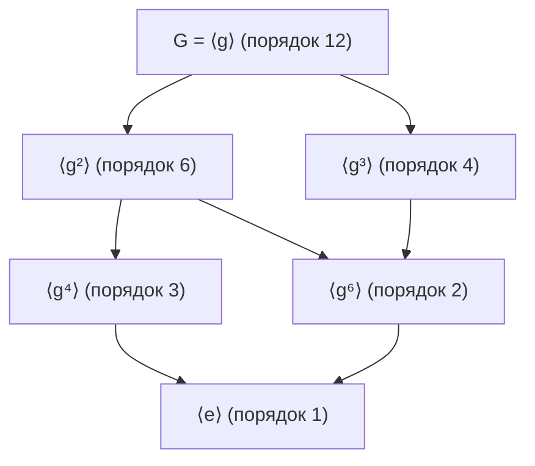

# Линейная алгебра (Алгебра)

> Сводный конспект по папке `ЛинАл/` (включая подпапку `Теория множеств/`) и разделу I файла `update 2.10 Опр + Теор.md`.
> **Источники.** Теория множеств: 26.09.03 «"Наивная" теория множеств и отображения», 26.09.04 «Теория множеств, отображения и упорядоченные множества», 26.09.08 «Бинарные отношения, индукция и мощности», «Обобщение» — конспект книги Н. К. Верещагина и А. Шеня «Начала теории множеств» (далее — *[В–Ш]*). Алгебра: 26.09.10 «Арифметика в ℤ», 26.09.17 «Теория чисел и введение в теорию групп», 26.09.18 «Группы, кольца, поля, симметрии многогранников», 26.09.24 «Подгруппы, гомоморфизмы и циклические группы», 26.10.01 «Циклические группы, теорема Лагранжа, RSA и тесты простоты», 26.10.08 «Кольца, подкольца и идеалы»; практика п_26.10.09 «Смежные классы, нормальность и факторизация групп».
> Материал из *[В–Ш]* выходит за рамки лекций; он отмечен значком 📖.
> Пометка **[Дополнение]** — пояснение, которого нет в исходных конспектах.
> Учебники из `ЛинАл/Books/` (PDF) в сводку не включались.

## Содержание

**Часть I. Теория множеств**
1. [Основы наивной теории множеств](#1-основы-наивной-теории-множеств)
2. [Упорядоченные пары, декартово произведение, парадокс Рассела](#2-упорядоченные-пары-декартово-произведение-парадокс-рассела)
3. [Отображения](#3-отображения)
4. [Аксиома выбора](#4-аксиома-выбора)
5. [Бинарные отношения и отношение эквивалентности](#5-бинарные-отношения-и-отношение-эквивалентности)
6. [Отношения порядка](#6-отношения-порядка)
7. [Индукция и вполне упорядоченные множества](#7-индукция-и-вполне-упорядоченные-множества)
8. [Мощности множеств](#8-мощности-множеств)
9. [Лемма Цорна, теорема Цермело и их следствия](#9-лемма-цорна-теорема-цермело-и-их-следствия)
10. [Ординалы 📖](#10-ординалы-)
11. [Приложения трансфинитной индукции 📖](#11-приложения-трансфинитной-индукции-)

**Часть II. Арифметика целых чисел**

12. [Делимость и деление с остатком](#12-делимость-и-деление-с-остатком)
13. [НОД, тождество Безу и алгоритм Евклида](#13-нод-тождество-безу-и-алгоритм-евклида)
14. [Простые числа и основная теорема арифметики](#14-простые-числа-и-основная-теорема-арифметики)
15. [Сравнения, кольцо вычетов, китайская теорема об остатках](#15-сравнения-кольцо-вычетов-китайская-теорема-об-остатках)

**Часть III. Алгебраические структуры и теория групп**

16. [Группы, кольца, поля](#16-группы-кольца-поля)
17. [Подгруппы и порождающие множества](#17-подгруппы-и-порождающие-множества)
18. [Гомоморфизмы](#18-гомоморфизмы)
19. [Порядок элемента и циклические группы](#19-порядок-элемента-и-циклические-группы)
20. [Смежные классы и теорема Лагранжа. Теоремы Эйлера и Ферма](#20-смежные-классы-и-теорема-лагранжа-теоремы-эйлера-и-ферма)
21. [Нормальные подгруппы и факторгруппы](#21-нормальные-подгруппы-и-факторгруппы)
22. [Симметрические группы и группы симметрий](#22-симметрические-группы-и-группы-симметрий)
23. [Группы и алгебры Ли](#23-группы-и-алгебры-ли)

**Часть IV. Теория колец**

24. [Кольца: примеры, делители нуля, нильпотенты](#24-кольца-примеры-делители-нуля-нильпотенты)
25. [Подкольца и идеалы](#25-подкольца-и-идеалы)

**Часть V. Приложения**

26. [Криптосистема RSA](#26-криптосистема-rsa)
27. [Тесты простоты](#27-тесты-простоты)

**Связи между темами:** отношение эквивалентности (§5) → сравнения по модулю и кольцо вычетов (§15) → смежные классы и теорема Лагранжа (§20). Принцип наименьшего элемента (§7) используется в доказательствах тождества Безу (§13) и строения подгрупп $\mathbb{Z}$ (§19). Теорема Лагранжа (§20) → теоремы Эйлера и Ферма → RSA и тесты простоты (§26–27). Смежные классы (§20) → нормальные подгруппы и факторгруппы (§21) ↔ ядра гомоморфизмов и теорема о гомоморфизме (§18) → идеалы колец (§25); деление с остатком и тождество Безу (§12–13) → кольца главных идеалов $\mathbb{Z}$ и $K[x]$ (§25).

> ⚠️ **В разных конспектах приведены разные формулировки. Требуется уточнение.** Нумерация натуральных чисел: в конспекте 26.09.03 $\mathbb{N} = \{1, 2, 3, \dots\}$, а в конспекте 26.09.08 (база индукции $P_0$, $\Gamma_n = \{0, \dots, n-1\}$) и в *[В–Ш]* $\mathbb{N} = \{0, 1, 2, \dots\}$. Ниже в каждом месте сохранена та конвенция, что в источнике.

---

# Часть I. Теория множеств

# 1. Основы наивной теории множеств

## Основные понятия и обозначения

* $A, B, C, \dots$ — множества.
* $\forall$ — «для любого»; $\exists$ — «существует»; $\exists!$ — «существует единственный».
* $]$ — «пусть» (обозначение предположения).
* $\iff$ — «тогда и только тогда»; $\implies$ — «влечёт».
* $x \in A$ — $x$ принадлежит $A$; $x \notin A$ — не принадлежит.
* Описание через предикат: $\{a \in A \mid P(a)\}$. *Пример:* $\mathbb{R}_{\ge 0} = \{x \in \mathbb{R} \mid x \ge 0\}$.

**Пустое множество** $\varnothing$: $\forall x\ (x \in \varnothing$ — ложно$)$. Следствия: $\varnothing \ne \{0\}$; $\varnothing \subseteq A$ для любого $A$.

## Определения: отношения между множествами

* **Равенство:** $A = B \iff \forall x\,(x \in A \iff x \in B)$.
* **Включение:** $A \subseteq B \iff \forall x\,(x \in A \implies x \in B)$.
* **Строгое включение:** $A \subset B$ ($A \subsetneq B$) $\iff A \subseteq B \land A \ne B$.

> 📖 В *[В–Ш]* знак $A \subset B$ означает нестрогое включение, а собственное подмножество — $A \subsetneq B$.

> **Лемма (о равенстве множеств):** $A = B \iff (A \subseteq B) \land (B \subseteq A)$.

## Числовые множества

* $\mathbb{N} = \{1, 2, 3, \dots\}$ (конвенция 26.09.03, см. ⚠️ выше);
* $\mathbb{Z} = \{\dots, -2, -1, 0, 1, 2, \dots\}$; *пример:* $2\mathbb{Z} = \{y \in \mathbb{Z} \mid \exists k \in \mathbb{Z}: y = 2k\}$ — чётные;
* $\mathbb{Q} = \left\{\frac{m}{n} \;\middle|\; m \in \mathbb{Z},\ n \in \mathbb{N}\right\}$;
* $\mathbb{R}$ — вещественные; $\mathbb{C}$ — комплексные.

## Операции над множествами

| Операция | Определение |
| :--- | :--- |
| Объединение | $A \cup B = \{x \mid x \in A \lor x \in B\}$ |
| Пересечение | $A \cap B = \{x \mid x \in A \land x \in B\}$ |
| Разность | $A \setminus B = \{x \in A \mid x \notin B\}$ (при $B \subset A$ — *дополнение* $B$ до $A$) |
| Симметрическая разность | $A \mathbin{\Delta} B = (A \setminus B) \cup (B \setminus A) = (A \cup B) \setminus (A \cap B)$ |
| Дополнение ($A \subseteq X$) | $A^c = X \setminus A$ |
| Булеан | $\mathcal{P}(A) = 2^A = \{S \mid S \subseteq A\}$ |
| Декартово произведение | $A \times B = \{(a, b) \mid a \in A,\ b \in B\}$ |
| Дизъюнктное объединение | $A \sqcup B = (A \times \{0\}) \cup (B \times \{1\})$ |

* $\Delta$ ассоциативна и коммутативна (соответствует сложению по модулю 2).
* **Булеан конечного множества:** $|\mathcal{P}(A)| = 2^{|A|}$. *Пример:* $2^{\{1,2,3\}} = \{\emptyset, \{1\}, \{2\}, \{3\}, \{1,2\}, \{1,3\}, \{2,3\}, \{1,2,3\}\}$, $|2^A| = 8$.
* **Дизъюнктное объединение (прямая сумма):** если $X$ и $Y$ пересекаются, их разделяют метками. Канонические вложения:
  $$i_X: X \hookrightarrow X \sqcup Y,\ i_X(x) = (x, 0); \qquad i_Y: Y \hookrightarrow X \sqcup Y,\ i_Y(y) = (y, 1)$$
  > В конспекте 26.09.03 записано $A \sqcup B = (\{0\} \times A) \cup (\{1\} \times B)$ (метка первой координатой; пример: $\{0\} \times \{a, b, c\} = \{(0,a), (0,b), (0,c)\}$), в 26.09.04 и сводке `update 2.10` — меткой второй координатой. **[Дополнение]** Это несущественное различие: обе конструкции дают равномощные копии с одинаковыми свойствами.

**Семейства множеств** $\{A_i\}_{i \in I}$ (или $\mathcal{F} = \{A, B, C, \dots\}$):
$$\bigcup_{i \in I} A_i = \{x \mid \exists i \in I: x \in A_i\}, \qquad \bigcup_{A \in \mathcal{F}} A = \{x \mid \exists A \in \mathcal{F}: x \in A\}, \qquad \bigcap_{i \in I} A_i = \{x \mid \forall i \in I: x \in A_i\}$$

## Свойства операций

1. $\varnothing \subseteq A$ для всех $A$.
2. **Коммутативность:** $A \cup B = B \cup A$, $A \cap B = B \cap A$.
3. **Дистрибутивность:**
   $$A \cup (B \cap C) = (A \cup B) \cap (A \cup C), \qquad A \cap (B \cup C) = (A \cap B) \cup (A \cap C)$$
4. **Законы де Моргана:**
   $$X \setminus \bigcup_{i \in I} A_i = \bigcap_{i \in I}(X \setminus A_i), \qquad X \setminus \bigcap_{i \in I} A_i = \bigcup_{i \in I}(X \setminus A_i)$$

## Характеристическая функция и формула включений-исключений 📖

Для $X \subset U$: $\chi_X(u) = 1$ при $u \in X$, иначе $0$.
* $\chi_{A \cap B} = \chi_A \chi_B$; $\ \chi_{U \setminus A} = 1 - \chi_A$; $\ |X| = \sum_{u \in U} \chi_X(u)$.

**Формула включений и исключений:**
$$|A_1 \cup \dots \cup A_n| = \sum_i |A_i| - \sum_{i<j} |A_i \cap A_j| + \sum_{i<j<k} |A_i \cap A_j \cap A_k| - \dots + (-1)^{n-1}|A_1 \cap \dots \cap A_n|$$

---

# 2. Упорядоченные пары, декартово произведение, парадокс Рассела

## Упорядоченная пара

* **Аксиома (основное свойство) пары:** $(a, b) = (c, d) \iff a = c \land b = d$.
* **Определение по Куратовскому:** $(a, b) := \{\{a\}, \{a, b\}\}$ (для сравнения: $\{a, b\} = \{b, a\}$ — неупорядоченная пара).
* Так как $(x, y) \subseteq \mathcal{P}(X \cup Y)$, то $(x, y) \in \mathcal{P}(\mathcal{P}(X \cup Y)) = 2^{2^{X \cup Y}}$, и декартово произведение строго определяется выделением:
  $$X \times Y = \big\{z \in 2^{2^{X \cup Y}} \;\big|\; \exists x \in X,\ \exists y \in Y:\ z = (x, y)\big\}$$

## Парадокс Рассела

$$\Pi = \{A \mid A \notin A\}$$
* Если $\Pi \in \Pi$, то $\Pi \notin \Pi$; если $\Pi \notin \Pi$, то $\Pi \in \Pi$ — противоречие.
* **Вывод:** наивное понимание множества противоречиво; нужна аксиоматика — **ZFC** (Цермело — Френкель с аксиомой выбора): множества строятся поэтапно по строгим правилам (аксиомы выделения, степени, объединения, выбора и др.).
* 📖 Связь с теоремой Кантора: если бы существовало «множество всех множеств» $U$, то $\mathcal{P}(U) \subseteq U$ и $|\mathcal{P}(U)| \le |U|$, что противоречит $|\mathcal{P}(U)| > |U|$ (§8).

---

# 3. Отображения

## Определения

> **Отображение** $A$ в $B$ — тройка $(A, B, \Gamma_f)$, где $A = \operatorname{Dom}(f)$ — область определения, $B = \operatorname{Codom}(f)$ — область прибытия, $\Gamma_f \subseteq A \times B$ — **график**, для которого
> $$\forall a \in A\ \ \exists!\, b \in B:\ (a, b) \in \Gamma_f$$
> Обозначение: $f: A \to B$, $a \mapsto b = f(a)$.

> ⚠️ **В разных конспектах приведены разные формулировки.** В *[В–Ш]* **функцией** называется отношение $F \subset A \times B$, в котором каждому $a$ соответствует **не более одного** $b$ (т. е. допускается частичная определённость), а в лекции 26.09.03 **отображение** требует **ровно одного** $b$ для каждого $a \in A$. **[Дополнение]** Это разные понятия (частичная функция и всюду определённое отображение), а не ошибка; на лекциях используется второе.

* **Образ:** $\operatorname{Im}(f) = f(A) = \{f(a) \mid a \in A\} = \{y \in B \mid \exists x:\ y = f(x)\} \subseteq B$ (в *[В–Ш]* — $\operatorname{Val} f$).
* **Полный прообраз** $Y \subseteq B$: $f^{-1}(Y) = \{a \in A \mid f(a) \in Y\} \subseteq A$.

**Свойства прообраза** ($f: X \to Y$, $\{B_i\}$ — подмножества $Y$):
$$f^{-1}\Big(\bigcup_i B_i\Big) = \bigcup_i f^{-1}(B_i), \qquad f^{-1}\Big(\bigcap_i B_i\Big) = \bigcap_i f^{-1}(B_i)$$

## Примеры отображений

1. **Тождественное:** $\operatorname{Id}_X(x) = x$; график — диагональ $\Delta = \{(x, x)\}$.
2. **Постоянное:** $c_y(x) = y$; $\operatorname{Im}(c_y) = \{y\}$; график $\{(x, y) \mid x \in X\}$.
3. **Проекции:** $\operatorname{pr}_1(x, y) = x$, $\operatorname{pr}_2(x, y) = y$.

## Композиция

Для $f: X \to Y$, $g: Y \to Z$: $(g \circ f)(x) := g(f(x))$.
* **Некоммутативна:** в общем случае $f \circ g \ne g \circ f$.
* **Ассоциативна:** $(h \circ g) \circ f = h \circ (g \circ f)$.

## Классификация отображений

1. **Инъекция (вложение):** $f(x_1) = f(x_2) \implies x_1 = x_2$ (эквивалентно: $x_1 \ne x_2 \implies f(x_1) \ne f(x_2)$).
2. **Сюръекция («на», наложение):** $\forall y\ \exists x:\ f(x) = y$, т. е. $\operatorname{Im}(f) = Y$.
3. **Биекция (взаимно однозначное соответствие):** инъекция и сюръекция одновременно.

**Пример: $x \mapsto x^2$ при разных областях:**

| Отображение | Инъекция | Сюръекция | Биекция |
| :--- | :-: | :-: | :-: |
| $\mathbb{R} \to \mathbb{R}$ | ❌ | ❌ | ❌ |
| $\mathbb{R} \to \mathbb{R}_{\ge 0}$ | ❌ | ✅ | ❌ |
| $\mathbb{R}_{\ge 0} \to \mathbb{R}$ | ✅ | ❌ | ❌ |
| $\mathbb{R}_{\ge 0} \to \mathbb{R}_{\ge 0}$ | ✅ | ✅ | ✅ |

Для $\mathbb{R}_{\ge 0} \to \mathbb{R}_{\ge 0}$ обратное — $g(x) = \sqrt{x}$: $g \circ f = f \circ g = \operatorname{Id}_{\mathbb{R}_{\ge 0}}$.

## Обратимость

> Пусть $f: X \to Y$.
> 1. **Обратимо слева:** $\exists g_L: Y \to X$, $g_L \circ f = \operatorname{Id}_X$.
> 2. **Обратимо справа:** $\exists g_R: Y \to X$, $f \circ g_R = \operatorname{Id}_Y$.
> 3. **Обратимо:** и слева, и справа.

> **Лемма (единственность обратного).** Если есть $g_L$ и $g_R$, то $g_L = g_R$:
> $$g_L = g_L \circ \operatorname{Id}_Y = g_L \circ (f \circ g_R) = (g_L \circ f) \circ g_R = \operatorname{Id}_X \circ g_R = g_R. \ \blacksquare$$
> Обозначение: $f^{-1}: Y \to X$.

> **Теорема (критерий обратимости).** $f$ обратимо $\iff f$ биективно.
>
> *($\Rightarrow$)* Инъективность: $f(x_1) = f(x_2) \implies f^{-1}(f(x_1)) = f^{-1}(f(x_2)) \implies x_1 = x_2$. Сюръективность: для $y$ возьмём $x = f^{-1}(y)$, тогда $f(x) = y$.
> *($\Leftarrow$)* Для каждого $y$ есть единственный $x$ с $f(x) = y$; положим $f^{-1}(y) = x$. По построению $f^{-1} \circ f = \operatorname{Id}_X$, $f \circ f^{-1} = \operatorname{Id}_Y$. $\blacksquare$

### Типы обратных и аксиома выбора

| Тип обратного | Условие | Эквивалентное свойство $f$ | Нужна AC? |
| :--- | :--- | :--- | :--- |
| Двустороннее | $f \circ g = \operatorname{id}_Y$, $g \circ f = \operatorname{id}_X$ | **биекция** | нет |
| Левое | $g \circ f = \operatorname{id}_X$ | **инъекция** ($X \ne \emptyset$) | нет |
| Правое (сечение) | $f \circ g = \operatorname{id}_Y$ | **сюръекция** | **да** |

**Построение левого обратного для инъекции.** Пусть $X \ne \emptyset$, зафиксируем $x_0 \in X$:
$$g(y) = \begin{cases} x, & y \in \operatorname{Im}(f),\ f(x) = y\ (x \text{ единственен по инъективности}) \\ x_0, & y \notin \operatorname{Im}(f) \end{cases}$$
Тогда $g(f(x)) = x$.

**Построение правого обратного для сюръекции.** Для каждого $y$ прообраз $f^{-1}(\{y\}) \ne \emptyset$; чтобы задать $g(y) \in f^{-1}(\{y\})$, нужно **одновременно выбрать** по элементу из каждого прообраза — это и есть **аксиома выбора**.

## Задачи

1. **Построить биекцию $\mathbb{N} \to \mathbb{Z}$.** Идея: чётные ↔ неотрицательные, нечётные ↔ отрицательные. Явная формула (26.09.04):
   $$f(n) = \begin{cases} \dfrac{n}{2}, & n \equiv 0 \pmod 2 \\[4pt] -\dfrac{n-1}{2}, & n \equiv 1 \pmod 2 \end{cases}$$
   ($f(1) = 0,\ f(2) = 1,\ f(3) = -1,\ f(4) = 2,\ f(5) = -2, \dots$)
   > **[Дополнение]** Формула даёт биекцию при $\mathbb{N} = \{1, 2, 3, \dots\}$. Если считать $0 \in \mathbb{N}$, то $f(0) = f(1) = 0$ и инъективность нарушается; тогда для нечётных $n$ берут $-\frac{n+1}{2}$.
2. **Построить биекцию $\mathbb{Z} \to \mathbb{Q}$** (оставлено как упражнение; счётность $\mathbb{Q}$ доказана в §8).

---

# 4. Аксиома выбора

> **Аксиома выбора (AC).** Для любого семейства непустых попарно непересекающихся множеств $\{A_i\}_{i \in I}$ существует множество $C$, содержащее ровно по одному элементу из каждого: $\forall i:\ |C \cap A_i| = 1$.
> Эквивалентно: существует **функция выбора** $f: I \to \bigcup_i A_i$ с $f(i) \in A_i$.

* **Парадокс Банаха — Тарского:** трёхмерный шар можно разбить на конечное число непересекающихся (неизмеримых по Лебегу) частей и жёсткими движениями собрать из них два таких же шара.
* Где используется AC: правое обратное для сюръекции (§3), «всякое бесконечное множество содержит счётное подмножество» (§8), лемма Цорна и теорема Цермело (§9), базис Гамеля.

---

# 5. Бинарные отношения и отношение эквивалентности

## Определения

**Бинарное отношение** между $X$ и $Y$ — любое $R \subseteq X \times Y$; запись $x R y$ или $R(x, y)$. При $X = Y$ — отношение **на** $X$.

**Основные свойства** отношения на $X$:
1. **Рефлексивность:** $\forall x:\ xRx$;
2. **Симметричность:** $xRy \implies yRx$;
3. **Антисимметричность:** $xRy \land yRx \implies x = y$;
4. **Транзитивность:** $xRy \land yRz \implies xRz$.

```
                    Отношение R
                   /           \
       (1, 2, 4)  /             \  (1, 3, 4)
                 v               v
   Эквивалентность            Частичный порядок (ЧУМ)
                                     |  + сравнимость всех пар
                                     v
                              Линейный порядок
```

**Отношение эквивалентности** ($\sim$, $\equiv$) — рефлексивно, симметрично, транзитивно.

## Примеры эквивалентностей

1. **Равенство** $=$ на любом множестве.
2. **Подобие треугольников** на множестве всех треугольников плоскости.
3. **Конечные примеры** на $X = \{1, 2, 3, 4, 5\}$:
   * диагональ $R_1 = \{(1,1), (2,2), (3,3), (4,4), (5,5)\}$ — минимальная эквивалентность;
   * $R_2 = R_1 \cup \{(1,2), (2,1)\}$ — $1$ и $2$ «склеены» в один класс, остальные — одноэлементные классы.
4. **Сравнение по модулю $n$** на $\mathbb{Z}$: $a \equiv b \pmod n \iff n \mid (a - b)$.
   * рефлексивность: $a - a = 0 = 0 \cdot n$;
   * симметричность: $a - b = kn \implies b - a = (-k)n$;
   * транзитивность: $a - b = kn,\ b - c = mn \implies a - c = (k + m)n$.
5. **Построение $\mathbb{Z}$ из $\mathbb{N} \times \mathbb{N}$:** пара $(a, b)$ «означает» $a - b$:
   $$(a, b) \sim (c, d) \iff a + d = b + c$$
6. **Построение $\mathbb{Q}$:** на $\mathbb{Z} \times (\mathbb{N} \setminus \{0\})$ (или $\mathbb{Z} \times (\mathbb{Z} \setminus \{0\})$) пара $(m, n)$ означает $\frac{m}{n}$:
   $$(m, n) \sim (p, q) \iff mq = np$$
7. **«Жить в одном доме»** на множестве жителей Санкт-Петербурга.

## Классы эквивалентности и фактормножество

* **Класс** элемента $x$: $[x] := \{y \in X \mid (y, x) \in R\}$; $x$ — **представитель** класса.
* **Фактормножество:** $X/R := \{[x] \mid x \in X\}$.

> **Лемма (о разбиении на классы).**
> 1. $x \in [x]$ для всех $x$.
> 2. Два класса либо не пересекаются, либо совпадают: $[a] \cap [b] \ne \emptyset \implies [a] = [b]$.
> 3. Фактормножество — разбиение: $X = \bigsqcup_{[x] \in X/R} [x]$.

*Доказательство.*
1. Рефлексивность: $(x, x) \in R \implies x \in [x]$.
2. Пусть $c \in [a] \cap [b]$: $(c, a) \in R$, $(c, b) \in R$. По симметрии $(a, c) \in R$; по транзитивности $(a, b) \in R$. Для $t \in [a]$: $(t, a) \in R$ и $(a, b) \in R \implies (t, b) \in R$, т. е. $t \in [b]$; значит $[a] \subseteq [b]$. Аналогично (так как $(b, a) \in R$) $[b] \subseteq [a]$. $\blacksquare$

**Фактор-конструкции:** $\mathbb{Z} = (\mathbb{N} \times \mathbb{N})/\sim$, $\ \mathbb{Q} = (\mathbb{Z} \times \mathbb{N}^+)/\sim$ — строгое построение числовых систем через классы пар.

> Смежные классы по подгруппе (§20) и классы вычетов (§15) — частные случаи этой конструкции. Подробнее об отношениях (матрицы, графы, замыкания) — в конспекте «Дискретная математика», §6.

---

# 6. Отношения порядка

## Определения

**Частичный порядок** $\le$ на $X$: рефлексивен, антисимметричен, транзитивен. $(X, \le)$ — **частично упорядоченное множество (ЧУМ, poset)**.

**Линейный (полный) порядок:** любые два элемента сравнимы: $\forall a, b:\ a \le b \lor b \le a$.

📖 **Строгий порядок** $<$: антирефлексивен ($x \not< x$) и транзитивен.

### Что такое пара $(X, \le)$ формально

1. Порядок — **само множество пар**: $\le\ = \{(a, b) \in X \times X \mid a \text{ предшествует } b\}$; запись $a \le b$ — сокращение для $(a, b) \in\ \le$.
2. Структура $(X, \le)$ — упорядоченная пара: носитель $X$ и подмножество $\le\ \subseteq X \times X$, удовлетворяющее аксиомам.

**Зачем указывать порядок явно:** на одном множестве бывают разные порядки. $(\mathbb{N}, \le)$ — линейный ($1 < 2 < 3 < \dots$); $(\mathbb{N}, \mid)$ (делимость) — частичный, но не линейный: $2 \preceq 4$, а $2$ и $3$ несравнимы.

## Примеры

1. $(\mathbb{N}, \le)$, $(\mathbb{Z}, \le)$, $(\mathbb{Q}, \le)$, $(\mathbb{R}, \le)$ — линейные порядки.
2. **Булеан с включением** $(\mathcal{P}(A), \subseteq)$: рефлексивность ($M \subseteq M$), антисимметричность ($M \subseteq N \land N \subseteq M \implies M = N$), транзитивность. При $A = \{1, 2\}$: $\{1\}$ и $\{2\}$ несравнимы — порядок частичный.
3. **Делимость на $\mathbb{N}$:** $a \le b \iff a \mid b$.

## Экстремальные элементы

Пусть $(X, \le)$ — ЧУМ.

| Понятие | Определение | Примечание |
| :--- | :--- | :--- |
| **Максимальный** $x$ | $\forall y:\ (x \le y \implies x = y)$ | «нет строго большего»; может быть несколько |
| **Наибольший** $M$ | $\forall y:\ y \le M$ | «больше всех»; единственен, если есть |
| **Минимальный** $x$ | $\forall y:\ (y \le x \implies x = y)$ | «нет строго меньшего»; может быть несколько |
| **Наименьший** $m$ | $\forall y:\ m \le y$ | «меньше всех»; единственен, если есть |

$$\text{Наибольший} \implies \text{максимальный} \quad (\text{обратное в общем случае неверно})$$

### Примеры (диаграммы Хассе)

**1. $(\mathcal{P}(\{0, 1\}), \subseteq)$:**
```
         {0, 1}   <--- наибольший (и максимальный)
         /    \
      {0}      {1}
         \    /
           ∅      <--- наименьший (и минимальный)
```

**2. $X = \mathcal{P}(\{0, 1\}) \setminus \{\{0, 1\}\}$:**
```
      {0}      {1}   <--- два МАКСИМАЛЬНЫХ элемента (наибольшего нет!)
         \    /
           ∅         <--- наименьший (и минимальный)
```
$\{0\}$ и $\{1\}$ несравнимы.

**3. $(\mathbb{N}, \le)$:**
```
       4
       |
       3
       |
       2
       |
       1  <--- наименьший (минимальный)
```
Наибольшего и максимальных нет.

## Грани и цепи

Пусть $A \subseteq X$.
* $x$ — **верхняя грань** $A$: $\forall a \in A:\ a \le x$; **нижняя грань**: $\forall a \in A:\ x \le a$.
* $A$ — **цепь**, если $A$ линейно упорядочено индуцированным порядком.

## Конструкции порядков 📖

* **Индуцированный порядок** на подмножестве $Y \subset X$.
* **Сумма** $X + Y$: объединение непересекающихся упорядоченных множеств, где каждый элемент $X$ меньше любого элемента $Y$.
* **Произведение** $X \times Y$ — антилексикографический порядок (главная — вторая координата):
  $$\langle x_1, y_1 \rangle \le \langle x_2, y_2 \rangle \iff (y_1 <_Y y_2) \lor (y_1 = y_2 \land x_1 \le_X x_2)$$

## Изоморфизмы порядков 📖

* ЧУМ $A$ и $B$ **изоморфны**, если есть биекция $f$ с $a_1 \le a_2 \iff f(a_1) \le f(a_2)$. Классы изоморфных множеств — **порядковые типы**.
* Конечные линейно упорядоченные множества одинаковой мощности изоморфны.
* **Плотный порядок:** между любыми $x < y$ есть $z$: $x < z < y$.
* **Теорема Кантора (об изоморфизме счётных плотных порядков):** любые два счётных плотных линейных порядка без наименьшего и наибольшего элементов изоморфны (и изоморфны $\mathbb{Q}$). Доказывается «челночным методом» (back-and-forth).
* Всякое счётное линейно упорядоченное множество изоморфно подмножеству $\mathbb{Q}$.

> Подробнее о ЧУМ (покрытия, диаграммы Хассе, решётки, топологическая сортировка) — в конспекте «Дискретная математика», §7.

---

# 7. Индукция и вполне упорядоченные множества

## Принцип математической индукции (ПМИ)

Пусть $\{P_n\}_{n \in \mathbb{N}}$ — семейство утверждений:
1. **база:** $P_0$ (или $P_1$) истинно;
2. **переход:** $\forall k:\ P_k \implies P_{k+1}$.

Тогда $P_n$ истинно для всех $n$.

## Принцип наименьшего элемента (НВП) — вполне упорядоченность $\mathbb{N}$

$$\forall A \subseteq \mathbb{N},\ A \ne \emptyset\ \implies \exists a_0 \in A:\ \forall x \in A\ \ a_0 \le x$$

## Теорема: ПМИ $\iff$ НВП

**(ПМИ $\Rightarrow$ НВП).** Пусть $A \ne \emptyset$ без наименьшего элемента. Докажем по индукции $P_n:\ \{0, 1, \dots, n\} \cap A = \emptyset$.
* *База:* если $0 \in A$, то $0$ — наименьший ($0 \le x$ для всех $x$). Значит $0 \notin A$.
* *Переход:* пусть $0, \dots, k \notin A$. Если $k + 1 \in A$, то он наименьший в $A$ (все меньшие числа не в $A$) — противоречие. Значит $k + 1 \notin A$.

По ПМИ $A = \emptyset$ — противоречие. $\blacksquare$

**(НВП $\Rightarrow$ ПМИ).** Пусть $P_0$ истинно, $P_k \implies P_{k+1}$, но $B = \{n \mid P_n \text{ ложно}\} \ne \emptyset$. По НВП есть $b = \min B$. $b \ne 0$ (так как $P_0$ истинно), значит $b - 1 \in \mathbb{N}$ и $b - 1 \notin B$ (минимальность), т. е. $P_{b-1}$ истинно $\implies P_b$ истинно $\implies b \notin B$ — противоречие. $\blacksquare$

## Вполне упорядоченные множества

> **Определение.** $X$ **вполне упорядочено**, если оно линейно упорядочено и любое непустое подмножество имеет наименьший элемент:
> $$\forall A \subseteq X,\ A \ne \emptyset \implies \exists m \in A:\ \forall a \in A\ (m \le a)$$

* *Пример:* $(\mathbb{N}, \le)$.
* *Контрпримеры:* $(\mathbb{Z}, \le)$, $(\mathbb{R}, \le)$, интервал $(0, 1)$ — у $(0, 1)$ нет наименьшего элемента внутри интервала.

### Фундированные множества 📖

**Теорема.** Для ЧУМ $X$ равносильны:
1. любое непустое подмножество имеет **минимальный** элемент;
2. нет бесконечных строго убывающих последовательностей $x_0 > x_1 > x_2 > \dots$;
3. справедлив **принцип трансфинитной индукции**:
   $$\big(\forall x\,[(\forall y < x\ A(y)) \implies A(x)]\big) \implies \forall x\ A(x)$$

Такие множества — **фундированные**. Сумма и произведение конечного числа фундированных множеств фундированы. Вполне упорядоченное множество = фундированное + линейное.

### Свойства вполне упорядоченных множеств 📖

* Есть наименьший элемент ($0$).
* У любого элемента $x$ (кроме наибольшего) есть **непосредственно следующий** $x + 1$.
* Элементы без непосредственно предшествующего — **предельные**.
* Каждый элемент однозначно представим как $z + n$, где $z$ — предельный, $n \in \mathbb{N}$.
* Любое ограниченное сверху подмножество имеет $\sup$.
* **Начальный отрезок:** $I \subset A$ такое, что $(b \in I \land a \le b) \implies a \in I$. Любой собственный начальный отрезок имеет вид $[0, x) = \{y \mid y < x\}$; семейство начальных отрезков вполне упорядочено по включению.

### Трансфинитная индукция и рекурсия 📖

* **Теорема.** Если $A$ вполне упорядочено и $f: A \to A$ строго возрастает, то $f(x) \ge x$ для всех $x$.
  *Следствие:* вполне упорядоченное множество не изоморфно своему собственному начальному отрезку; единственный его автоморфизм — тождественный.
* **Теорема о трансфинитной рекурсии.** Если задано правило $F(x, g)$ ($x \in A$, $g: [0, x) \to B$), то существует единственная $f: A \to B$ с $f(x) = F(x, f|_{[0, x)})$.
* **Теорема о сравнении.** Для вполне упорядоченных $A$ и $B$ верно ровно одно: $A \cong B$; $A$ изоморфно собственному начальному отрезку $B$; $B$ изоморфно собственному начальному отрезку $A$.

---

# 8. Мощности множеств

## Определения

* **Равномощность:** $|X| = |Y| \iff \exists$ биекция $f: X \to Y$ (обозначение 📖: $A \sim B$).
  Равномощность — эквивалентность: рефлексивна ($\operatorname{id}_X$), симметрична ($f^{-1}$), транзитивна ($g \circ f$).
* **Сравнение:** $|X| \le |Y| \iff \exists$ инъекция $X \hookrightarrow Y$ (📖 эквивалентно: $X$ равномощно подмножеству $Y$); $|X| < |Y| \iff |X| \le |Y| \land |X| \ne |Y|$ (инъекция есть, биекции нет).

## Конечные множества

$\Gamma_n := \{k \in \mathbb{N} \mid k < n\} = \{0, 1, \dots, n-1\}$, $\Gamma_0 = \emptyset$.

> **Лемма.** $|\Gamma_n| = |\Gamma_m| \implies n = m$.

*Доказательство (индукция по $n$).* База $n = 0$: $|\Gamma_m| = |\emptyset| \implies m = 0$. Переход: пусть $f: \Gamma_{n+1} \to \Gamma_m$ — биекция. $\Gamma_{n+1} \ne \emptyset \implies m > 0$. Сужение $f$ на $\Gamma_n = \Gamma_{n+1} \setminus \{n\}$ — биекция на $\Gamma_m \setminus \{f(n)\}$, а та биективна с $\Gamma_{m-1}$ (перенумерация со сдвигом после $f(n)$). Получаем биекцию $\Gamma_n \to \Gamma_{m-1}$; по предположению $n = m - 1$. $\blacksquare$

**Конечное множество:** $|X| = |\Gamma_n|$ для некоторого $n$; $n$ — **число элементов** ($|X| = n$, 📖 также $\#X$).

## Счётные множества

* **Счётное:** $|X| = |\mathbb{N}| = \aleph_0$ — элементы нумеруются без повторов и пропусков: $X = \{x_0, x_1, \dots\}$.
* **Не более чем счётное (н.б.с.):** конечно или счётно, $|X| \le |\mathbb{N}|$.
* **Несчётное:** бесконечно и не счётно ($|X| > |\mathbb{N}|$).

### Теорема: подмножество $\mathbb{N}$ конечно или счётно

Пусть $A \subseteq \mathbb{N}$ бесконечно. По НВП: $n_0 = \min A$, $n_1 = \min(A \setminus \{n_0\})$, …, $n_k = \min(A \setminus \{n_0, \dots, n_{k-1}\})$. Получаем $n_0 < n_1 < \dots$; $f(k) = n_k$.
* *Инъективность:* $i < j \implies n_i < n_j$.
* *Сюръективность:* так как $n_k$ строго возрастают, $n_k \ge k$. Если бы $a \in A$ никогда не выбирался, то $n_k < a$ для всех $k$, т. е. $k \le n_k < a$ для всех $k$ — невозможно (чисел меньше $a$ конечно много). $\blacksquare$

### Теорема: $\mathbb{N} \times \mathbb{N}$ счётно

Располагаем пары $(k, l)$ в таблицу и нумеруем по диагоналям $m = k + l$ (на диагонали $m$ — $m + 1$ пара; на диагоналях с суммой меньше $m$ — $\frac{m(m+1)}{2}$ пар):

$$\begin{array}{c|ccccc}
l \backslash k & 0 & 1 & 2 & 3 & \dots \\
\hline
0 & (0,0) & (1,0) & (2,0) & (3,0) & \dots \\
1 & (0,1) & (1,1) & (2,1) & \dots & \\
2 & (0,2) & (1,2) & \dots & & \\
3 & (0,3) & \dots & & & \\
\end{array}$$

**Функция спаривания Кантора** (биекция $\mathbb{N} \times \mathbb{N} \to \mathbb{N}$):
$$f(k, l) = \frac{(k + l)(k + l + 1)}{2} + k$$

По индукции $|\mathbb{N}^k| = |\mathbb{N}^{k-1} \times \mathbb{N}| = |\mathbb{N}|$. $\blacksquare$

**Счётность $\mathbb{Q}$:** несократимая дробь $\frac{p}{q}$ ($p \in \mathbb{Z}$, $q \in \mathbb{N} \setminus \{0\}$) задаёт инъекцию $\mathbb{Q} \hookrightarrow \mathbb{Z} \times \mathbb{N}$, а $|\mathbb{Z} \times \mathbb{N}| = |\mathbb{N}|$; значит $\mathbb{Q}$ н.б.с., а будучи бесконечным — счётно.

### Теорема: счётное объединение н.б.с. множеств н.б.с.

Пусть $S$ н.б.с. и каждое $A_s$ н.б.с. Возьмём сюръекции $\varphi: \mathbb{N} \to S$ и $\psi_s: \mathbb{N} \to A_s$; положим
$$F: \mathbb{N} \times \mathbb{N} \to \bigcup_{s \in S} A_s, \qquad F(n, m) = \psi_{\varphi(n)}(m)$$
Для $x \in A_s$: $\varphi(n) = s$, $\psi_s(m) = x$, тогда $F(n, m) = x$ — сюръекция. Значит объединение — образ счётного множества, т. е. н.б.с. $\blacksquare$

> **[Дополнение]** Одновременный выбор сюръекций $\psi_s$ для всех $s$ использует (счётную) аксиому выбора; кроме того, для пустых $A_s$ сюръекции $\mathbb{N} \to A_s$ нет, и такие множества нужно просто исключить из объединения.

### Свойства счётных множеств 📖

1. Подмножество счётного множества конечно или счётно.
2. Всякое бесконечное множество содержит счётное подмножество *(требует AC)*.
3. Объединение конечного или счётного числа н.б.с. множеств н.б.с.
4. $\mathbb{N}^k$ счётно.
5. Множество всех конечных последовательностей элементов счётного множества счётно.
* **Примеры:** $\mathbb{Z}$, $\mathbb{Q}$, множество алгебраических чисел (корней многочленов с целыми коэффициентами).
* **Поглощение:** если $A$ бесконечно, $B$ н.б.с., то $|A \cup B| = |A|$; если $A$ несчётно, то и $|A \setminus B| = |A|$.
* **Теорема Дедекинда:** множество бесконечно $\iff$ равномощно своему собственному подмножеству.

### Примеры равномощности 📖

* Любые невырожденные интервалы, отрезки, полуинтервалы прямой равномощны.
* $(0, 1) \sim (0, +\infty)$: $x \mapsto \frac{1}{x} - 1$.
* Бесконечные 0-1-последовательности $\sim \mathcal{P}(\mathbb{N})$; $\ \mathcal{P}(U) \sim 2^U = \{f: U \to \{0, 1\}\}$.
* $[0, 1] \sim \{0, 1\}^{\mathbb{N}}$ (двоичная запись; неоднозначность дробей $m/2^n$ устранима — их счётно много).
* **Квадрат и отрезок:** $[0, 1] \times [0, 1] \sim [0, 1]$ — паре $\langle x_0 x_1 \dots, y_0 y_1 \dots \rangle$ сопоставляется «перемешанная» последовательность $x_0 y_0 x_1 y_1 \dots$

## Теорема Кантора

> **Теорема.** Ни для какого $X$ нет сюръекции $f: X \twoheadrightarrow \mathcal{P}(X)$. Следовательно, $|X| < |\mathcal{P}(X)|$.

*Доказательство (диагональный метод).* Пусть $f$ — сюръекция. Положим $D := \{x \in X \mid x \notin f(x)\} \in \mathcal{P}(X)$. Найдётся $d$ с $f(d) = D$.
* $d \in D \implies d \notin f(d) = D$ — противоречие;
* $d \notin D \implies d \in f(d) = D$ — противоречие.

Инъекция $x \mapsto \{x\}$ есть, сюръекции нет, значит $|X| < |\mathcal{P}(X)|$. $\blacksquare$

**Следствия:**
1. Не существует «множества всех множеств» (парадокс Кантора).
2. $\mathcal{P}(\mathbb{N})$, $\mathcal{P}(\mathbb{Z})$, $\mathcal{P}(\mathbb{Q})$ несчётны (мощность континуума).
3. Множество бесконечных двоичных последовательностей $\{0, 1\}^\infty$ несчётно.
4. 📖 $\mathbb{R}$ несчётно, $|\mathbb{R}| = \mathfrak{c} = 2^{\aleph_0}$ (**мощность континуума**).
5. 📖 Существуют трансцендентные числа (алгебраических счётно много, а $\mathbb{R}$ несчётно).

> Другие доказательства несчётности $\mathbb{R}$ (через вложенные отрезки) — в конспекте «Математический анализ», §2 и §7.

## Теорема Кантора — Бернштейна 📖

> Если $|A| \le |B|$ и $|B| \le |A|$, то $|A| = |B|$.

**Идея доказательства.** Достаточно: если $A_2 \subset A_1 \subset A_0$ и $f: A_0 \to A_2$ — биекция, то $A_0 \sim A_1$. Положим $A_{n+1} = f(A_n)$, слои $C_n = A_n \setminus A_{n+1}$, сердцевина $C = \bigcap_n A_n$. Тогда
$$A_0 = C_0 \cup C_1 \cup C_2 \cup \dots \cup C, \qquad A_1 = C_1 \cup C_2 \cup C_3 \cup \dots \cup C$$
$f$ биективно переводит $C_{2k} \to C_{2k+2}$. Биекция $g: A_0 \to A_1$: $g(x) = f(x)$ при $x \in \bigcup C_{2k}$; $g(x) = x$ при $x \in \bigcup C_{2k+1} \cup C$.

## Арифметика мощностей 📖

Для $a = |A|$, $b = |B|$:
* **сумма:** $a + b = |A' \cup B'|$, где $A' \sim A$, $B' \sim B$, $A' \cap B' = \varnothing$;
* **произведение:** $a \cdot b = |A \times B|$;
* **степень:** $a^b = |A^B|$, $A^B$ — функции $B \to A$.

Обозначения: $\aleph_0 = |\mathbb{N}|$, $\mathfrak{c} = 2^{\aleph_0} = |\mathbb{R}|$.

**Свойства:** коммутативность, ассоциативность, дистрибутивность; $a^{b+c} = a^b a^c$, $(ab)^c = a^c b^c$, $(a^b)^c = a^{bc}$;
$$\mathfrak{c} \cdot \mathfrak{c} = 2^{\aleph_0 + \aleph_0} = \mathfrak{c}, \qquad \mathfrak{c}^{\aleph_0} = 2^{\aleph_0 \cdot \aleph_0} = \mathfrak{c}, \qquad \aleph_0^{\aleph_0} = \mathfrak{c}$$

**Теорема Кёнига:** если $b_i < a_i$ для всех $i \in I$, то $\sum_{i} b_i < \prod_{i} a_i$. *Следствие:* континуум не представим в виде счётного объединения множеств меньшей мощности.

**Бесконечные мощности** (для бесконечного $A$):
1. $|A \times \mathbb{N}| = |A|$;
2. $|A| + |B| = \max(|A|, |B|)$;
3. $|A \times A| = |A|$ (лемма Цорна, применённая к максимальным биекциям $B \to B \times B$);
4. $|A \times B| = \max(|A|, |B|)$;
5. множество конечных последовательностей (и конечных подмножеств) $A$ имеет мощность $|A|$.

---

# 9. Лемма Цорна, теорема Цермело и их следствия

## Лемма Цорна

> Пусть $(X, \le)$ — непустой ЧУМ, в котором **каждая цепь имеет верхнюю грань** (индуктивно упорядоченное множество). Тогда в $X$ есть **хотя бы один максимальный элемент** (📖 и для любого $a$ найдётся максимальный $b \ge a$).

## Теорема Цермело (о полном упорядочении)

> На любом множестве $X$ можно ввести порядок, относительно которого $X$ вполне упорядочено.

**Схема доказательства через лемму Цорна:**
1. $Y = \{(A, \le_A) \mid A \subseteq X,\ \le_A \text{ — вполне порядок на } A\}$.
2. $(A, \le_A) \prec (B, \le_B)$, если $A \subseteq B$, $\le_B$ продолжает $\le_A$ и $A$ — начальный отрезок $B$.
3. Любая цепь в $(Y, \prec)$ имеет верхнюю грань (объединение).
4. По лемме Цорна есть максимальный $(M, \le_M)$.
5. Если $M \ne X$, добавим точку из $X \setminus M$ в конец — противоречие с максимальностью. Значит $M = X$.

📖 Другое доказательство — через функцию выбора $\varphi$ (каждому $X \subsetneq A$ сопоставляет $\varphi(X) \in A \setminus X$) и объединение согласованных «корректных фрагментов» порядка.
📖 **Следствие:** любые два множества сравнимы по мощности.

## Эквивалентность в ZF

$$\boxed{\text{Аксиома выбора}} \iff \boxed{\text{Лемма Цорна}} \iff \boxed{\text{Теорема Цермело}}$$

Добавление любого из этих утверждений к $\mathsf{ZF}$ даёт $\mathsf{ZFC}$ — стандартную аксиоматику математики.

## Следствия 📖

* **Теорема Шпильрайна:** всякий частичный порядок продолжается до линейного.
* **Базис Гамеля** — линейно независимая система, через которую любой вектор выражается **конечной** линейной комбинацией. Любое линейно независимое множество дополняется до базиса Гамеля (лемма Цорна / трансфинитная рекурсия). Любые два базиса Гамеля бесконечномерного пространства равномощны.
* **Применения базиса Гамеля** ($\mathbb{R}$ как пространство над $\mathbb{Q}$):
  * разрывные решения уравнения Коши $f(x + y) = f(x) + f(y)$, не являющиеся умножением на константу;
  * изоморфизм аддитивных групп $\mathbb{R} \cong \mathbb{R} \oplus \mathbb{R}$;
  * 3-я проблема Гильберта: куб и правильный тетраэдр равного объёма не равносоставлены (инвариант Дена);
  * неизмеримые множества (множество Витали на окружности).

---

# 10. Ординалы 📖

* **Ординал** — порядковый тип вполне упорядоченного множества. $\alpha < \beta$, если представитель $\alpha$ изоморфен собственному начальному отрезку представителя $\beta$; $[0, \alpha)$ имеет тип $\alpha$.
* **Парадокс Бурали-Форти:** совокупность всех ординалов — не множество (иначе её ординал $\Omega$ удовлетворял бы $\Omega < \Omega$).
* **Ординалы фон Неймана:** каждый ординал — множество всех меньших ординалов:
  $$0 = \varnothing,\quad 1 = \{\varnothing\},\quad 2 = \{\varnothing, \{\varnothing\}\},\quad \alpha + 1 = \alpha \cup \{\alpha\},\quad \omega = \{0, 1, 2, \dots\},\quad \omega + 1 = \{0, 1, \dots, \omega\}$$
  Порядок $<$ совпадает с $\in$.

## Арифметика ординалов

* **Сложение** — тип суммы $A + B$: ассоциативно; **некоммутативно** ($1 + \omega = \omega \ne \omega + 1$); строго монотонно по правому аргументу; есть левое вычитание (при $\alpha \ge \beta$ уравнение $\beta + \gamma = \alpha$ имеет единственное решение).
* **Умножение** — тип $A \times B$ с антилексикографическим порядком: ассоциативно; **некоммутативно** ($2 \cdot \omega = \omega \ne \omega \cdot 2 = \omega + \omega$); левая дистрибутивность $\alpha(\beta + \gamma) = \alpha\beta + \alpha\gamma$ (правая неверна: $(1 + 1)\omega = \omega \ne \omega + \omega$); деление с остатком: $\gamma = \alpha\tau + \rho$, $\rho < \alpha$ (при $\alpha > 0$).

**Индуктивные определения** ($\gamma$ — предельный, $\gamma \ne 0$):
$$\alpha + 0 = \alpha,\quad \alpha + (\beta + 1) = (\alpha + \beta) + 1,\quad \alpha + \gamma = \sup_{\beta < \gamma}(\alpha + \beta)$$
$$\alpha \cdot 0 = 0,\quad \alpha(\beta + 1) = \alpha\beta + \alpha,\quad \alpha\gamma = \sup_{\beta < \gamma} \alpha\beta$$
$$\alpha^0 = 1,\quad \alpha^{\beta + 1} = \alpha^\beta \cdot \alpha,\quad \alpha^\gamma = \sup_{\beta < \gamma} \alpha^\beta$$

* **Явная конструкция $\alpha^\beta$:** функции $B \to A$ с конечным носителем, сравниваемые по наибольшему элементу, где они различаются.
* Если $\alpha, \beta$ счётны, то $\alpha + \beta$, $\alpha\beta$, $\alpha^\beta$ счётны.
* **Нормальная форма Кантора:** всякий $\xi < \alpha^\beta$ единственным образом записывается как
  $$\xi = \alpha^{\beta_1} a_1 + \alpha^{\beta_2} a_2 + \dots + \alpha^{\beta_k} a_k, \qquad \beta > \beta_1 > \dots > \beta_k,\ 0 < a_i < \alpha$$
* **$\varepsilon_0$** — наименьшее решение $\omega^\varepsilon = \varepsilon$: $\ \varepsilon_0 = \sup(\omega, \omega^\omega, \omega^{\omega^\omega}, \dots)$.

---

# 11. Приложения трансфинитной индукции 📖

1. **Борелевские множества.** $\sigma$-алгебра — семейство, замкнутое относительно счётных объединений, пересечений и дополнений. Борелевские множества — наименьшая $\sigma$-алгебра, содержащая отрезки. Иерархия: $B_0$ — отрезки и их дополнения; $B_{\alpha+1}$ — счётные объединения и пересечения множеств из $B_\alpha$; $B_\gamma = \bigcup_{\beta < \gamma} B_\beta$ для предельных $\gamma$. Процесс стабилизируется на первом несчётном ординале $\omega_1$ ($\aleph_1$). **Теорема:** борелевских множеств ровно $\mathfrak{c}$.
2. **Ранг фундированного множества:** единственная $\operatorname{rk}: X \to \mathbf{Ord}$, $\operatorname{rk}(x) = \min\{\alpha \mid \alpha > \operatorname{rk}(y)\ \forall y < x\}$. Дерево без бесконечных ветвей фундировано; ранг дерева со счётным ветвлением — счётный ординал, и любой счётный ординал реализуется как ранг дерева.
3. **Двуточечное множество (теорема 47):** существует $M \subset \mathbb{R}^2$, пересекающееся с каждой прямой ровно в двух точках. Прямые (их $\mathfrak{c}$) вполне упорядочиваются наименьшим ординалом мощности $\mathfrak{c}$: $\{l_\beta\}_{\beta < \mathfrak{c}}$; трансфинитной рекурсией строятся $M_\beta$ без трёх точек на одной прямой; на шаге $\beta$ на $l_\beta$ добавляются недостающие точки вне прямых через пары уже построенных точек (запрещённых прямых $< \mathfrak{c}$, поэтому свободные точки есть).

---

# Часть II. Арифметика целых чисел

# 12. Делимость и деление с остатком

## Определения

Мотивация — уравнение $ax = b$, $a, b \in \mathbb{Z}$.

**Делимость.** $a \mid b$ ($a$ делит $b$), если $\exists c \in \mathbb{Z}:\ b = a \cdot c$.
**Конвенция:** $0 \mid x \iff x = 0$.

## Теорема о делении с остатком

> Для любых $a, b \in \mathbb{Z}$, $b \ne 0$, существуют и единственны $q, r \in \mathbb{Z}$:
> $$a = bq + r, \qquad 0 \le r < |b|$$
> $q$ — **неполное частное**, $r$ — **остаток**.

*Доказательство.*

**Существование.**
* *Случай $a \ge 0$, $b > 0$* — индукция по $a$. База: при $a < b$ $a = b \cdot 0 + a$. Шаг: при $a \ge b$ число $0 \le a - b < a$, по предположению $a - b = bq' + r'$, $0 \le r' < b$, откуда $a = b(q' + 1) + r'$.
* *Случай $a < 0$, $b > 0$.* По случаю 1: $-a = bq + r$, $0 \le r < b$, т. е. $a = -bq - r$. Если $r = 0$ — готово. Если $r > 0$, то $0 < b - r < b$ и
  $$a = b(-q - 1) + (b - r)$$
* *Случай $b < 0$* сводится к замене $b$ на $|b|$.

**Единственность.** Пусть $a = bq + r = b\tilde{q} + \tilde{r}$, $0 \le r, \tilde{r} < |b|$. Тогда $|b| \cdot |q - \tilde{q}| = |\tilde{r} - r|$. Если $q \ne \tilde{q}$, то слева $\ge |b|$, а справа $< |b|$ — противоречие. Значит $q = \tilde{q}$, $r = \tilde{r}$. $\blacksquare$

---

# 13. НОД, тождество Безу и алгоритм Евклида

## Определения

* **Общий делитель** $a$ и $b$: $d \mid a$ и $d \mid b$.
* **НОД** — число $d$ такое, что:
  1. $d \mid a$ и $d \mid b$;
  2. для любого $d'$: $d' \mid a \land d' \mid b \implies d' \mid d$.
* НОД определён с точностью до знака; обычно берут $d > 0$. Обозначение $\gcd(a, b)$, $\text{НОД}(a, b)$. По определению $\gcd(0, a) = |a|$.

## Тождество Безу (линейное представление НОД)

> $\gcd(a, b)$ существует, и $\exists u, v \in \mathbb{Z}$:
> $$\gcd(a, b) = au + bv$$

*Доказательство.* Без ограничения общности $a, b > 0$. $S = \{au + bv \mid u, v \in \mathbb{Z}\}$, $S_{>0} = S \cap \mathbb{Z}_{>0} \ne \varnothing$ ($a \in S_{>0}$). По принципу наименьшего элемента берём $d = \min S_{>0} = au_1 + bv_1$.
1. *$d \mid a$:* $a = dq + r$, $0 \le r < d$; $r = a(1 - u_1 q) + b(-v_1 q) \in S$. Если $r \ne 0$, то $r \in S_{>0}$ и $r < d$ — противоречие с минимальностью. Значит $r = 0$. Аналогично $d \mid b$.
2. *Максимальность:* любой общий делитель $d'$ делит линейную комбинацию $au_1 + bv_1 = d$. $\blacksquare$

**Критерий взаимной простоты (соотношение Безу):**
$$\gcd(a, b) = 1 \iff \exists s, t \in \mathbb{Z}:\ as + bt = 1$$

## Алгоритм Евклида

Можно считать $a, b \in \mathbb{N} \setminus \{0\}$, так как $\gcd(a, b) = \gcd(|a|, |b|)$. Для $a > b > 0$:
$$\begin{aligned}
a &= b q_0 + r_0, & 0 \le r_0 < b \\
b &= r_0 q_1 + r_1, & 0 \le r_1 < r_0 \\
r_0 &= r_1 q_2 + r_2, & 0 \le r_2 < r_1 \\
&\ \ \vdots \\
r_{k-2} &= r_{k-1} q_k + r_k, & 0 \le r_k < r_{k-1} \\
r_{k-1} &= r_k q_{k+1} + 0 & (r_{k+1} = 0)
\end{aligned}$$

Остатки строго убывают: $b > r_0 > r_1 > \dots \ge 0$ — процесс конечен.

> **Утверждение.** Последний ненулевой остаток $r_k = \gcd(a, b)$.

*Лемма:* $\gcd(a, b) = \gcd(b, r_0)$. Если $d = \gcd(a, b)$, то $d \mid a - bq_0 = r_0$, откуда $d \mid \gcd(b, r_0)$. Обратно, $d' = \gcd(b, r_0)$ делит $bq_0 + r_0 = a$, откуда $d' \mid \gcd(a, b)$.

Применяя лемму по цепочке:
$$\gcd(a, b) = \gcd(b, r_0) = \gcd(r_0, r_1) = \dots = \gcd(r_{k-1}, r_k) = \gcd(r_k, 0) = r_k. \ \blacksquare$$

**Расширенный алгоритм Евклида** — тот же процесс с обратным ходом, дающий коэффициенты $u, v$ тождества Безу (используется в диофантовых уравнениях, КТО, RSA).

## Теорема Ламе (оценка числа шагов)

**Числа Фибоначчи:** $F_0 = 0$, $F_1 = 1$, $F_{n+1} = F_n + F_{n-1}$: $0, 1, 1, 2, 3, 5, 8, 13, 21, 34, 55, \dots$

> **Лемма.** $F_{n+2} \ge \varphi^n$ для всех $n \ge 0$, где $\varphi = \frac{1 + \sqrt{5}}{2} \approx 1{,}618$ (золотое сечение).

*Доказательство.* $\varphi$ — корень $x^2 - x - 1 = 0$, т. е. $\varphi^2 = \varphi + 1$. База: $F_2 = 1 \ge \varphi^0$, $F_3 = 2 \ge \varphi^1$. Шаг:
$$F_{n+2} = F_{n+1} + F_n \ge \varphi^{n-1} + \varphi^{n-2} = \varphi^{n-2}(\varphi + 1) = \varphi^{n-2}\varphi^2 = \varphi^n. \ \blacksquare$$

> **Теорема (Ламе).** Число делений $N = k + 1$ в алгоритме Евклида для $a > b \ge 1$ удовлетворяет
> $$N \le 1 + \log_\varphi b$$
> то есть сложность алгоритма $O(\log b)$.

*Доказательство (26.09.10).* Все $q_i \ge 1$, а последний $q_{k+1} \ge 2$ (так как $r_{k-1} > r_k > 0$). Снизу вверх:
$$\begin{aligned}
r_k &\ge 1 = F_2 \\
r_{k-1} &= q_{k+1} r_k \ge 2 = F_3 \\
r_{k-2} &= q_k r_{k-1} + r_k \ge F_3 + F_2 = 3 = F_4 \\
r_{k-3} &= q_{k-1} r_{k-2} + r_{k-1} \ge F_4 + F_3 = 5 = F_5 \\
&\ \ \vdots \\
r_{k-i} &\ge F_{i+2}
\end{aligned}$$
Для $b$ ($i = k$, «$r_{-1} = b$»): $b \ge F_{k+2} \ge \varphi^k$, откуда $k \le \log_\varphi b$ и $N = k + 1 \le 1 + \log_\varphi b$. $\blacksquare$

> ⚠️ **В разных конспектах приведены разные формулировки (индексация).** В конспекте 26.09.10 первый остаток — $r_0$ ($a = bq_0 + r_0$), делитель $b$ играет роль $r_{-1}$, а $N = k + 1$ — число делений. В конспекте 26.09.17 принято $r_{-1} = a$, $r_0 = b$, «предпоследнее» частное $q_k \ge 2$, доказывается $b = r_0 \ge F_{k+1} \ge \varphi^{k-1}$, и оценка записана как $k \le 1 + \log_\varphi b$, где $k$ названо «числом шагов». Итоговая оценка числа делений в обоих случаях одна и та же — $1 + \log_\varphi b$; различается только нумерация остатков. Требуется уточнение, какая индексация принята на лекции.

Схема индукции в варианте 26.09.17: база $r_k \ge 1 = F_2$, $r_{k-1} = q_k r_k \ge 2 = F_3$; шаг $r_{k-i-1} = q_{k-i+1} r_{k-i} + r_{k-i+1} \ge F_{i+2} + F_{i+1} = F_{i+3}$.

> **Практическое следствие:** $\log_\varphi 10 \approx 4{,}785 < 5$, поэтому число шагов алгоритма Евклида **не превышает $5 \times$ (число десятичных цифр $b$)**.

## Линейные диофантовы уравнения $ax + by = c$

1. **Критерий разрешимости:** разрешимо в целых $\iff d = \gcd(a, b) \mid c$.
2. **Алгоритм решения:**
   * делим на $d$: $a'x + b'y = c'$, где $a' = \frac{a}{d}$, $b' = \frac{b}{d}$, $c' = \frac{c}{d}$, $\gcd(a', b') = 1$;
   * расширенным алгоритмом Евклида находим $s_0, t_0$: $a's_0 + b't_0 = 1$;
   * частное решение: $x_0 = s_0 c'$, $y_0 = t_0 c'$;
   * вычитая $a'x_0 + b'y_0 = c'$: $a'(x - x_0) = -b'(y - y_0)$; так как $\gcd(a', b') = 1$, $b' \mid (x - x_0)$.
3. **Общее решение:**
   $$\begin{cases} x = x_0 + \dfrac{b}{d}k \\[4pt] y = y_0 - \dfrac{a}{d}k \end{cases} \qquad k \in \mathbb{Z}$$

---

# 14. Простые числа и основная теорема арифметики

## Определения

**Простое число** — $p \in \mathbb{N}$, $p \ge 2$, единственные натуральные делители которого $1$ и $p$.

## Теоремы

### Лемма Евклида

$$p \text{ — простое} \iff \forall a, b \in \mathbb{Z}:\ (p \mid ab \implies p \mid a \text{ или } p \mid b)$$

*Доказательство ($\Rightarrow$).* $\gcd(a, p) \in \{1, p\}$. Если $p$ — то $p \mid a$. Если $1$ — по Безу $as + pt = 1 \implies abs + pbt = b$; левая часть делится на $p$ (так как $p \mid ab$), значит $p \mid b$. $\blacksquare$

### Основная теорема арифметики

> Любое $n \in \mathbb{Z} \setminus \{0\}$ единственным образом (с точностью до порядка множителей) представляется как
> $$n = \varepsilon \cdot p_1^{\alpha_1} p_2^{\alpha_2} \cdots p_k^{\alpha_k}$$
> где $\varepsilon = \operatorname{sgn}(n) \in \{+1, -1\}$, $p_i$ — попарно различные простые, $\alpha_i \in \mathbb{N}$.

* **Существование** (индукция, сильная): если $n$ простое — готово; иначе $n = n_1 n_2$, $1 < n_1, n_2 < n$, и каждый множитель раскладывается по предположению индукции.
* **Единственность:** пусть $p_1 \cdots p_k = q_1 \cdots q_m$. $p_1 \mid q_1 \cdots q_m$, по лемме Евклида $p_1$ делит некоторый $q_j$ (пусть $q_1$); оба простые $\implies p_1 = q_1$. Сокращаем и продолжаем по индукции.

### Теорема Евклида: простых чисел бесконечно много

*Доказательство.* Пусть простых конечное число $p_1, \dots, p_k$. $M = p_1 p_2 \cdots p_k + 1 > 1$ имеет простой делитель $p$, но $M$ даёт остаток 1 при делении на каждое $p_i$, значит $p \notin \{p_1, \dots, p_k\}$ — противоречие. $\blacksquare$

---

# 15. Сравнения, кольцо вычетов, китайская теорема об остатках

## Сравнения по модулю

**Определение:** $a \equiv b \pmod n \iff n \mid (a - b)$ ($n \in \mathbb{N}$).

**Свойства:**
1. Это отношение эквивалентности (рефлексивно, симметрично, транзитивно — доказательство в §5).
2. **Совместимость с операциями:** если $a_1 \equiv a_2$ и $b_1 \equiv b_2 \pmod n$, то
   $$a_1 + b_1 \equiv a_2 + b_2, \qquad a_1 b_1 \equiv a_2 b_2 \pmod n$$
3. **Сокращение:** $ac \equiv bc \pmod n$ и $\gcd(c, n) = 1 \implies a \equiv b \pmod n$.

## Кольцо вычетов ℤ/nℤ

* $\mathbb{Z}/n\mathbb{Z} = \mathbb{Z}_n = \{\bar{0}, \bar{1}, \dots, \overline{n-1}\}$ с операциями $\bar{a} + \bar{b} = \overline{a + b}$, $\bar{a} \cdot \bar{b} = \overline{ab}$ (корректны по свойству 2).
* **Критерий обратимости:** $\bar{a}$ обратим по умножению $\iff \gcd(a, n) = 1$. (По Безу: $ax + ny = 1 \iff ax \equiv 1 \pmod n$.)
* **Делители нуля:** если $n = ab$, $1 < a, b < n$, то $\bar{a} \cdot \bar{b} = \bar{n} = \bar{0}$ при $\bar{a}, \bar{b} \ne \bar{0}$ — значит $\mathbb{Z}/n\mathbb{Z}$ **не поле**.
* **Критерий поля:** $\mathbb{Z}/n\mathbb{Z}$ — поле $\iff n = p$ простое. Обозначение $\mathbb{F}_p = GF(p)$.
* **Порядок любого конечного поля** равен $p^k$ ($p$ простое, $k \in \mathbb{N}$).

## Мультипликативная группа вычетов и функция Эйлера

$$(\mathbb{Z}/n\mathbb{Z})^* = \mathbb{Z}_n^\times = \{\bar{a} \mid \gcd(a, n) = 1\}$$

**Функция Эйлера** $\varphi(n) = |(\mathbb{Z}/n\mathbb{Z})^*|$ — число $a$, $1 \le a \le n$, взаимно простых с $n$.

**Свойства:**
1. $\varphi(p) = p - 1$ для простого $p$;
2. $\varphi(p^k) = p^k - p^{k-1} = p^{k-1}(p - 1) = p^k\left(1 - \frac{1}{p}\right)$;
3. **мультипликативность:** $\gcd(m, n) = 1 \implies \varphi(mn) = \varphi(m)\varphi(n)$ (следует из КТО);
4. для $n = p_1^{\alpha_1} \cdots p_s^{\alpha_s}$:
   $$\varphi(n) = \prod_{i=1}^s \left(p_i^{\alpha_i} - p_i^{\alpha_i - 1}\right) = n\prod_{i=1}^s \left(1 - \frac{1}{p_i}\right)$$

## Китайская теорема об остатках (КТО)

> Пусть $\gcd(n, m) = 1$. Тогда для любых $a_1, a_2$ система
> $$\begin{cases} x \equiv a_1 \pmod n \\ x \equiv a_2 \pmod m \end{cases}$$
> имеет единственное решение по модулю $nm$.
> Алгебраически — канонические изоморфизмы колец и групп:
> $$\mathbb{Z}/mn\mathbb{Z} \cong \mathbb{Z}/m\mathbb{Z} \times \mathbb{Z}/n\mathbb{Z}, \qquad (\mathbb{Z}/mn\mathbb{Z})^* \cong (\mathbb{Z}/m\mathbb{Z})^* \times (\mathbb{Z}/n\mathbb{Z})^*$$
> Отображение: $[x]_{mn} \mapsto ([x]_m, [x]_n)$.

**Доказательство 1 (через мощности).** $f: \{0, \dots, nm - 1\} \to \{0, \dots, n-1\} \times \{0, \dots, m-1\}$, $f(x) = (x \bmod n,\ x \bmod m)$.
* *Инъективность:* $f(y) = f(z) \implies n \mid (y - z)$ и $m \mid (y - z)$; так как $\gcd(n, m) = 1$, $nm \mid (y - z)$.
* *Сюръективность:* мощности обоих множеств равны $nm$, инъекция конечных равномощных множеств — биекция.

**Доказательство 2 (конструктивное, через Безу).** $ns + mt = 1$. Тогда
$$x = a_1 \cdot mt + a_2 \cdot ns$$
— решение: $x \equiv a_1(1 - ns) \equiv a_1 \pmod n$ и $x \equiv a_2(1 - mt) \equiv a_2 \pmod m$.

**Пример:** $\mathbb{Z}_6 \cong \mathbb{Z}_2 \times \mathbb{Z}_3$. Уравнение $x^2 = x$ в $\mathbb{Z}_6$: в каждом из $\mathbb{Z}_2$, $\mathbb{Z}_3$ решения $\{0, 1\}$, всего $2 \cdot 2 = 4$ решения: $x \in \{0, 1, 3, 4\}$.

## Теорема Вильсона

$$p \ge 2 \text{ — простое} \iff (p - 1)! \equiv -1 \pmod p$$

*Идея ($\Rightarrow$, 26.09.18).* В поле $\mathbb{F}_p$ уравнение $x^2 = 1 \iff (x - 1)(x + 1) = 0 \iff x \equiv \pm 1$. Остальные элементы $\mathbb{F}_p^*$ разбиваются на пары $\{x, x^{-1}\}$ с $x \ne x^{-1}$, произведение каждой пары равно 1. Поэтому $(p-1)! \equiv 1 \cdot (-1) \equiv -1 \pmod p$.

> В сводке `update 2.10` теорема сформулирована как критерий ($\iff$); на лекции 26.09.18 разобрано направление «простое $\Rightarrow$ сравнение».

Теоремы Эйлера и Ферма доказаны в §20 (через теорему Лагранжа).

---

# Часть III. Алгебраические структуры и теория групп

# 16. Группы, кольца, поля

## Иерархия структур

```
[Множество с операцией]
       | (ассоциативность)
       v
  [Полугруппа]
       | (+ нейтральный элемент e)
       v
    [Моноид]
       | (+ обратный элемент a⁻¹)
       v
    [Группа]  ---- (+ коммутативность) ---->  [Абелева группа]
```

## Определения

* **Бинарная операция** на $G$: $\circ: G \times G \to G$, $(a, b) \mapsto a \circ b$.
* **Полугруппа:** операция **ассоциативна**: $(a \circ b) \circ c = a \circ (b \circ c)$.
* **Моноид:** полугруппа с **нейтральным элементом**: $\exists e:\ a \circ e = e \circ a = a$.
* **Группа $(G, \circ)$:** моноид, где у каждого элемента есть **обратный**: $\forall a\ \exists a^{-1}:\ a \circ a^{-1} = a^{-1} \circ a = e$.
* **Абелева (коммутативная) группа:** дополнительно $a \circ b = b \circ a$.

## Теоремы: базовые свойства группы

* **Единственность нейтрального:** $e_1 = e_1 \cdot e_2 = e_2$.
* **Единственность обратного:** если $\tilde{g}$ и $g^{-1}$ обратны к $g$, то
  $$\tilde{g} = \tilde{g} e = \tilde{g}(g g^{-1}) = (\tilde{g} g) g^{-1} = e g^{-1} = g^{-1}$$

## Примеры групп

1. **Тривиальная** $(\{e\}, \cdot)$.
2. **Аддитивные:** $(\mathbb{Z}, +)$, $(\mathbb{Q}, +)$, $(\mathbb{R}, +)$, $(\mathbb{C}, +)$ (нейтральный $0$, обратный $-x$); $(\mathbb{Z}/n\mathbb{Z}, +)$.
3. **Мультипликативные:** $(\mathbb{Q}^\times, \cdot)$, $(\mathbb{R}^\times, \cdot)$, $(\mathbb{C}^\times, \cdot)$, где $X^\times = X \setminus \{0\}$; $(\mathbb{R}_{>0}, \cdot)$; $(\mathbb{Z}/n\mathbb{Z})^\times$.
4. **Симметрическая группа** $S_X$ — все биекции $X \to X$ с композицией (нейтральный — $\operatorname{id}_X$, обратный — $f^{-1}$).
5. **Группа диэдра** $D_n$ — симметрии правильного $n$-угольника, $|D_n| = 2n$ (§22).
6. **Функциональные:** последовательности $\mathbb{R}^\infty = \mathbb{R}^{\mathbb{N}}$ с покоординатным сложением; функции $\operatorname{Map}(\mathbb{R}, \mathbb{R})$ с $(f + g)(x) = f(x) + g(x)$.

*Примеры абелевых групп* (26.09.18): $(\mathbb{Z}, +)$, $(\mathbb{Q}, +)$, $(\mathbb{R}, +)$, $(\mathbb{R}_{>0}, \cdot)$, $(\operatorname{Fun}(\mathbb{R}, \mathbb{R}), +)$, $(\mathbb{R}^{\mathbb{N}}, +)$.
> **[Дополнение]** $S_X$ при $|X| \ge 3$ и $D_n$ — неабелевы.

## Кольцо

$(R, +, \cdot)$ — множество с двумя операциями:
* **(I) $(R, +)$ — абелева группа:** ассоциативность, нуль $0$, противоположный $-a$, коммутативность;
* **(II) умножение ассоциативно:** $(ab)c = a(bc)$;
* **(III) дистрибутивность:** $a(b + c) = ab + ac$ (левая), $(a + b)c = ac + bc$ (правая).

**Делители нуля** — ненулевые $a, b$ с $ab = 0$.

**Группа обратимых элементов кольца** (ассоциативного, с единицей $1_R$):
$$R^\times = R^* = \{x \in R \mid \exists y:\ xy = yx = 1_R\}$$
* $\mathbb{Z}^* = \{+1, -1\}$; для поля $F^* = F \setminus \{0\}$; $|\mathbb{Z}_n^\times| = \varphi(n)$.

## Поле

$(F, +, \cdot)$ — ассоциативное **коммутативное** кольцо с единицей $1 \ne 0$, где каждый ненулевой элемент обратим:
* аксиомы кольца;
* коммутативность умножения: $ab = ba$;
* единица: $\exists 1 \ne 0:\ a \cdot 1 = 1 \cdot a = a$;
* обратимость: $\forall a \ne 0\ \exists a^{-1}:\ a a^{-1} = 1$.

Эквивалентно: $(F \setminus \{0\}, \cdot)$ — абелева группа.

*Примеры:* $\mathbb{Q}$, $\mathbb{R}$, $\mathbb{C}$, $\mathbb{F}_p = GF(p) \cong \mathbb{Z}/p\mathbb{Z}$.

> Подробнее о кольцах (примеры, нильпотенты, подкольца, идеалы) — §24–25.
> Аксиоматика поля $\mathbb{R}$ с порядком и полнотой — в конспекте «Математический анализ», §3.

---

# 17. Подгруппы и порождающие множества

## Определение

Непустое $H \subseteq G$ — **подгруппа** ($H \le G$), если $H$ — группа относительно той же операции:
1. $a, b \in H \implies ab \in H$ (замкнутость);
2. $a \in H \implies a^{-1} \in H$;
3. $e \in H$.

## Теорема (критерии подгруппы)

Для $H \ne \varnothing$ эквивалентны:
1. $H \le G$;
2. **одношаговый критерий:** $\forall a, b \in H:\ ab^{-1} \in H$;
3. **для конечных $H$:** достаточно замкнутости по умножению: $\forall a, b \in H:\ ab \in H$.

*Доказательство п. 3.* Пусть $a \in H$. В последовательности $a, a^2, a^3, \dots \in H$ (конечное $H$) найдутся $a^i = a^j$, $i < j$. Тогда $a^{j-i} = e \in H$. Если $j - i = 1$, то $a = e = a^{-1}$; иначе $a \cdot a^{j-i-1} = e$, т. е. $a^{-1} = a^{j-i-1} \in H$. $\blacksquare$

## Примеры подгрупп

1. $(n\mathbb{Z}, +) \le (\mathbb{Z}, +) \le (\mathbb{Q}, +) \le (\mathbb{R}, +) \le (\mathbb{C}, +)$.
2. **Изометрии:** $\operatorname{Isom}(\mathbb{R}^n) = \{f \mid \|f(x) - f(y)\| = \|x - y\|\} \le (\operatorname{Bij}(\mathbb{R}^n), \circ)$.
3. **Вращения многоугольника:** $R_n = \langle r \mid r^n = e \rangle \le D_n$.
4. **Знакопеременная группа:** $A_n = \{\sigma \in S_n \mid \operatorname{sgn}\sigma = +1\} \le S_n$.
5. **Обратимые элементы кольца:** $R^\times$ — группа по умножению.

## Прямое произведение групп

$G_1 \times G_2$ — пары $(g_1, g_2)$ с покомпонентной операцией $(a_1, a_2)(b_1, b_2) = (a_1 b_1, a_2 b_2)$.
1. $e = (e_{G_1}, e_{G_2})$;
2. $(g_1, g_2)^{-1} = (g_1^{-1}, g_2^{-1})$;
3. $\operatorname{ord}(g_1, g_2) = \operatorname{lcm}(\operatorname{ord} g_1, \operatorname{ord} g_2)$.

## Пересечение подгрупп

> **Лемма.** Для любого семейства подгрупп $\{H_i\}_{i \in I}$: $\bigcap_i H_i \le G$.

*Доказательство.* $e \in H_i$ для всех $i$, значит пересечение непусто. Если $a, b \in \bigcap H_i$, то $ab^{-1} \in H_i$ для всех $i$. $\blacksquare$

## Подгруппа, порождённая множеством

* **Внешнее определение** — наименьшая подгруппа, содержащая $X$:
  $$\langle X \rangle := \bigcap_{\substack{H \le G \\ X \subseteq H}} H$$
* **Конструктивное определение** — все слова над $X \cup X^{-1}$:
  $$\langle X \rangle = \left\{x_1^{\varepsilon_1} x_2^{\varepsilon_2} \cdots x_k^{\varepsilon_k} \;\middle|\; k \ge 0,\ x_i \in X,\ \varepsilon_i \in \{+1, -1\}\right\}$$

### Алгоритм: порождение подгруппы (BFS по графу Кэли)

Порождение $\langle g_1, \dots, g_m \rangle$ эквивалентно обходу в ширину графа Кэли $\Gamma(G, X)$:

```python
def generate_subgroup(generators, identity, mult_op, inv_op):
    """Генерирует конечную подгруппу <X> алгоритмом насыщения (BFS)."""
    subgroup = {identity}
    queue = [identity]

    # Расширенный алфавит: образующие и обратные к ним
    alphabet = list(generators) + [inv_op(g) for g in generators]

    while queue:
        current = queue.pop(0)
        for gen in alphabet:
            neighbor = mult_op(current, gen)
            if neighbor not in subgroup:
                subgroup.add(neighbor)
                queue.append(neighbor)

    return subgroup
```

> ⚠️ **Проблема равенства слов (Word Problem).** Для группы, заданной образующими и соотношениями $G = \langle X \mid R \rangle$: равны ли слова $w_1, w_2$ ($w_1 =_G w_2 \iff w_1 w_2^{-1} =_G e$)?
> **Теорема Новикова — Бооне (1955):** в общем случае проблема **алгоритмически неразрешима** — нет единого алгоритма для всех конечно заданных групп.

---

# 18. Гомоморфизмы

## Определения

$f: (G_1, \cdot) \to (G_2, *)$ — **гомоморфизм**, если
$$f(a \cdot b) = f(a) * f(b) \quad \forall a, b \in G_1$$

| Вид | Свойство |
| :--- | :--- |
| **Мономорфизм** | инъективный ($\ker f = \{e\}$); вложение (например, $D_n \hookrightarrow S_n$) |
| **Эпиморфизм** | сюръективный ($\operatorname{Im} f = G_2$) |
| **Изоморфизм** ($G_1 \cong G_2$) | биективный |
| **Эндоморфизм** | $f: G \to G$ |
| **Автоморфизм** | изоморфизм $G \to G$ ($f \in \operatorname{Aut}(G)$) |

* **Ядро:** $\ker f = \{x \in G_1 \mid f(x) = e_{G_2}\}$.
* **Образ:** $\operatorname{Im} f = \{f(x) \mid x \in G_1\}$.

## Теорема (свойства гомоморфизма)

1. $f(e_{G_1}) = e_{G_2}$;
2. $f(a^{-1}) = f(a)^{-1}$;
3. $f(a^k) = f(a)^k$ для всех $k \in \mathbb{Z}$;
4. $\operatorname{Im} f \le G_2$;
5. $\ker f \trianglelefteq G_1$ — **нормальная подгруппа**: $\forall g \in G_1,\ x \in \ker f:\ gxg^{-1} \in \ker f$;
6. **критерий инъективности:** $f$ инъективен $\iff \ker f = \{e_{G_1}\}$.

*Доказательство.*
1. $f(e) = f(e \cdot e) = f(e) * f(e)$; умножаем на $f(e)^{-1}$: $e_{G_2} = f(e)$.
2. $e_{G_2} = f(a a^{-1}) = f(a) * f(a^{-1})$.
3. Индукция по $k \in \mathbb{N}$; при $k < 0$ — из п. 2.
5. Ядро — подгруппа: $e \in \ker f$; если $x, y \in \ker f$, то $f(xy^{-1}) = f(x) f(y)^{-1} = e$. **Нормальность:** $f(gxg^{-1}) = f(g) \cdot e \cdot f(g)^{-1} = e$.
6. ($\Rightarrow$) $f(x) = e = f(e) \implies x = e$. ($\Leftarrow$) $f(x) = f(y) \implies f(xy^{-1}) = e \implies xy^{-1} \in \ker f = \{e\} \implies x = y$. $\blacksquare$

## Первая теорема об изоморфизме (теорема о гомоморфизме, Э. Нётер)

$$G_1 / \ker f \cong \operatorname{Im} f$$

(Факторгруппа и нормальные подгруппы — §21.)

## Примеры гомоморфизмов

1. **Экспонента и логарифм** (изоморфизмы): $\exp: (\mathbb{R}, +) \to (\mathbb{R}_{>0}, \cdot)$, $\exp(x + y) = \exp x \cdot \exp y$; обратный $\ln(xy) = \ln x + \ln y$.
2. **Каноническая проекция:** $\pi: (\mathbb{Z}, +) \to (\mathbb{Z}_n, +)$, $x \mapsto [x]_n$, $\ker \pi = n\mathbb{Z}$.
3. **КТО:** при $\gcd(m, n) = 1$ $[x]_{mn} \mapsto ([x]_m, [x]_n)$ — изоморфизм $\mathbb{Z}_{mn} \cong \mathbb{Z}_m \times \mathbb{Z}_n$; мультипликативно $\mathbb{Z}_{mn}^\times \cong \mathbb{Z}_m^\times \times \mathbb{Z}_n^\times$.
4. **Знак перестановки:** $\operatorname{sgn}: S_n \to \{\pm 1\}$, $\ker \operatorname{sgn} = A_n$.
5. **Определитель:** $\det: \operatorname{GL}_n(\mathbb{R}) \to \mathbb{R} \setminus \{0\}$, $\ker \det = \operatorname{SL}_n(\mathbb{R})$.
6. **Эвалюация (вычисление в точке):** $\operatorname{ev}_{x_0}: \mathcal{F}(X, \mathbb{R}) \to \mathbb{R}$, $f \mapsto f(x_0)$; для многочленов $\operatorname{ev}_\alpha: K[x] \to K$, $P \mapsto P(\alpha)$, $\ker \operatorname{ev}_\alpha = (x - \alpha)K[x]$ — идеал многочленов, делящихся на $x - \alpha$ (теорема Безу).

---

# 19. Порядок элемента и циклические группы

## Определения

* **Порядок элемента** $\operatorname{ord}(g) = |g|$ — наименьшее $n \in \mathbb{N}$ с $g^n = e$; если такого нет — $\operatorname{ord}(g) = \infty$.
* Эквивалентно: $\operatorname{ord}(g) = |\langle g \rangle|$.
* **Циклическая группа:** $G = \langle g \rangle = \{g^k \mid k \in \mathbb{Z}\}$.

## Теорема (свойства порядка)

Пусть $\operatorname{ord}(g) = n < \infty$:
1. $g^m = e \iff n \mid m$;
2. $g^k = g^m \iff k \equiv m \pmod n$;
3. **порядок степени:**
   $$\operatorname{ord}(g^k) = \frac{n}{\gcd(k, n)}$$
4. если $G$ конечна — $\operatorname{ord}(g) \mid |G|$, $g^{|G|} = e$ (следствие теоремы Лагранжа, §20).

*Доказательство п. 1.* $m = qn + r$, $0 \le r < n$: $g^m = (g^n)^q g^r = g^r$, значит $g^r = e$; по минимальности $n$ $r = 0$. $\blacksquare$

*Доказательство п. 3.* Пусть $m = \operatorname{ord}(g^k)$. $g^{km} = e \iff n \mid km \iff \frac{n}{\gcd(k, n)} \mid m \cdot \frac{k}{\gcd(k, n)}$. Числа $\frac{n}{\gcd}$ и $\frac{k}{\gcd}$ взаимно просты, по лемме Евклида $\frac{n}{\gcd(k, n)} \mid m$; наименьшее такое $m$ — это $\frac{n}{\gcd(k, n)}$. $\blacksquare$

*То же в аддитивной записи ($G = \mathbb{Z}_n$, 26.10.01):* порядок $k$ — наименьшее $x > 0$ с $xk \equiv 0 \pmod n$; все решения $x = \frac{n}{\gcd(n, k)} t$. В частности, **$k$ — образующий $\mathbb{Z}_n \iff \gcd(n, k) = 1$**.

## Теорема (классификация циклических групп)

$$G = \langle g \rangle \cong \begin{cases} (\mathbb{Z}, +), & |G| = \infty \\ (\mathbb{Z}_n, +) = C_n, & |G| = n < \infty \end{cases}$$

## Теорема (о подгруппах циклической группы)

1. Всякая подгруппа циклической группы **циклическая**: $H = \langle a^k \rangle$.
2. В циклической группе порядка $n$ для каждого $d \mid n$ существует **ровно одна** подгруппа порядка $d$:
   $$H_d = \left\langle g^{n/d} \right\rangle, \quad |H_d| = d$$
3. **Число образующих** циклической группы порядка $n$ равно $\varphi(n)$: $\langle g^k \rangle = G \iff \gcd(k, n) = 1$.

*Доказательство.*

**Бесконечный случай ($G \cong \mathbb{Z}$).** Пусть $H \le \mathbb{Z}$. Если $H = \{0\} = \langle 0 \rangle$ — готово. Иначе в $H$ есть положительные элементы (вместе с $x$ лежит $-x$); $n = \min\{x \in H \mid x > 0\}$. Тогда $n\mathbb{Z} \subseteq H$. Для $m \in H$: $m = qn + r$, $0 \le r < n$, $r = m - qn \in H$, по минимальности $r = 0$. Итак, $H = n\mathbb{Z} = \langle n \rangle$.

**Конечный случай ($G \cong \mathbb{Z}_n$).** Канонический эпиморфизм $\pi: \mathbb{Z} \to \mathbb{Z}_n$. По теореме о соответствии подгрупп $\pi^{-1}(H) \le \mathbb{Z}$ и содержит $\ker \pi = n\mathbb{Z}$. По доказанному $\pi^{-1}(H) = k\mathbb{Z}$; $n\mathbb{Z} \subseteq k\mathbb{Z} \implies k \mid n$. Тогда $H = \pi(k\mathbb{Z}) = \langle \pi(k) \rangle$ — циклическая, и
$$|H| = \operatorname{ord}(k) = \frac{n}{\gcd(n, k)} = \frac{n}{k} = d$$
Для заданного $d \mid n$ берём $k = \frac{n}{d}$. Единственность: любой элемент $x$ с $\operatorname{ord}(x) \mid d$ кратен $\frac{n}{d}$. $\blacksquare$

**Пример: решётка подгрупп $\mathbb{Z}_{12}$** изоморфна решётке делителей 12 (диаграмма Хассе):



---

# 20. Смежные классы и теорема Лагранжа. Теоремы Эйлера и Ферма

## Отношение смежности

Для $H \le G$:
$$g_1 \underset{H}{\sim} g_2 \iff g_2^{-1} g_1 \in H \iff \exists h \in H:\ g_1 = g_2 h$$

> **Лемма.** $\underset{H}{\sim}$ — отношение эквивалентности.

*Доказательство.*
1. *Рефлексивность:* $g = g \cdot e$, $e \in H$.
2. *Симметричность:* $g_1 = g_2 h \implies g_2 = g_1 h^{-1}$, $h^{-1} \in H$.
3. *Транзитивность:* $g_1 = g_2 h_1$, $g_2 = g_3 h_2 \implies g_1 = g_3(h_2 h_1)$, $h_2 h_1 \in H$. $\blacksquare$

**Левый смежный класс** — класс эквивалентности $g$:
$$gH = \{gh \mid h \in H\}$$
$G/H$ — множество левых смежных классов; они образуют разбиение: $G = \bigsqcup_{gH \in G/H} gH$.

## Теорема Лагранжа

> Если $G$ конечна и $H \le G$, то
> $$|G| = |H| \cdot [G : H]$$
> где $[G : H] = |G/H|$ — **индекс** $H$ в $G$ (число смежных классов).

*Доказательство.* $f_g: H \to gH$, $h \mapsto gh$ — сюръекция по определению $gH$ и инъекция: $gh_1 = gh_2 \implies h_1 = h_2$. Значит $|gH| = |H|$ для всех $g$. $G$ разбита на $[G : H]$ классов мощности $|H|$:
$$|G| = \sum_{gH \in G/H} |gH| = [G : H] \cdot |H|. \ \blacksquare$$

## Следствия

1. $|H| \mid |G|$ для любой подгруппы.
2. $\operatorname{ord}(g) \mid |G|$, откуда $g^{|G|} = e$. *(Берём $H = \langle g \rangle$, $|H| = \operatorname{ord}(g)$.)*
3. **Группа простого порядка циклична:** $|G| = p \implies G \cong \mathbb{Z}_p$. *(Для $g \ne e$: $\operatorname{ord}(g) > 1$ и делит $p$, значит равен $p$ и $\langle g \rangle = G$.)*

## Теорема Эйлера

> $\gcd(a, n) = 1 \implies a^{\varphi(n)} \equiv 1 \pmod n$.

*Доказательство.* $G = (\mathbb{Z}/n\mathbb{Z})^*$, $|G| = \varphi(n)$, $\bar{a} \in G$. По следствию 2: $\bar{a}^{|G|} = \bar{1}$. $\blacksquare$

## Малая теорема Ферма

> Если $p$ простое и $\gcd(a, p) = 1$, то $a^{p-1} \equiv 1 \pmod p$. Для любого $a \in \mathbb{Z}$: $a^p \equiv a \pmod p$.

(Частный случай теоремы Эйлера: $|\mathbb{Z}_p^\times| = p - 1$.)

---

# 21. Нормальные подгруппы и факторгруппы

> Источник — практика 26.10.09.

## Мотивация

Смежные классы — аналог аффинных подпространств $x + V$ для подпространства $V$. В некоммутативной группе сдвигать можно **слева** ($gH$) и **справа** ($Hg = \{hg \mid h \in H\}$), и эти классы могут не совпадать. Хотим превратить $G/H$ в группу, умножая классы как подмножества:
$$(g_1 H)(g_2 H) \stackrel{?}{=} (g_1 g_2) H$$
Раскрывая, $(g_1 H)(g_2 H) = g_1 (H g_2) H$; если $Hg_2 = g_2 H$, то это $g_1 g_2 H H = (g_1 g_2) H$. Иначе произведение не обязано быть смежным классом.

## Определения

* **Нормальная подгруппа** $N \trianglelefteq G$ — подгруппа, для которой выполнено любое из равносильных условий:
  1. $gN = Ng$ для всех $g \in G$;
  2. $gNg^{-1} = N$ для всех $g \in G$;
  3. $gng^{-1} \in N$ для всех $g \in G$, $n \in N$ (замкнутость относительно **сопряжения**).
* **Факторгруппа** $G/N$ (для $N \trianglelefteq G$) — множество смежных классов с операцией $(g_1 N)(g_2 N) = (g_1 g_2) N$; нейтральный элемент $N = eN$, обратный $(gN)^{-1} = g^{-1}N$, $|G/N| = [G : N]$.
* **Каноническая проекция** $\pi: G \to G/N$, $g \mapsto gN$ — сюръективный гомоморфизм, $\ker \pi = N$. Вместе с §18 ($\ker f \trianglelefteq G$): **нормальные подгруппы — это в точности ядра гомоморфизмов**.
* **Центр** $Z(G) = \{z \in G \mid zg = gz\ \forall g \in G\}$ — всегда нормальная подгруппа.
* В абелевой группе любая подгруппа нормальна.

## Пример: $S_3$

$S_3 \cong D_3$ (§22): $e$; транспозиции $(1\,2), (2\,3), (1\,3)$ — осевые симметрии треугольника; 3-циклы $(1\,2\,3), (1\,3\,2)$ — повороты.

* **$H = \{e, (1\,2)\}$ не нормальна.** Композиция справа налево:
  $$(2\,3)H = \{(2\,3), (1\,3\,2)\} \ne \{(2\,3), (1\,2\,3)\} = H(2\,3)$$
  Геометрически: сопряжение переносит ось симметрии в другую ось.
* **$A_3 = \{e, (1\,2\,3), (1\,3\,2)\}$ нормальна:** сопряжение поворота отражением снова даёт поворот (в другую сторону). Это же следует из теоремы об индексе 2.

## Теорема (об индексе 2)

> Если $[G : H] = 2$, то $H \trianglelefteq G$.

*Доказательство.* Классов ровно два, и один из них $H = eH = He$. Поэтому вторым классом — и среди левых, и среди правых — может быть только $G \setminus H$. Для $g \in H$: $gH = H = Hg$; для $g \notin H$: $gH = G \setminus H = Hg$. $\blacksquare$

*Примеры:* $A_n \trianglelefteq S_n$; подгруппа поворотов $C_n \trianglelefteq D_n$.

## Пример: $Q_8 / Z(Q_8) \cong V_4$

* $Z(Q_8) = \{\pm 1\}$: $\pm 1$ коммутируют со всеми, а $ij = k \ne -k = ji$ (аналогично для $j, k$).
* В $Q_8$ $\operatorname{ord}(i) = 4$, но в факторгруппе $\bar{i}^2 = (-1)Z = \bar{e}$, т. е. $\operatorname{ord}(\bar{i}) = 2$; так же для $\bar{j}, \bar{k}$.
* $\bar{i}\bar{j} = kZ = \bar{k}$ и $\bar{j}\bar{i} = (-k)Z = \bar{k}$ — знаки склеились, факторгруппа абелева.
* Группа порядка 4, где все неединичные элементы имеют порядок 2: $Q_8 / Z(Q_8) \cong \mathbb{Z}_2 \times \mathbb{Z}_2 = V_4$ (четверная группа Клейна).

## Утверждения о порядках

1. **Если $g^2 = e$ для всех $g \in G$, то $G$ абелева.**
   *Доказательство.* $g = g^{-1}$ для всех $g$, поэтому $xy = (xy)^{-1} = y^{-1}x^{-1} = yx$. $\blacksquare$
2. **Если $|G|$ конечен и чётен, то в $G$ есть элемент порядка 2.**
   *Доказательство.* Разобьём на пары $\{x, x^{-1}\}$ элементы с $x \ne x^{-1}$ — их число чётно. Остальные элементы — решения $x^2 = e$, и их число $\equiv |G| \equiv 0 \pmod 2$. Среди них есть $e$, значит, есть и $g \ne e$ с $g^2 = e$. $\blacksquare$
3. **$\operatorname{ord}(xy) = \operatorname{ord}(yx)$.**
   *Доказательство.* $yx = x^{-1}(xy)x$ — элементы сопряжены, и $(yx)^n = x^{-1}(xy)^n x$. Поэтому $(xy)^n = e \iff (yx)^n = e$. $\blacksquare$
   (Вообще, сопряжение $a \mapsto gag^{-1}$ — автоморфизм группы и сохраняет порядок.)

## Пример: аффинная группа прямой $\operatorname{Aff}(\mathbb{R})$

$f_{a,b}(x) = ax + b$, $a \ne 0$; операция — композиция:
$$(a, b) \circ (c, d) = (ac,\ ad + b) \quad\longleftrightarrow\quad \begin{pmatrix} a & b \\ 0 & 1 \end{pmatrix}\begin{pmatrix} c & d \\ 0 & 1 \end{pmatrix} = \begin{pmatrix} ac & ad + b \\ 0 & 1 \end{pmatrix}$$

* **Масштабирования $H_1 = \{(a, 0)\}$ (неподвижна точка $0$) — не нормальная подгруппа:** сопряжение сдвигом на $b$ даёт $x \mapsto a(x - b) + b = ax + b(1 - a) \notin H_1$ при $a \ne 1$, $b \ne 0$ (центр растяжения переехал в $b$).
* **Переносы $H_2 = \{(1, t)\}$ — нормальная подгруппа:**
  $$\begin{pmatrix} a & c \\ 0 & 1 \end{pmatrix}\begin{pmatrix} 1 & t \\ 0 & 1 \end{pmatrix}\begin{pmatrix} a & c \\ 0 & 1 \end{pmatrix}^{-1} = \begin{pmatrix} 1 & at \\ 0 & 1 \end{pmatrix} \in H_2$$
* $(a, b) \mapsto a$ — гомоморфизм $\operatorname{Aff}(\mathbb{R}) \to \mathbb{R}^*$ с ядром $H_2$, поэтому по теореме о гомоморфизме $\operatorname{Aff}(\mathbb{R}) / H_2 \cong \mathbb{R}^*$. Сама группа — полупрямое произведение $\operatorname{Aff}(\mathbb{R}) \cong \mathbb{R} \rtimes \mathbb{R}^*$.

---

# 22. Симметрические группы и группы симметрий

## Симметрическая группа $S_n$

* Все биекции (перестановки) $n$-элементного множества с композицией; $|S_n| = n!$.
* **Двухстрочная запись:**
  $$\pi = \begin{pmatrix} 1 & 2 & 3 & \dots & n \\ \pi(1) & \pi(2) & \pi(3) & \dots & \pi(n) \end{pmatrix}$$
* **Знакопеременная группа** $A_n = \ker(\operatorname{sgn})$ — чётные перестановки, $|A_n| = \frac{n!}{2}$.
* **Теорема Кэли:** всякая группа порядка $n$ изоморфна подгруппе $S_n$.

## Группа диэдра $D_n$

Все симметрии правильного $n$-угольника ($n \ge 3$), $|D_n| = 2n$:
1. **$n$ поворотов** на $\frac{2\pi k}{n}$, $k = 0, \dots, n - 1$ — циклическая подгруппа $C_n \cong \mathbb{Z}/n\mathbb{Z}$;
2. **$n$ осевых симметрий:**
   * $n$ нечётно ($D_3$): каждая ось проходит через вершину и середину противоположной стороны;
   * $n$ чётно ($D_4$): $n/2$ осей через противоположные вершины и $n/2$ — через середины противоположных сторон.

**Задание образующими и соотношениями:**
$$D_n = \langle r, s \mid r^n = e,\ s^2 = e,\ srs = r^{-1} \rangle$$

* $D_3 \cong S_3$ (симметрии треугольника = все перестановки его вершин).
* При $n \ge 4$ $D_n$ — собственная подгруппа $S_n$ ($D_n \hookrightarrow S_n$).

## Группа кватернионов $Q_8$

Неабелева группа порядка 8: $Q_8 = \{\pm 1, \pm i, \pm j, \pm k\}$,
$$i^2 = j^2 = k^2 = ijk = -1$$
$$ij = k,\quad jk = i,\quad ki = j,\quad ji = -k,\quad kj = -i,\quad ik = -j$$

## Группы симметрий многогранников

Полная группа симметрий тела $G_{\text{full}} \subset O(3)$:
* **собственные вращения** $G^+ \subset SO(3)$ — сохраняют ориентацию, $\det = +1$;
* **несобственные движения** — отражения, инверсия, зеркальные повороты, $\det = -1$.

```
       Полная группа симметрий G_full
                 /        \
   Собственные вращения   Несобственные симметрии
     G^+ (det = +1)          (det = -1, отражения)
```

| Тело | Вращения | Порядок | Полная группа | Порядок |
| :--- | :--- | :-: | :--- | :-: |
| Тетраэдр | $T \cong A_4$ | 12 | $T_d \cong S_4$ | 24 |
| Куб / октаэдр | $O \cong S_4$ | 24 | $O_h \cong S_4 \times \mathbb{Z}_2$ | 48 |
| Икосаэдр / додекаэдр | $I \cong A_5$ | 60 | $I_h \cong A_5 \times \mathbb{Z}_2$ | 120 |

### Тетраэдр

* Вращения — чётные перестановки 4 вершин: $T \cong A_4$, $|T| = \frac{4!}{2} = 12$.
* Оси: 4 оси 3-го порядка (вершина — центр противоположной грани): $4 \times 2 = 8$; 3 оси 2-го порядка (середины скрещивающихся рёбер): $3 \times 1 = 3$; тождественное: 1. Итого $8 + 3 + 1 = 12$.
* Полная группа: добавляются 6 плоскостей симметрии через рёбра; $T_d \cong S_4$, 24 элемента.

### Куб и октаэдр (взаимно двойственны)

* Каждое вращение однозначно переставляет 4 главные диагонали куба: $O \cong S_4$, $|O| = 24$.
* Оси: 3 оси 4-го порядка (центры противоположных граней): $3 \times 3 = 9$; 4 оси 3-го порядка (главные диагонали): $4 \times 2 = 8$; 6 осей 2-го порядка (середины противоположных рёбер): $6 \times 1 = 6$; тождественное: 1. Итого $9 + 8 + 6 + 1 = 24$.
* Куб центрально-симметричен (инверсия $\vec{x} \mapsto -\vec{x}$): $O_h \cong S_4 \times \mathbb{Z}_2$, 48 элементов.

### Икосаэдр и додекаэдр (взаимно двойственны)

* В тело вписываются 5 кубов; вращения — чётные перестановки этих кубов: $I \cong A_5$, $|I| = \frac{5!}{2} = 60$.
* Оси: 6 осей 5-го порядка (противоположные вершины икосаэдра): $6 \times 4 = 24$; 10 осей 3-го порядка (центры противоположных граней): $10 \times 2 = 20$; 15 осей 2-го порядка (середины противоположных рёбер): $15 \times 1 = 15$; тождественное: 1. Итого $24 + 20 + 15 + 1 = 60$.
* С инверсией: $I_h \cong A_5 \times \mathbb{Z}_2$, 120 элементов.

## Теорема Шаля

Любое **собственное движение** $\mathbb{R}^3$ — **винтовое движение**: композиция вращения вокруг прямой (оси винта) и сдвига вдоль неё:
$$f(\vec{x}) = R\vec{x} + \vec{v}, \qquad R\vec{v}_\parallel = \vec{v}_\parallel$$

**Следствие (теорема Эйлера о вращении):** движение твёрдого тела с неподвижной точкой (например, центром масс многогранника) — это поворот вокруг некоторой оси (вектор сдвига нулевой); любая композиция вращений сводится к одному повороту.

---

# 23. Группы и алгебры Ли

* **Группа Ли** — гладкое многообразие $G$ со структурой группы, где умножение $(x, y) \mapsto xy$ и обращение $x \mapsto x^{-1}$ гладкие. *Примеры:* $(\mathbb{R}, +)$, $(\mathbb{R}_{>0}, \cdot)$, $SO(3)$, $GL(n, \mathbb{R})$.
* **Алгебра Ли** $\mathfrak{g} = T_e G$ — касательное пространство в единице с билинейной **скобкой Ли (коммутатором)** $[x, y]$:
  1. антикоммутативность: $[x, y] = -[y, x]$;
  2. тождество Якоби: $[x, [y, z]] + [y, [z, x]] + [z, [x, y]] = 0$.
* **Экспоненциальное отображение** $\exp: \mathfrak{g} \to G$, $\exp: (\mathfrak{g}, +) \to (G, \cdot)$.
  * Для коммутирующих элементов: $\exp(A + B) = \exp(A)\exp(B)$.
  * Простейший пример: $\exp: (\mathbb{R}, +) \to (\mathbb{R}_{>0}, \cdot)$, $e^{x + y} = e^x e^y$.

---

# Часть IV. Теория колец

# 24. Кольца: примеры, делители нуля, нильпотенты

Определение кольца — в §16. Далее кольца ассоциативны и с единицей, если не оговорено иное.

> 💡 **$a \cdot 0 = 0$ — не аксиома, а следствие дистрибутивности:** $a \cdot 0 = a(0 + 0) = a \cdot 0 + a \cdot 0 \implies a \cdot 0 = 0$.

## Определения

* **Делитель нуля** — $a \ne 0$, для которого $\exists b \ne 0$: $ab = 0$ или $ba = 0$.
* **Область целостности** — коммутативное кольцо с $1 \ne 0$ без делителей нуля ($\mathbb{Z}$, $K[x]$, любое поле). В ней можно сокращать: $ab = ac,\ a \ne 0 \implies b = c$.
* **Нильпотент** — $x$, для которого $\exists k \in \mathbb{N}$: $x^k = 0$.
* **Идемпотент** — $x^2 = x$. **Булево кольцо** — кольцо, где все элементы идемпотентны.

## Теорема (связь понятий)

1. Обратимый элемент не является делителем нуля: $ab = 0 \implies b = a^{-1}ab = 0$.
2. Ненулевой нильпотент — делитель нуля. Обратное неверно: $\bar{2} \in \mathbb{Z}/6\mathbb{Z}$ — делитель нуля, но не нильпотент.

*Доказательство (2).* Пусть $k$ — наименьшее с $x^k = 0$; так как $x \ne 0$, $k \ge 2$. Тогда $x \cdot x^{k-1} = 0$, где $x^{k-1} \ne 0$ по минимальности $k$. $\blacksquare$

## Примеры колец

| Кольцо | Обратимые | Делители нуля | Нильпотенты |
| :--- | :--- | :--- | :--- |
| $\mathbb{Z}/n\mathbb{Z}$ | $\bar{a}$ с $\gcd(a, n) = 1$ | $\bar{a} \ne \bar{0}$ с $\gcd(a, n) > 1$ | $\bar{a}$ с $\operatorname{rad}(n) \mid a$ (все простые делители $n$ делят $a$) |
| $M_n(K)$, $n \ge 2$ | $\operatorname{GL}_n(K) = \{\det A \ne 0\}$ | $A \ne 0$ с $\det A = 0$ | например, строго верхнетреугольные |
| $C[a, b] \subset \mathbb{R}^{[a, b]}$ | $f$ без нулей на $[a, b]$ | $f \ne 0$, обращающиеся в $0$ на целом интервале | только $0$ |
| $(\mathcal{P}(X), \triangle, \cap)$ | только $X$ | все $A \ne \varnothing, X$ | только $\varnothing$ |

* **$\mathbb{Z}/6\mathbb{Z}$:** $(\mathbb{Z}/6\mathbb{Z})^* = \{\bar{1}, \bar{5}\}$ ($\bar{5}^2 = \bar{1}$); делители нуля $\{\bar{2}, \bar{3}, \bar{4}\}$ ($\bar{2} \cdot \bar{3} = \bar{3} \cdot \bar{4} = \bar{0}$). В конечном коммутативном кольце каждый элемент — либо $0$, либо обратим, либо делитель нуля (в $\mathbb{Z}$ это уже не так: $2$ ни то, ни другое).
* **$\mathbb{Z}/n\mathbb{Z}$ — поле $\iff n$ простое** (§15).
* **$\mathbb{Z}/8\mathbb{Z}$:** $\bar{2}^3 = \bar{0}$, $\bar{4}^2 = \bar{0}$ — нильпотенты.
* **$M_2(\mathbb{R})$:** $E_{12} E_{21} = E_{11} \ne E_{22} = E_{21} E_{12}$ — некоммутативно; $E_{12}^2 = 0$; $E_{11} E_{22} = 0$. В $M_3$: $N = \begin{pmatrix} 0 & 1 & 2 \\ 0 & 0 & 3 \\ 0 & 0 & 0 \end{pmatrix}$, $N^2 = 3E_{13}$, $N^3 = 0$; строго верхнетреугольная матрица $n \times n$ нильпотентна степени $\le n$.
* **$C[0, 1]$:** $f$ обратима $\iff$ $f(x) \ne 0$ всюду ($1/f$ непрерывна; по теореме Вейерштрасса $|f| \ge m > 0$). Делители нуля: $f = \max(x - \tfrac12, 0)$, $g = \max(\tfrac12 - x, 0)$, $fg = 0$, так как $\{f \ne 0\} = (\tfrac12, 1]$ и $\{g \ne 0\} = [0, \tfrac12)$ не пересекаются.
* **Булево кольцо $\mathcal{P}(X)$:** сложение — симметрическая разность $A \triangle B$ (нуль $\varnothing$, $-A = A$), умножение — пересечение (единица $X$).

## Теорема (свойства булева кольца)

1. $2x = 0$ для всех $x$: $x + x = (x + x)^2 = 4x^2 = 4x \implies 2x = 0$, т. е. $x = -x$.
2. Булево кольцо коммутативно: $x + y = (x + y)^2 = x + xy + yx + y \implies xy + yx = 0 \implies xy = -yx = yx$. $\blacksquare$

---

# 25. Подкольца и идеалы

## Определения

* **Подкольцо** $R' \subseteq R$ — непустое, замкнутое относительно вычитания и умножения.
* **Левый идеал** $I$ — подгруппа $(R, +)$ с поглощением $\forall r \in R,\ a \in I:\ ra \in I$; **правый** — $ar \in I$; **двусторонний** ($I \trianglelefteq R$) — оба. В коммутативном кольце понятия совпадают.
* **Главный идеал** $(a) = aR$ (в коммутативном кольце). **Кольцо главных идеалов** (PID) — область целостности, где все идеалы главные.
* **Операции над идеалами:** $I + J = \{x + y\}$, $I \cap J$, $IJ = \{\sum x_i y_i \mid x_i \in I,\ y_i \in J\}$ — снова идеалы; $IJ \subseteq I \cap J \subseteq I \subseteq I + J$.

| | Подкольцо | Идеал |
| :--- | :--- | :--- |
| Умножение | замкнутость: $a, b \in R' \implies ab \in R'$ | поглощение: $r \in R,\ a \in I \implies ra, ar \in I$ |
| Единица | может содержать $1_R$ | $1_R \in I$ (или обратимый $u \in I$) $\implies I = R$ |
| Аналог в группах | подгруппа $H \le G$ | нормальная подгруппа $N \trianglelefteq G$; идеалы — ядра гомоморфизмов колец |

Всякий идеал — подкольцо (возможно, без единицы), обратное неверно.

*Примеры:*
1. $\mathbb{Z} \subset \mathbb{Q}$ — подкольцо, не идеал: $\tfrac12 \cdot 1 \notin \mathbb{Z}$.
2. $2\mathbb{Z} \trianglelefteq \mathbb{Z}$ — идеал (и подкольцо без единицы): $r \cdot 2k = 2(rk)$.
3. Диагональные матрицы $D \subset M_2(K)$ — подкольцо, не идеал: $\begin{pmatrix} 0 & 1 \\ 1 & 0 \end{pmatrix} E_{11} = E_{21} \notin D$.
4. $\mathfrak{m}_{x_0} = \{f \in C[a, b] \mid f(x_0) = 0\}$ — идеал ($= \ker \operatorname{ev}_{x_0}$, §18), причём максимальный.

## Теорема ($\mathbb{Z}$ — кольцо главных идеалов)

> Всякий идеал $I \trianglelefteq \mathbb{Z}$ имеет вид $n\mathbb{Z}$, $n \ge 0$.

*Доказательство.* Если $I \ne \{0\}$, то $I$ содержит положительные числа; пусть $d = \min(I \cap \mathbb{Z}_{>0})$ (принцип наименьшего элемента). $d\mathbb{Z} \subseteq I$ по поглощению. Для $a \in I$: $a = qd + r$, $0 \le r < d$, $r = a - qd \in I$, по минимальности $r = 0$. $\blacksquare$

## Арифметика идеалов в $\mathbb{Z}$

Для $a, b > 0$:
$$(a) + (b) = (\gcd(a, b)), \qquad (a) \cap (b) = (\operatorname{lcm}(a, b)), \qquad (a)(b) = (ab)$$
(первое — тождество Безу, §13). *Пример:* $(6) + (8) = (2)$, $(6) \cap (8) = (24)$, $(6)(8) = (48)$.

Включение обращает делимость: $(a) \subseteq (b) \iff b \mid a$.

## Теорема ($K[x]$ — кольцо главных идеалов)

> Для поля $K$ всякий ненулевой идеал $I \trianglelefteq K[x]$ порождается единственным приведённым многочленом.

*Доказательство* — как для $\mathbb{Z}$: берём ненулевой $d \in I$ наименьшей степени и делим с остатком, $\deg r < \deg d$. $\blacksquare$

> 💡 **Евклидово кольцо** — область целостности с делением с остатком по «норме» ($|a|$ в $\mathbb{Z}$, $\deg f$ в $K[x]$). То же рассуждение: **евклидово кольцо $\implies$ PID**.

*Пример:* $(x^3 - 1, x^2 - 1) = (\gcd) = (x - 1)$, так как $x^3 - 1 = (x - 1)(x^2 + x + 1)$, $x^2 - 1 = (x - 1)(x + 1)$; явно $x - 1 = (x^3 - 1) - x(x^2 - 1)$.

## Теорема (простота $M_n(K)$)

> Для поля $K$ кольцо $M_n(K)$ не имеет двусторонних идеалов, кроме $\{0\}$ и $M_n(K)$.

*Доказательство.* Пусть $0 \ne A \in I$, $a_{pq} \ne 0$. Матричные единицы: $E_{ip} A E_{qj} = a_{pq} E_{ij} \in I$, после умножения на $a_{pq}^{-1} E$ получаем $E_{ij} \in I$ для всех $i, j$. Тогда $E = \sum_k E_{kk} \in I$, и $I = M_n(K)$. $\blacksquare$

> ⚠️ Односторонние идеалы есть: матрицы с ненулевым только первым столбцом — левый идеал, но не правый ($E_{11} E_{12} = E_{12}$).

---

# Часть V. Приложения

# 26. Криптосистема RSA

```
+-------------------------------------------------------------+
|                        Генерация ключей                     |
|  1. Выбираются большие простые p, q (p != q)                |
|  2. n = p * q,  phi(n) = (p - 1)(q - 1)                     |
|  3. Выбирается e: 1 < e < phi(n),  НОД(e, phi(n)) = 1       |
|  4. Вычисляется d: e * d = 1 (mod phi(n))                   |
+-------------------------------------------------------------+
               |                               |
        Открытый ключ (e, n)            Закрытый ключ (d, n)
               |                               |
               v                               v
    Шифрование: c = m^e (mod n)    Расшифрование: m = c^d (mod n)
```

## Алгоритм

1. **Параметры:** случайные большие простые $p \ne q$; $n = pq$; $\varphi(n) = (p - 1)(q - 1)$.
2. **Экспоненты:** открытая $e$: $1 < e < \varphi(n)$, $\gcd(e, \varphi(n)) = 1$; секретная $d$: $ed \equiv 1 \pmod{\varphi(n)}$ (обратный к $e$ — расширенным алгоритмом Евклида).
3. **Ключи:** открытый $(e, n)$ публикуется; закрытый $(d, n)$ хранится в секрете.
4. **Шифрование** $m \in \mathbb{Z}_n$: $E(m) = c \equiv m^e \pmod n$.
5. **Расшифрование:** $D(c) = c^d \equiv m^{ed} \pmod n$.

## Теорема (корректность RSA)

> $m^{ed} \equiv m \pmod n$ для любого $m \in \mathbb{Z}_n$.

*Доказательство.* $ed = 1 + k(p - 1)(q - 1)$, $k \ge 0$. Докажем $m^{ed} \equiv m \pmod p$:
* если $p \mid m$: обе части $\equiv 0$;
* если $p \nmid m$: по малой теореме Ферма $m^{p-1} \equiv 1$, и
  $$m^{ed} = m \cdot \left(m^{p-1}\right)^{k(q-1)} \equiv m \pmod p$$

Аналогично $m^{ed} \equiv m \pmod q$. Так как $\gcd(p, q) = 1$, по КТО $m^{ed} \equiv m \pmod{pq}$. $\blacksquare$

---

# 27. Тесты простоты

## Тест (критерий) Люка

> Пусть $n > 1$ и известно разложение $n - 1 = p_1^{\alpha_1} \cdots p_k^{\alpha_k}$. Тогда $n$ простое $\iff \exists a$, $1 < a < n$:
> 1. $a^{n-1} \equiv 1 \pmod n$;
> 2. $a^{\frac{n-1}{p_i}} \not\equiv 1 \pmod n$ для каждого простого $p_i \mid (n - 1)$.

*Доказательство.*
* ($\Rightarrow$) Если $n$ простое, $\mathbb{Z}_n^*$ — циклическая группа порядка $n - 1$; в качестве $a$ подходит любой образующий (первообразный корень), $\operatorname{ord}(a) = n - 1$.
* ($\Leftarrow$) Из (1) $\operatorname{ord}(a) \mid (n - 1)$; из (2) $\operatorname{ord}(a)$ не делит ни одно $\frac{n-1}{p_i}$, значит $\operatorname{ord}(a) = n - 1$. Тогда $n - 1 = \operatorname{ord}(a) \le |(\mathbb{Z}/n\mathbb{Z})^*| = \varphi(n) \le n - 1$, т. е. $\varphi(n) = n - 1$, что возможно только для простого $n$. $\blacksquare$

## Тест Ферма и числа Кармайкла

**Тест:** случайная база $a \in [2, n - 2]$; проверка $a^{n-1} \stackrel{?}{\equiv} 1 \pmod n$.
* $a^{n-1} \not\equiv 1$ — $n$ **точно составное**;
* $a^{n-1} \equiv 1$ — $n$ *вероятно простое*.

> ⚠️ **Числа Кармайкла** — составные $n$, для которых $a^{n-1} \equiv 1 \pmod n$ при **всех** $a$, взаимно простых с $n$. Наименьшее — $561 = 3 \cdot 11 \cdot 17$. Из-за них тест Ферма не отсеивает гарантированно составные числа никаким числом раундов.

## Тест Миллера — Рабина

Для нечётного $n > 2$: $n - 1 = 2^s \cdot m$, $m$ нечётно, $s \ge 1$.

> **Лемма (о корнях из единицы).** Если $n$ простое, то $x^2 \equiv 1 \pmod n$ имеет только решения $x \equiv \pm 1$ (в $\mathbb{F}_p$: $(x - 1)(x + 1) = 0$).

> **Лемма (свойство простого числа).** Если $n$ простое, то для любого $a \in [1, n-1]$ выполнено хотя бы одно:
> 1. $a^m \equiv 1 \pmod n$;
> 2. $\exists r \in \{0, \dots, s - 1\}:\ a^{2^r m} \equiv -1 \pmod n$.

*Доказательство.* По Ферма $a^{2^s m} \equiv 1$. Рассмотрим $a^m, a^{2m}, a^{4m}, \dots, a^{2^s m}$ (каждый — квадрат предыдущего). Если $a^m \equiv 1$ — выполнено (1). Иначе пусть $a^{2^{r+1}m}$ — первая единица; тогда $x = a^{2^r m}$: $x^2 \equiv 1$, $x \not\equiv 1$, и по лемме $x \equiv -1$. $\blacksquare$

**Алгоритм (один раунд):**
1. $n - 1 = 2^s m$, $m$ нечётно.
2. Случайное $a \in [2, n - 2]$.
3. $x = a^m \bmod n$.
4. Если $x \equiv 1$ или $x \equiv n - 1$ — «вероятно простое».
5. Повторить $s - 1$ раз: $x \leftarrow x^2 \bmod n$; если $x \equiv n - 1$ — «вероятно простое»; если $x \equiv 1$ — «составное» (найден нетривиальный корень из 1).
6. Иначе — «составное».

> **Теорема Рабина.** Для нечётного составного $n \ge 9$ число «лжесвидетелей» $a \in [1, n - 1]$ не превосходит $\frac{\varphi(n)}{4} < \frac{n}{4}$.
> **Следствие:** при $k$ независимых раундах
> $$P(\text{ошибка}) \le \left(\frac{1}{4}\right)^k = 4^{-k}$$

> 💡 **Детерминированный тест AKS** (Агравал — Каял — Саксена) проверяет простоту за полиномиальное время $\tilde{O}(\log^6 n)$ без вероятностных предположений.
