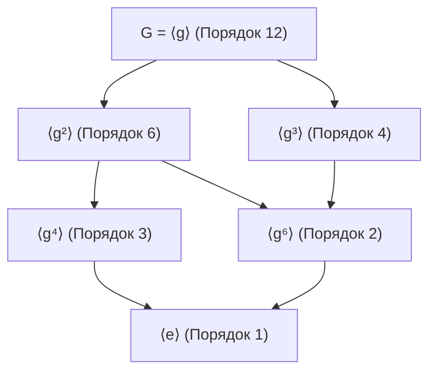

# Лекция: Подгруппы, гомоморфизмы и циклические группы

---

## Краткое содержание
* **Подгруппы**: определение, критерии (двухшаговый, одношаговый, критерий для конечных подмножеств), примеры. Группа обратимых элементов.
* **Прямое произведение групп**: определение операции и порядка элементов.
* **Гомоморфизмы и изоморфизмы**:
  * Определение, базовые свойства гомоморфизма.
  * Ядро ($\ker f$), нормальность ядра и критерий инъективности.
  * Образ ($\operatorname{Im} f$) и Первая теорема об изоморфизме (Теорема о гомоморфизме).
  * Примеры гомоморфизмов, гомоморфизм эвалюации (вычисления).
* **Порождение групп и задание соотношениями**:
  * Пересечение подгрупп.
  * Подгруппа, порожденная множеством $\langle X \rangle$ (внешнее и конструктивное определения).
  * Алгоритмический аспект: граф Кэли, генерация подгруппы и алгоритмическая неразрешимость проблемы тождества слов (Теорема Новикова — Бооне).
* **Циклические группы и порядок элемента**:
  * Порядок элемента $\operatorname{ord}(g)$: эквивалентные определения, связь с теоремой Лагранжа и теоремой Эйлера.
  * Формула порядка степени $\operatorname{ord}(g^k)$.
  * Полная классификация циклических групп: изоморфизм с $(\mathbb{Z}, +)$ или $(\mathbb{Z}_n, +)$.
  * Фундаментальная теорема о подгруппах циклической группы и решетка подгрупп.

---

## 1. Подгруппы и критерии подгруппы

> **Определение 1 (Подгруппа)**:
> Пусть $(G, \cdot)$ — группа. Непустое подмножество $H \subseteq G$ называется **подгруппой** группы $G$ (обозначается $H \le G$), если $H$ образует группу относительно индуцированной операции $\cdot$, то есть выполнены аксиомы:
> 1. $\forall a, b \in H \implies a \cdot b \in H$ *(замкнутость относительно операции)*;
> 2. $\forall a \in H \implies a^{-1} \in H$ *(замкнутость относительно взятия обратного)*;
> 3. $e \in H$ *(содержит нейтральный элемент группы $G$)*.

### Критерии подгруппы

> **Теорема (Критерии подгруппы)**:
> Пусть $G$ — группа, $H \subseteq G$, $H \neq \varnothing$. Следующие условия эквивалентны:
> 1. $H \le G$;
> 2. **Одношаговый критерий:** $\forall a, b \in H \implies a \cdot b^{-1} \in H$;
> 3. **Критерий для конечных подмножеств:** если $|H| < \infty$, то достаточно лишь замкнутости относительно умножения:
>    $$\forall a, b \in H \implies a \cdot b \in H \implies H \le G$$

**Доказательство критерия для конечных множеств:**
Пусть $H \subseteq G$ конечно и замкнуто по умножению. Возьмем произвольный $a \in H$. Рассмотрим последовательность элементов $\{a^1, a^2, a^3, \dots\} \subseteq H$. В силу конечности $H$ найдутся индексы $i < j$ такие, что $a^i = a^j$. Домножив на $(a^i)^{-1} \in G$, получаем:
$$a^{j-i} = e \implies e \in H \quad (\text{так как } j - i \ge 1)$$
Если $j - i = 1$, то $a = e$, и $a^{-1} = e \in H$.
Если $j - i > 1$, то $a \cdot a^{j-i-1} = e \implies a^{-1} = a^{j-i-1} \in H$.
Таким образом, $e \in H$ и $a^{-1} \in H$, то есть $H \le G$. $\blacksquare$

### Примеры подгрупп
1. **Аддитивные числовые подгруппы**:
   $$(n\mathbb{Z}, +) \le (\mathbb{Z}, +) \le (\mathbb{Q}, +) \le (\mathbb{R}, +) \le (\mathbb{C}, +)$$
2. **Группа движений (изометрий) евклидова пространства**:
   $$\operatorname{Isom}(\mathbb{R}^n) \le (\operatorname{Bij}(\mathbb{R}^n), \circ)$$
   где $\operatorname{Isom}(\mathbb{R}^n) = \{ f: \mathbb{R}^n \to \mathbb{R}^n \mid \|f(x) - f(y)\| = \|x - y\|,\; \forall x, y \in \mathbb{R}^n \}$.
3. **Группа вращений правильного $n$-угольника**:
   $$R_n = \langle r \mid r^n = e \rangle \le D_n$$
   где $D_n$ — группа диэдра порядка $2n$.
4. **Симметрическая и знакопеременная группы**:
   $$A_n = \{ \sigma \in S_n \mid \operatorname{sgn}(\sigma) = +1 \} \le S_n$$
5. **Группа обратимых элементов кольца (моноида)**:
   Пусть $(R, +, \cdot)$ — ассоциативное кольцо с единицей $1_R$. Множество его мультипликативно обратимых элементов образует группу по умножению:
   $$R^\times = \{ x \in R \mid \exists y \in R : x \cdot y = y \cdot x = 1_R \}$$
   *Пример:* для кольца вычетов $\mathbb{Z}_n$ группа $\mathbb{Z}_n^\times = \{ [k]_n \mid \gcd(k, n) = 1 \}$ имеет порядок $|\mathbb{Z}_n^\times| = \varphi(n)$ (функция Эйлера).

---

## 2. Прямое произведение групп

> **Определение 2 (Внешнее прямое произведение)**:
> Пусть $(G_1, \cdot_1)$ и $(G_2, \cdot_2)$ — группы. Их **прямым произведением** $G_1 \times G_2$ называется группа, состоящая из пар $(g_1, g_2)$, где $g_1 \in G_1, g_2 \in G_2$, с покомпонентной операцией:
> $$(a_1, a_2) \cdot (b_1, b_2) \coloneqq (a_1 \cdot_1 b_1,\; a_2 \cdot_2 b_2)$$

> 💡 **Свойства прямого произведения**:
> 1. Нейтральный элемент: $e_{G_1 \times G_2} = (e_{G_1}, e_{G_2})$.
> 2. Обратный элемент: $(g_1, g_2)^{-1} = (g_1^{-1}, g_2^{-1})$.
> 3. Порядок элемента: $\operatorname{ord}((g_1, g_2)) = \operatorname{lcm}(\operatorname{ord}(g_1), \operatorname{ord}(g_2))$.

---

## 3. Гомоморфизмы, изоморфизмы и теоремы о строении

> **Определение 3 (Гомоморфизм и изоморфизм)**:
> Пусть $(G_1, \cdot)$ и $(G_2, *)$ — группы.
> 1. Отображение $f: G_1 \to G_2$ называется **гомоморфизмом групп**, если оно сохраняет алгебраическую структуру:
>    $$f(a \cdot b) = f(a) * f(b) \quad \forall a, b \in G_1$$
> 2. Отображение $f: G_1 \to G_2$ называется **изоморфизмом групп** (обозначается $G_1 \cong G_2$), если $f$ — биективный гомоморфизм.

### Свойства гомоморфизма и ядро

> **Теорема 1 (Свойства гомоморфизма)**:
> Пусть $f: G_1 \to G_2$ — гомоморфизм групп. Тогда:
> 1. $f(e_{G_1}) = e_{G_2}$;
> 2. $f(a^{-1}) = \left(f(a)\right)^{-1}$ для любого $a \in G_1$;
> 3. $f(a^k) = \left(f(a)\right)^k$ для всех $k \in \mathbb{Z}$;
> 4. **Образ** $\operatorname{Im} f \coloneqq \{ f(x) \mid x \in G_1 \}$ является подгруппой в $G_2$ ($\operatorname{Im} f \le G_2$);
> 5. **Ядро** $\ker f \coloneqq \{ x \in G_1 \mid f(x) = e_{G_2} \}$ является **нормальной подгруппой** в $G_1$ ($\ker f \trianglelefteq G_1$);
> 6. **Критерий инъективности**: $f$ инъективен $\iff \ker f = \{ e_{G_1} \}$.

**Доказательство:**
1. $f(e_{G_1}) = f(e_{G_1} \cdot e_{G_1}) = f(e_{G_1}) * f(e_{G_1})$. Домножая на $(f(e_{G_1}))^{-1} \in G_2$, получаем $e_{G_2} = f(e_{G_1})$.
2. $e_{G_2} = f(e_{G_1}) = f(a \cdot a^{-1}) = f(a) * f(a^{-1}) \implies f(a^{-1}) = (f(a))^{-1}$.
3. Индукция по $k \in \mathbb{N}$; для $k < 0$ следует из свойства (2).
4. Проверим критерий подгруппы для $\ker f$:
   * $e_{G_1} \in \ker f$, так как $f(e_{G_1}) = e_{G_2}$.
   * Пусть $x, y \in \ker f$. Тогда $f(x \cdot y^{-1}) = f(x) * (f(y))^{-1} = e_{G_2} * e_{G_2}^{-1} = e_{G_2} \implies x \cdot y^{-1} \in \ker f$.
   * **Нормальность ядра**: пусть $x \in \ker f, g \in G_1$. Проверим сопряжение:
     $$f(g \cdot x \cdot g^{-1}) = f(g) * f(x) * f(g^{-1}) = f(g) * e_{G_2} * (f(g))^{-1} = f(g) * (f(g))^{-1} = e_{G_2}$$
     Следовательно, $g \cdot x \cdot g^{-1} \in \ker f$, то есть $\ker f \trianglelefteq G_1$.
5. Критерий инъективности:
   * $(\implies)$ Если $f$ инъективен, то из $f(x) = e_{G_2} = f(e_{G_1})$ сразу следует $x = e_{G_1}$.
   * $(\impliedby)$ Пусть $\ker f = \{ e_{G_1} \}$. Если $f(x) = f(y)$, то:
     $$f(x) * (f(y))^{-1} = e_{G_2} \implies f(x \cdot y^{-1}) = e_{G_2} \implies x \cdot y^{-1} \in \ker f = \{ e_{G_1} \} \implies x = y \quad \blacksquare$$

> 💡 **Продвинутый факт: Первая теорема об изоморфизме (Теорема о гомоморфизме Эмми Нётер)**:
> Для любого гомоморфизма групп $f: G_1 \to G_2$ факторгруппа по его ядру изоморфна образу:
> $$G_1 / \ker f \cong \operatorname{Im} f$$

### Примеры гомоморфизмов

1. **Каноническая факторизация**:
   $$\pi: (\mathbb{Z}, +) \to (\mathbb{Z}_n, +), \quad x \mapsto [x]_n, \quad \ker \pi = n\mathbb{Z}$$
2. **Китайская теорема об остатках (КТО)**:
   При $\gcd(m, n) = 1$:
   $$f: (\mathbb{Z}_{mn}, +) \xrightarrow{\sim} (\mathbb{Z}_m, +) \times (\mathbb{Z}_n, +), \quad [x]_{mn} \mapsto ([x]_m, [x]_n)$$
   В мультипликативной форме: $\mathbb{Z}_{mn}^\times \cong \mathbb{Z}_m^\times \times \mathbb{Z}_n^\times$.
3. **Знак перестановки**:
   $$\operatorname{sgn}: (S_n, \circ) \to (\{+1, -1\}, \cdot), \quad \ker(\operatorname{sgn}) = A_n \quad (\text{знакопеременная группа})$$
4. **Определитель матрицы**:
   $$\det: (\operatorname{GL}_n(\mathbb{R}), \cdot) \to (\mathbb{R} \setminus \{0\}, \cdot), \quad \ker(\det) = \operatorname{SL}_n(\mathbb{R}) \quad (\text{специальная линейная группа})$$
5. **Гомоморфизм эвалюации (вычисления в точке)**:
   * Для пространства функций $\mathcal{F}(X, \mathbb{R})$:
     $$\operatorname{ev}_{x_0}: \mathcal{F}(X, \mathbb{R}) \to \mathbb{R}, \quad f \mapsto f(x_0)$$
   * Для кольца многочленов $K[x]$:
     $$\operatorname{ev}_\alpha: K[x] \to K, \quad P(x) \mapsto P(\alpha)$$
     Ядро этого гомоморфизма $\ker(\operatorname{ev}_\alpha) = (x - \alpha)K[x]$ — идеал многочленов, делящихся на $(x - \alpha)$ (Теорема Безу).

---

## 4. Порождение групп и алгоритмические структуры

> **Лемма 1 (О пересечении подгрупп)**:
> Пусть $\{H_i\}_{i \in I}$ — произвольное (в том числе бесконечное) семейство подгрупп группы $G$. Тогда:
> $$\bigcap_{i \in I} H_i \le G$$

**Доказательство:**
1. Так как $e \in H_i$ для всех $i \in I$, нейтральный элемент принадлежит их пересечению: $e \in \bigcap H_i \neq \varnothing$.
2. Пусть $a, b \in \bigcap H_i$. Тогда $\forall i \in I: a, b \in H_i \implies a \cdot b^{-1} \in H_i$ (по критерию подгруппы для $H_i$).
3. Следовательно, $a \cdot b^{-1} \in \bigcap_{i \in I} H_i$, то есть пересечение является подгруппой. $\blacksquare$

> **Определение 4 (Порождающее множество)**:
> Пусть $G$ — группа, $X \subseteq G$.
> 1. **Подгруппа, порожденная множеством $X$** — наименьшая по включению подгруппа в $G$, содержащая $X$:
>    $$\langle X \rangle \coloneqq \bigcap_{\substack{H \le G \\ X \subseteq H}} H$$
> 2. **Конструктивное определение**:
>    $$\langle X \rangle = \left\{ x_1^{\varepsilon_1} x_2^{\varepsilon_2} \dots x_k^{\varepsilon_k} \;\middle|\; k \in \mathbb{N} \cup \{0\},\; x_i \in X,\; \varepsilon_i \in \{+1, -1\} \right\}$$
>    *(Множество всех редуцированных слов над алфавитом $X \cup X^{-1}$)*.

### Алгоритмический аспект: построение $\langle X \rangle$ и граф Кэли

В терминах структур данных порождение подгруппы конечным множеством образующих $X = \{g_1, \dots, g_m\}$ эквивалентно обходу в ширину (BFS) по графу Кэли $\Gamma(G, X)$:

```python
def generate_subgroup(generators, identity, mult_op, inv_op):
    """
    Генерирует конечное подмножество <X> алгоритмом насыщения (BFS).
    """
    subgroup = {identity}
    queue = [identity]
    
    # Расширенный алфавит: образующие и обратные к ним
    alphabet = list(generators) + [inv_op(g) for g in generators]
    
    while queue:
        current = queue.pop(0)
        for gen in alphabet:
            neighbor = mult_op(current, gen)
            if neighbor not in subgroup:
                subgroup.add(neighbor)
                queue.append(neighbor)
                
    return subgroup
```

> ⚠️ **Теоретическая сложность: Проблема равенства слов (Word Problem)**:
> Если группа задана образующими и соотношениями $G = \langle X \mid R \rangle$, возникает фундаментальная алгоритмическая задача: определить, равны ли два заданных слова $w_1, w_2$ в группе $G$ ($w_1 =_G w_2 \iff w_1 w_2^{-1} =_G e$).
> **Теорема Новикова — Бооне (1955)**: Проблема равенства слов в общем случае **алгоритмически неразрешима** (не существует единого алгоритма для произвольной конечно заданной группы).

---

## 5. Циклические группы и теория порядков

> **Определение 5 (Порядок элемента)**:
> Пусть $G$ — группа, $g \in G$.
> 1. Порядком элемента $g$ называется наименьшее натуральное число $n \in \mathbb{N}$ такое, что $g^n = e$. Обозначается $\operatorname{ord}(g) = n$ или $|g| = n$.
> 2. Если такого $n \in \mathbb{N}$ не существует, то $\operatorname{ord}(g) = \infty$.
> 3. **Эквивалентное тополого-алгебраическое свойство**: $\operatorname{ord}(g) = |\langle g \rangle|$.

### Фундаментальные свойства порядка

> **Теорема 2 (Свойства порядков элементов)**:
> Пусть $g \in G$, $\operatorname{ord}(g) = n < \infty$. Тогда:
> 1. $g^m = e \iff n \mid m$.
> 2. $g^k = g^m \iff k \equiv m \pmod n$.
> 3. **Порядок степени**: для любого $k \in \mathbb{Z}$:
>    $$\operatorname{ord}(g^k) = \frac{n}{\gcd(k, n)}$$
> 4. **Связь с порядком группы (Теорема Лагранжа)**:
>    Если группа $G$ конечна, то $\forall g \in G$:
>    $$\operatorname{ord}(g) \;\big|\; |G| \implies g^{|G|} = e$$

**Доказательство формулы порядка степени:**
Пусть $m = \operatorname{ord}(g^k)$. По свойству (1):
$$(g^k)^m = e \iff g^{km} = e \iff n \mid km \iff \frac{n}{\gcd(k, n)} \mathrel{\Big|} m \cdot \frac{k}{\gcd(k, n)}$$
Так как числа $\frac{n}{\gcd(k, n)}$ и $\frac{k}{\gcd(k, n)}$ взаимно просты, по лемме Евклида:
$$\frac{n}{\gcd(k, n)} \mathrel{\Big|} m$$
Наименьшим таким натуральным $m$ является $m = \frac{n}{\gcd(k, n)}$. $\blacksquare$

> 💡 **Следствия в теории чисел**:
> 1. **Малая теорема Ферма**: в группе $(\mathbb{Z}_p^\times, \cdot)$ порядка $p-1$ для любого $a \not\equiv 0 \pmod p$:
>    $$a^{p-1} \equiv 1 \pmod p$$
> 2. **Теорема Эйлера**: в группе $(\mathbb{Z}_n^\times, \cdot)$ порядка $\varphi(n)$ для любого $\gcd(a, n) = 1$:
>    $$a^{\varphi(n)} \equiv 1 \pmod n$$

---

## 6. Полная классификация и подгрупповая структура циклических групп

> **Теорема 3 (О классификации циклических групп)**:
> Всякая циклическая группа $G = \langle g \rangle$ с точностью до изоморфизма однозначно определяется своей мощностью:
> $$G \cong \begin{cases} (\mathbb{Z}, +), & \text{если } |G| = \infty, \\ (\mathbb{Z}_n, +), & \text{если } |G| = n < \infty. \end{cases}$$

> **Теорема 4 (Фундаментальная теорема о подгруппах циклической группы)**:
> Пусть $G = \langle g \rangle$ — циклическая группа порядка $n$. Тогда:
> 1. Всякая подгруппа $H \le G$ является **циклической**.
> 2. Для каждого делителя $d \mid n$ существует **ровно одна** подгруппа порядка $d$. Она порождается элементом $g^{n/d}$:
>    $$H_d = \left\langle g^{n/d} \right\rangle, \quad |H_d| = d$$
> 3. Количество образующих (элементов порядка $n$) в циклической группе $G$ в точности равно значению функции Эйлера $\varphi(n)$:
>    $$\langle g^k \rangle = G \iff \gcd(k, n) = 1$$


*Диаграмма Хассе: решетка подгрупп циклической группы $\mathbb{Z}_{12}$, изоморфная решетке делителей числа 12.*