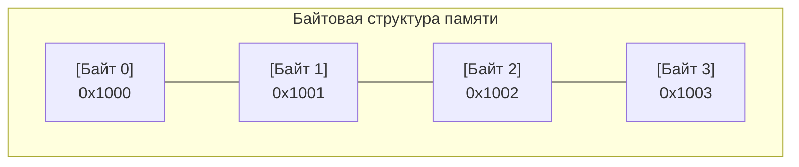
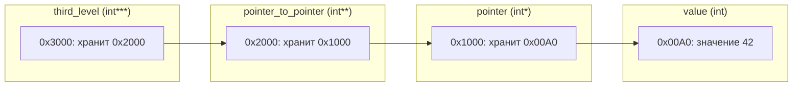
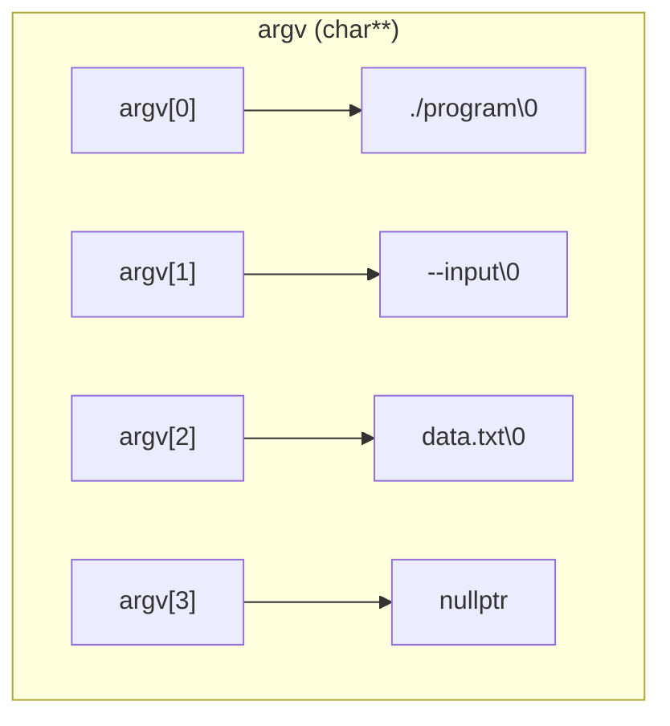
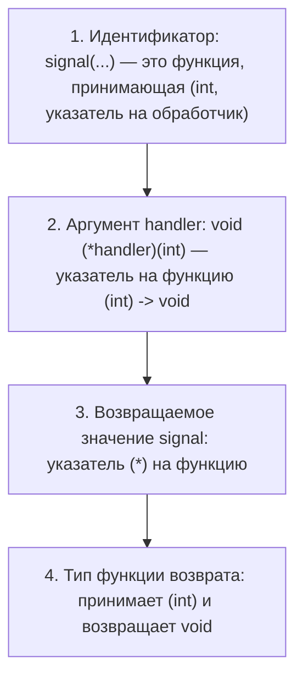

# Лекция 3: Указатели, массивы и строки

---

### Краткое содержание
1. **Указатели и адреса памяти**: виртуальная память, байтовая адресация, унарные операторы `&` и `*`, многоуровневая косвенность, константность указателей, `nullptr` против `NULL`, висячие указатели (*dangling pointers*).
2. **Передача объектов по указателю**: сравнение семантики передачи по значению и по адресу, реализация функции `swap`.
3. **Массивы и адресная арифметика**: непрерывное размещение в памяти, деградация массива в указатель (*array decay*), исключения из decay (`sizeof`, `&`, `decltype`), полуинтервалы `[begin, end)` и *one-past-the-end*.
4. **C-строки (Null-terminated strings)**: внутреннее устройство, литералы памяти `rodata` против стековых массивов, алгоритмы вычисления длины и сравнения, аргументы командной строки `argc` / `argv`.
5. **Универсальный указатель `void*` и представление памяти**: нетипизированные адреса, побайтовый анализ объектов, порядок байтов (*Endianness*: Little-endian vs Big-endian).
6. **Указатели на функции**: синтаксис определения, функции высшего порядка и компараторы, парсинг сложных объявлений (на примере `signal`).

---

## 1. Указатели и адресация памяти

В современной модели памяти процесс оперирует линейным виртуальным адресным пространством. Память разбита на дискретные адресуемые единицы — байты (октеты), каждый из которых имеет уникальный порядковый номер (адрес).



> **Определение 1 (Указатель)**:  
> **Указатель** (*pointer*) — переменная скалярного типа, значением которой является адрес некоторой ячейки памяти либо специальное нулевое значение.

### 1.1. Базовые операторы `&` и `*`

- **Оператор взятия адреса `&`** (*address-of*): унарный оператор, применимый к $lvalue$-выражениям. Возвращает адрес области памяти, где размещен объект.
- **Оператор разыменования `*`** (*dereference / indirection*): унарный оператор, предоставляющий доступ по чтению или записи к значению, находящемуся по указанному адресу.

```cpp
#include <iostream>

int main() {
    int x = 42;
    int *ptr = &x; // ptr хранит адрес переменной x

    std::cout << "Адрес x: " << ptr << '\n';
    std::cout << "Значение x через ptr: " << *ptr << '\n';

    *ptr = 100; // Мутация значения x по адресу
    std::cout << "Новое значение x: " << x << '\n'; // 100
}
```

### 1.2. Адрес самого указателя и многоуровневая косвенность

Указатель сам является объектом первого класса и занимает память в стеке или куче. Следовательно, к указателю применим оператор `&`, возвращающий указатель на указатель ($T**$).



```cpp
int value = 42;
int *pointer = &value;
int **pointer_to_pointer = &pointer;
int ***third_level = &pointer_to_pointer;

***third_level = 10; // Эквивалентно: value = 10;
```

### 1.3. Квалификатор `const` для указателей

При связывании указателей и модификатора `const` выделяют три ортогональных случая:

1. **Указатель на константу (`const T*` / `T const*`)**:  
   Запрещает мутацию целевого объекта через данный указатель. Сам указатель может быть перенаправлен на другой адрес.
2. **Константный указатель (`T* const`)**:  
   Адрес, хранящийся в указателе, неизменяем после инициализации. Значение адресуемого объекта модифицировать разрешено.
3. **Константный указатель на константу (`const T* const`)**:  
   Запрещены как изменение адреса, так и мутация данных по адресу.

```cpp
int a = 10, b = 20;

const int *p1 = &a; // Указатель на константу
// *p1 = 15;        // ОШИБКА: read-only location
p1 = &b;            // Корректно

int * const p2 = &a; // Константный указатель
*p2 = 15;            // Корректно
// p2 = &b;          // ОШИБКА: assignment of read-only variable

const int * const p3 = &a; // Полный запрет изменений
```

### 1.4. Нулевые указатели: `nullptr`, `0` и `NULL`

> **Определение 2 (`nullptr`)**:  
> `nullptr` — ключевое слово стандарта C++11, обозначающее литерал нулевого указателя строгого типа `std::nullptr_t`. В отличие от целочисленного макроса `NULL` (определяемого как `0` или `(void*)0`), `nullptr` безопасно участвует в перегрузке функций.

```cpp
#include <iostream>

void handle(int *ptr) { std::cout << "Pointer overload\n"; }
void handle(int val)  { std::cout << "Integer overload\n"; }

int main() {
    handle(nullptr); // Однозначно вызывает handle(int*)
    handle(0);       // Однозначно вызывает handle(int)
    // handle(NULL); // ОШИБКА компиляции: неоднозначность (ambiguous call)
}
```

### 1.5. Висячие указатели (*Dangling Pointers*) и время жизни

> ⚠️ **Критическое замечание:**  
> Указатель не управляет временем жизни (*storage duration*) адресуемого объекта. Разыменование указателя на объект, время жизни которого завершилось, является **Undefined Behavior (UB)**.

```cpp
int* make_dangling() {
    int local = 100;
    return &local; // ОШИБКА: local уничтожается при выходе из функции
}

void dangerous_usage() {
    int *ptr = make_dangling();
    // *ptr = 50; // Неопределенное поведение (запись в инвалидированный стек)
}
```

---

## 2. Передача объектов через указатели

По умолчанию в языке C/C++ аргументы в функцию передаются **по значению** (*pass-by-value*) — внутри функции создаются локальные копии переданных сущностей.

Чтобы функция могла модифицировать переменные вызывающего контекста, передают их адреса (указатели):

```cpp
void swap(int *left, int *right) {
    if (left == nullptr || right == nullptr) return;
    int temp = *left;
    *left = *right;
    *right = temp;
}

int main() {
    int a = 1, b = 2;
    swap(&a, &b);
    // Теперь a == 2, b == 1
}
```

---

## 3. Массивы и адресная арифметика

> **Определение 3 (Массив)**:  
> **Массив** — непрерывный блок памяти, состоящий из $N$ однотипных элементов типа $T$, зафиксированный на этапе компиляции (для статических массивов).

### 3.1. Преобразование массива в указатель (*Array-to-Pointer Decay*)

В большинстве выражений имя массива неявно преобразуется в указатель на его нулевой элемент:

$$\text{Array } A \text{ of type } T[N] \xrightarrow{\text{decay}} T* \quad (\&A[0])$$

```cpp
int arr[3] = {10, 20, 30};
int *p = arr; // Decay: arr -> &arr[0]
```

**Случаи, когда деградация (Decay) НЕ происходит:**
1. Под оператором `sizeof(arr)`: возвращает полный размер массива $N \cdot \operatorname{sizeof}(T)$ в байтах.
2. Под унарным оператором `&arr`: возвращает указатель на массив целиком $T(*)[N]$.
3. В выражении `decltype(arr)`: выводится точный тип массива `int[N]`.
4. При связывании со ссылкой: `int (&ref)[3] = arr;`.

```cpp
int values[3] = {10, 20, 30};

std::cout << sizeof(values) << '\n';      // 12 байт (3 * 4)
std::cout << sizeof((int*)values) << '\n'; // 8 байт (размер указателя на x86-64)

int (*ptr_to_array)[3] = &values; // Указатель на массив из 3 элементов
```

### 3.2. Адресная арифметика и индексация

> **Теорема 1 (Правило смещения адреса)**:  
> Для указателя $p$ типа $T*$ и целого числа $k \in \mathbb{Z}$, адрес смещенного указателя вычисляется как:
> 
> $$\operatorname{addr}(p \pm k) = \operatorname{addr}(p) \pm k \cdot \operatorname{sizeof}(T)$$

Оператор индексации $a[i]$ формально эквивалентен разыменованию смещенного указателя:

$$a[i] \iff *(a + i) \iff *(i + a) \iff i[a]$$

### 3.3. Диапазоны и *One-Past-The-End*

Стандарт гарантирует корректность получения адреса ячейки, следующей непосредственно за последним элементом массива (позиция *one-past-the-end*). Это позволяет организовывать полуинтервалы $[begin, end)$:

```cpp
int data[4] = {1, 2, 3, 4};
int *begin = data;
int *end = data + 4; // Валидный адрес для сравнения, но НЕ для разыменования

for (int *curr = begin; curr != end; ++curr) {
    std::cout << *curr << ' ';
}
```

> ⚠️ **Замечание:**  
> Разыменование `*end` или вычисление адреса дальше, чем `end + 0` (например, `end + 1`), является немедленным *Undefined Behavior*.

---

## 4. C-строки (Null-Terminated Strings)

> **Определение 4 (C-строка)**:  
> **C-строка** — это массив символов типа `char`, содержащий значащие символы и оканчивающийся служебным терминатором `'\0'` (нулевой байт со значением `0x00`).

```
Строка: "Code"
Память: ['C'] ['o'] ['d'] ['e'] ['\0']
Индексы:  0     1     2     3     4
Длина строки = 4; Размер в памяти = 5 байт.
```

### 4.1. Строковые литералы против символьных массивов

- **Строковый литерал** (`const char* s = "Hello";`) располагается в сегменте данных только для чтения (`.rodata`). Попытка записи в него вызывает падение программы (`SIGSEGV`).
- **Символьный массив** (`char s[] = "Hello";`) аллоцируется на стеке и копирует байты из `.rodata`. Его элементы можно изменять.

```cpp
const char *literal = "Hello";
// literal[0] = 'h'; // UB: попытка записи в .rodata

char array[] = "Hello";
array[0] = 'h'; // Корректно: изменяется локальный массив на стеке
```

### 4.2. Алгоритмы обхода и сравнения C-строк

**1. Вычисление длины (`strlen`):**
```cpp
size_t string_length(const char *str) {
    const char *end = str;
    while (*end != '\0') {
        ++end;
    }
    return static_cast<size_t>(end - str);
}
```

**2. Лексикографическое сравнение (`strcmp`):**
```cpp
int string_compare(const char *lhs, const char *rhs) {
    while (*lhs != '\0' && *lhs == *rhs) {
        ++lhs;
        ++rhs;
    }
    return static_cast<unsigned char>(*lhs) - static_cast<unsigned char>(*rhs);
}
```

### 4.3. Аргументы командной строки (`argc`, `argv`)

Точка входа программы принимает параметры запуска операционной системы:

```cpp
int main(int argc, char *argv[])
```
- `argc` (*argument count*): количество переданных параметров (включая имя бинарного файла).
- `argv` (*argument vector*): массив указателей на нуль-терминированные C-строки ($argv[0], \dots, argv[argc-1]$). При этом $argv[argc] == \text{nullptr}$.



---

## 5. Универсальный указатель `void*` и побайтовая модель памяти

### 5.1. Тип `void*`

`void*` — указатель на нетипизированную область памяти. Он хранит «сырой» адрес без информации о типе и размере лежащего по нему объекта.

**Свойства `void*`:**
- Не допускает прямого разыменования (`*p` $\to$ ошибка).
- Не поддерживает адресную арифметику по стандарту ISO C/C++.
- Для работы требует явного приведения типа (в C++ через `static_cast<T*>` или `reinterpret_cast<T*>`).

### 5.2. Побайтовое представление объектов и порядок байтов (*Endianness*)

Для побайтового анализа произвольного объекта память приводят к указателю на `unsigned char*` или `std::byte*`:

```cpp
#include <iostream>
#include <iomanip>

void dump_bytes(const void *object_ptr, size_t size) {
    const auto *bytes = static_cast<const unsigned char*>(object_ptr);
    for (size_t i = 0; i < size; ++i) {
        std::cout << "0x" << std::hex << std::setw(2) << std::setfill('0')
                  << static_cast<int>(bytes[i]) << ' ';
    }
    std::cout << '\n';
}

int main() {
    uint32_t val = 0x12345678;
    dump_bytes(&val, sizeof(val));
}
```

> **Определение 5 (Endianness)**:  
> - **Little-Endian** (младший байт по младшему адресу): число `0x12345678` в памяти лежит как `78 56 34 12` (архитектуры x86, ARM по умолчанию).
> - **Big-Endian** (старший байт по младшему адресу): число `0x12345678` в памяти лежит как `12 34 56 78` (сетевые протоколы, некоторые RISC-процессоры).

---

## 6. Указатели на функции (Function Pointers)

Функции в скомпилированном бинарном файле размещаются в сегменте кода (`.text`). Адрес точки входа в функцию можно сохранить в указатель на функцию.

### 6.1. Синтаксис объявления и вызова

Общая форма объявления указателя на функцию:

$$\text{Возвращаемый\_тип } (*\text{Имя\_указателя})(\text{Типы\_параметров});$$

```cpp
#include <iostream>

int add(int a, int b) { return a + b; }
int multiply(int a, int b) { return a * b; }

int main() {
    // Объявление указателя на функцию, принимающую (int, int) и возвращающую int
    int (*operation)(int, int) = &add; // '&' опционален

    std::cout << operation(3, 4) << '\n'; // 7 (неявное разыменование)
    
    operation = multiply;
    std::cout << (*operation)(3, 4) << '\n'; // 12 (явное разыменование)
}
```

### 6.2. Функции высшего порядка и компараторы

Указатели на функции позволяют передавать предикаты и критерии упорядочивания в обобщенные алгоритмы:

```cpp
#include <iostream>

using Comparator = bool (*)(int, int);

bool ascending(int a, int b)  { return a < b; }
bool descending(int a, int b) { return a > b; }

int select_extreme(const int *arr, size_t size, Comparator cmp) {
    int extreme = arr[0];
    for (size_t i = 1; i < size; ++i) {
        if (cmp(arr[i], extreme)) {
            extreme = arr[i];
        }
    }
    return extreme;
}

int main() {
    int data[] = {7, 2, 9, 1, 5};
    size_t n = sizeof(data) / sizeof(data[0]);

    std::cout << "Min: " << select_extreme(data, n, ascending) << '\n';  // 1
    std::cout << "Max: " << select_extreme(data, n, descending) << '\n'; // 9
}
```

### 6.3. Разбор сложных объявлений типов (Clockwise/Spiral Rule)

При чтении сложных сигнатур C/C++ применяется правило «изнутри наружу» (по спирали от идентификатора):

**Разбор классической функции `signal` из POSIX/C Standard Library:**

```cpp
void (*signal(int sig, void (*handler)(int)))(int);
```



С использованием псевдонимов типов (`using` / `typedef`) объявление факторизуется до очевидного:

```cpp
using SigHandler = void (*)(int);
SigHandler signal(int sig, SigHandler handler);
```