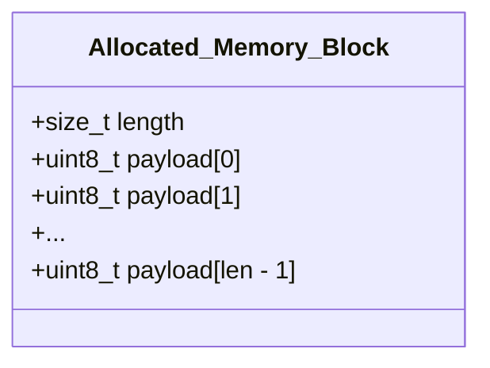

# Лекция 4: Пользовательские типы данных: Структуры, Объединения и Выравнивание памяти

### Содержание лекции
1. **Структуры (`struct`)**: синтаксис, способы объявления, теги, синонимы типов (`typedef`).
2. **Инициализация и операции над структурами**: позиционная инициализация, *designated initializers*, копирование, семантика передачи в функции.
3. **Модель памяти и выравнивание (*Memory Alignment & Padding*)**: естественное выравнивание, внутренние и хвостовые паддинги, макрос `offsetof`, упакованные структуры (`#pragma pack`, `__attribute__((packed))`).
4. **Битовые поля (*Bit-fields*)**: синтаксис, упаковка флагов, неименованные поля, ограничения стандарта.
5. **Гибкие массивы (*Flexible Array Members*, FAM)**: динамическое выделение памяти для структур переменной длины.
6. **Объединения (`union`)**: перекрытие памяти, каламбур типизации (*Type Punning*), размеченные объединения (*Tagged Unions / Algebraic Data Types*).
7. **Перечисления (`enum`)**: целочисленные константы, правила типизации.
8. **Рекурсивные структуры и неполные типы (*Incomplete Types*)**: паттерн непрозрачного указателя (*Opaque Pointer*), организация связных структур данных.

---

## 1. Структуры данных (`struct`)

> **Определение 1 (Структура)**:  
> **Структура (`struct`)** в языке C — это составной пользовательский тип данных, представляющий собой упорядоченный набор разнородных элементов фиксированного размера, называемых *полями* (*members/fields*), расположенных в последовательных областях памяти.

### 1.1. Синтаксис объявления и связывание пространств имён

В языке C имя структуры помещается в отдельное пространство имён тегов (`struct tag`). Объявление структуры не вводит самостоятельный тип в глобальное пространство идентификаторов без использования ключевого слова `struct` или директивы `typedef`.

```c
// 1. Объявление типа с тегом
struct Point {
    double x;
    double y;
};

// Переменная объявляется только с префиксом struct
struct Point p1;

// 2. Создание синонима типа через typedef
typedef struct Point Point_t;
Point_t p2;

// 3. Идиоматическое совмещенное объявление
typedef struct Node {
    int value;
    struct Node* next; // Внутри используется тег struct Node
} Node;
```

---

## 2. Инициализация и операции над структурами

### 2.1. Способы инициализации

Начиная со стандарта C99, поддерживаются *именованные инициализаторы* (*Designated Initializers*):

```c
struct Config {
    int port;
    const char* host;
    bool tls_enabled;
    int timeout_ms;
};

// Позиционная инициализация (чувствительна к перестановке полей)
struct Config c1 = {8080, "127.0.0.1", true, 5000};

// Именованная инициализация (Designated Initializer, C99)
struct Config c2 = {
    .host = "0.0.0.0",
    .port = 443,
    .tls_enabled = true
    // timeout_ms не указан -> гарантированно инициализируется нулем (0)
};

// Анонимные составные литералы (Compound Literals)
struct Config* cfg_ptr = &(struct Config){ .port = 80, .host = "localhost" };
```

### 2.2. Допустимые и недопустимые операции

1. **Доступ к полям**:
   - Прямой доступ: `.` (высший приоритет оператора).
   - Косвенный доступ через указатель: `ptr->field` $\iff$ `(*ptr).field`.
2. **Присваивание (`=`)**:
   - Выполняет побайтовое / почленное копирование (*shallow copy*). Если поле является указателем, копируется сам адрес, а не буфер, на который он указывает.
3. **Сравнение (`==`, `!=`)**:
   - ⚠️ **Запрещено на уровне языка**. Компилятор не генерирует операторы сравнения для структур, так как в паддинг-байтах может содержаться неинициализированный мусор, что делает `memcmp` некорректным без предварительного обнуления памяти структуры (`memset`).

---

## 3. Модель памяти: Выравнивание (*Alignment*) и Заполнение (*Padding*)

### 3.1. Принцип естественного выравнивания

> **Определение 2 (Выравнивание)**:  
> **Требование выравнивания (*Alignment Requirement*)** — это ограничение аппаратной архитектуры, требующее, чтобы адрес памяти $A$, по которому расположен объект типа $T$, удовлетворял условию:
> $$A \equiv 0 \pmod{\operatorname{alignof}(T)}$$
> где $\operatorname{alignof}(T)$ — базовое выравнивание типа в байтах (как правило, $\operatorname{alignof}(T) = \operatorname{sizeof}(T)$ для примитивных скалярных типов на архитектурах x86-64 / ARM64).

Если данные расположены по невыровненному адресу, процессор выполняет несколько циклов шины памяти для чтения одного значения либо генерирует аппаратное исключение (`SIGBUS` / Unaligned Access Fault).

### 3.2. Правила вычисления размера структуры

Для структуры $S = \{f_1, f_2, \dots, f_n\}$, где поле $f_i$ имеет размер $s_i = \operatorname{sizeof}(f_i)$ и выравнивание $a_i = \operatorname{alignof}(f_i)$:

1. **Смещение поля**: Смещение $\operatorname{offset}(f_1) = 0$. Каждое следующее поле $f_{i}$ размещается по наименьшему смещению $\operatorname{offset}(f_i) \ge \operatorname{offset}(f_{i-1}) + s_{i-1}$, такому что:
   $$\operatorname{offset}(f_i) \equiv 0 \pmod{a_i}$$
   Разность между смещением и концом предыдущего поля заполняется неиспользуемыми байтами (*Internal Padding*).

2. **Выравнивание структуры**:
   $$\operatorname{alignof}(S) = \max_{1 \le i \le n} \left( a_i \right)$$

3. **Итоговый размер структуры (*Trailing Padding*)**:
   Итоговый размер структуры $\operatorname{sizeof}(S)$ дополняется в конце так, чтобы быть кратным общему выравниванию структуры $\operatorname{alignof}(S)$. Это необходимо для корректного выравнивания элементов в массивах $S\text{ arr}[N]$:
   $$\operatorname{sizeof}(S) \equiv 0 \pmod{\operatorname{alignof}(S)}$$

### 3.3. Пример анализа выравнивания

Рассмотрим структуру:

```c
struct Unoptimized {
    char a;      // 1 байт  [offset: 0]
                 // 3 байта Padding
    int b;       // 4 байта [offset: 4]
    char c;      // 1 байт  [offset: 8]
                 // 7 байт  Padding
    double d;    // 8 байт  [offset: 16]
};               // Итоговый размер: 24 байта (alignof = 8)
```

Схема распределения памяти в `struct Unoptimized`:

```
Offset:  0   1   2   3   4   5   6   7   8   9  10  11  12  13  14  15  16              23
Bytes:  [a] [  PAD  ]   [       b       ]   [c] [       PAD         ]   [       d       ]
```

Оптимизированная перестановка полей (по убыванию выравнивания):

```c
struct Optimized {
    double d;    // 8 байт  [offset: 0]
    int b;       // 4 байта [offset: 8]
    char a;      // 1 байт  [offset: 12]
    char c;      // 1 байт  [offset: 13]
                 // 2 байта Trailing Padding (до кратности 8)
};               // Итоговый размер: 16 байт (alignof = 8)
```

```
Offset:  0               7   8  9  10 11  12  13  14  15
Bytes:  [       d       ]   [     b     ]   [a] [c] [PAD]
```

### 3.4. Инструменты инспекции и управления памятью

- Макрос `offsetof(type, member)` из `<stddef.h>`: вычисляет смещение поля в байтах.
- `_Alignof` / `alignof` и `_Alignas` / `alignas` (из `<stdalign.h>` в C11).
- Директивы упаковки (*Packed Structs*):

```c
#include <stddef.h>
#include <stdio.h>

// Отключение выравнивания (специфично для GCC/Clang)
struct __attribute__((__packed__)) RawHeader {
    uint8_t  id;
    uint32_t length;
}; // sizeof = 5 байт, alignof = 1

// Альтернативный кроссплатформенный синтаксис MSVC/GCC
#pragma pack(push, 1)
struct PacketHeader {
    uint8_t  flags;
    uint16_t seq;
}; // sizeof = 3 байта
#pragma pack(pop)
```

> ⚠️ **Замечание:**  
> Разыменование указателя на невыровненное поле внутри `packed`-структуры на архитектурах с жестким выравниванием (ARM, SPARC, MIPS) приводит к аппаратному сбою `Bus Error` (`SIGBUS`). На архитектуре x86/x86-64 это вызывает падение производительности на уровне кэш-линий L1/L2.

---

## 4. Битовые поля (*Bit-fields*)

> **Определение 3 (Битовое поле)**:  
> **Битовое поле** — это поле структуры с явно заданной битовой шириной, позволяющее упаковывать несколько переменных в один машинный элемент памяти (*storage unit*).

```c
struct TCPHeaderFlags {
    unsigned int fin : 1;
    unsigned int syn : 1;
    unsigned int rst : 1;
    unsigned int psh : 1;
    unsigned int ack : 1;
    unsigned int urg : 1;
    unsigned int reserved : 2; // Дополнение до байта
    unsigned int : 0;          // Принудительный переход на границу следующего int
    unsigned int next_word : 16;
};
```

### Ограничения стандарта на битовые поля:
1. К битовому полю **запрещено** применять оператор взятия адреса `&` (так как адрес адресует байт, а не отдельный бит).
2. Запрещено использовать `sizeof` и `alignof` относительно битовых полей.
3. Порядок упаковки битов внутри машинного слова (LSB-first или MSB-first) не регламентируется стандартом и зависит от *Endianness* и соглашений компилятора (*Implementation-defined behavior*).

---

## 5. Гибкие массивы (*Flexible Array Members*, FAM)

Начиная со стандарта C99, разрешено объявлять структуру с открытым массивом на конце для реализации буферов переменного размера без лишних уровней косвенности.

```c
typedef struct {
    size_t length;
    uint8_t payload[]; // Flexible Array Member (размер не указан)
} Message;
```

### Правила использования:
1. Поле FAM должно быть **строго последним** в структуре.
2. В структуре должно быть хотя бы одно именованное поле перед FAM.
3. `sizeof(Message)` возвращает размер структуры без учета массива `payload` (с учетом необходимого хвостового выравнивания).

### Паттерн выделения и освобождения памяти:

```c
Message* create_message(const uint8_t* data, size_t len) {
    // Выделение памяти под заголовок + динамические данные
    Message* msg = malloc(sizeof(Message) + len * sizeof(uint8_t));
    if (!msg) return NULL;

    msg->length = len;
    memcpy(msg->payload, data, len);
    return msg;
}

void destroy_message(Message* msg) {
    free(msg); // Однократное освобождение всей области памяти
}
```



---

## 6. Объединения (`union`)

> **Определение 4 (Объединение)**:  
> **Объединение (`union`)** — это составной тип данных, все поля которого располагаются по **одному и тому же базовому адресу памяти**. Размер объединения равен размеру его наибольшего поля, округленному вверх до кратного общему выравниванию `union`.

$$\operatorname{sizeof}(U) = \operatorname{align\_up}\left(\max_{i} \operatorname{sizeof}(f_i), \max_{i} \operatorname{alignof}(f_i)\right)$$

### 6.1. Каламбур типизации (*Type Punning*)

В стандарте C (в отличие от C++) разрешено выполнять запись в одно поле `union`, а чтение — из другого для низкоуровневой инспекции битового представления:

```c
typedef union {
    float f;
    uint32_t raw_bits;
    struct {
        uint32_t mantissa : 23;
        uint32_t exponent : 8;
        uint32_t sign     : 1;
    } ieee754;
} FloatInspector;

void print_float_bits(float val) {
    FloatInspector fi = { .f = val };
    printf("Sign: %u, Exp: 0x%X, Mantissa: 0x%X\n", 
           fi.ieee754.sign, fi.ieee754.exponent, fi.ieee754.mantissa);
}
```

### 6.2. Размеченные объединения (*Tagged Union / Discriminated Union*)

Поскольку сам `union` не хранит информацию о том, какое именно поле сейчас активно, его используют в комбинации с перечислением (`enum`):

```c
typedef enum {
    TYPE_INT,
    TYPE_FLOAT,
    TYPE_STRING
} ValueType;

typedef struct {
    ValueType type; // Дискриминатор (тэг типа)
    union {
        int64_t as_int;
        double  as_float;
        char*   as_str;
    } data;         // Анонимный или именованный union
} DynamicValue;

void print_value(const DynamicValue* val) {
    switch (val->type) {
        case TYPE_INT:    printf("%ld\n", val->data.as_int); break;
        case TYPE_FLOAT:  printf("%f\n",  val->data.as_float); break;
        case TYPE_STRING: printf("%s\n",  val->data.as_str); break;
    }
}
```

---

## 7. Перечисления (`enum`)

> **Определение 5 (Перечисление)**:  
> **Перечисление (`enum`)** задает множество целочисленных констант. В C значения типа `enum` не образуют изолированной строгой системы типов и неявно приводятся к типу `int`.

```c
enum HttpStatus {
    HTTP_OK = 200,
    HTTP_BAD_REQUEST = 400,
    HTTP_FORBIDDEN = 403,
    HTTP_NOT_FOUND = 404,
    HTTP_INTERNAL_ERROR = 500
};

// Автоматическая инкрементация
enum Flags {
    FLAG_A = 1 << 0, // 1
    FLAG_B = 1 << 1, // 2
    FLAG_C = 1 << 2  // 4
};
```

---

## 8. Неполные типы и инкапсуляция (*Opaque Pointers*)

Структура не может содержать поле своего же типа по значению, так как $\operatorname{sizeof}(S)$ становится бесконечным. Однако структура может содержать **указатель на саму себя** (*самоссылающаяся структура*):

```c
typedef struct ListNode {
    void* data;
    struct ListNode* next; // Корректно: размер указателя известен
} ListNode;
```

### Паттерн непрозрачного указателя (*Opaque Pointer / Handle*)

Используется для достижения строгой инкапсуляции и сокрытия деталей реализации в API библиотек:

```c
// === Файл: vector.h (публичный интерфейс) ===
#ifndef VECTOR_H
#define VECTOR_H

// Неполный тип (Incomplete type): клиент знает о существовании типа, но не о полях
typedef struct Vector Vector;

Vector* vector_create(size_t capacity);
void    vector_push(Vector* vec, int item);
void    vector_destroy(Vector* vec);

#endif

// === Файл: vector.c (приватная реализация) ===
#include "vector.h"
#include <stdlib.h>

struct Vector {
    int* data;
    size_t size;
    size_t capacity;
};

Vector* vector_create(size_t capacity) {
    Vector* v = malloc(sizeof(Vector));
    v->data = malloc(sizeof(int) * capacity);
    v->size = 0;
    v->capacity = capacity;
    return v;
}

void vector_destroy(Vector* vec) {
    free(vec->data);
    free(vec);
}
```

---

## 9. Сводная сравнительная таблица составных типов

| Характеристика | `struct` | `union` | `enum` |
| :--- | :--- | :--- | :--- |
| **Выделение памяти** | Раздельная память под каждое поле | Общая память под все поля | Как правило, $\operatorname{sizeof}(\text{int})$ |
| **Формула размера** | $\ge \sum \operatorname{sizeof}(\text{fields})$ (+ padding) | $\max(\operatorname{sizeof}(\text{fields}))$ (+ trailing pad) | $\operatorname{sizeof}(\text{int})$ |
| **Базовый адрес полей** | Возрастает монотонно | Одинаков для всех полей | — |
| **Одновременный доступ** | Ко всем полям независимо | Только к одному активному полю | К именованной константе |
| **Основное назначение** | Агрегация разнородных данных | Экономия памяти / полиморфизм | Символьные константы / состояния |