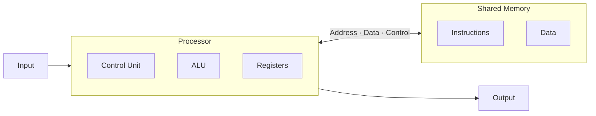
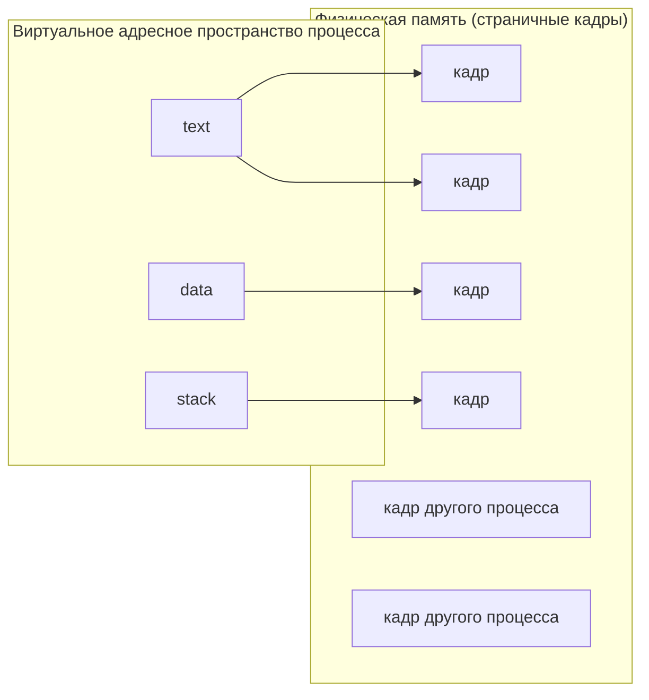
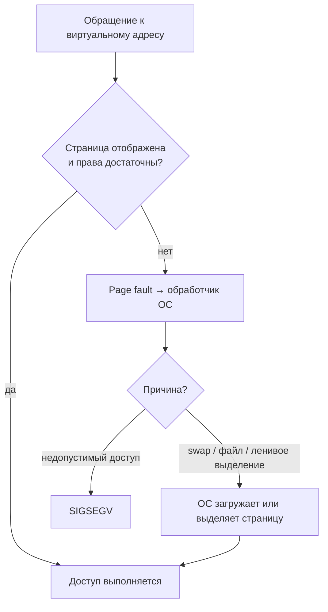
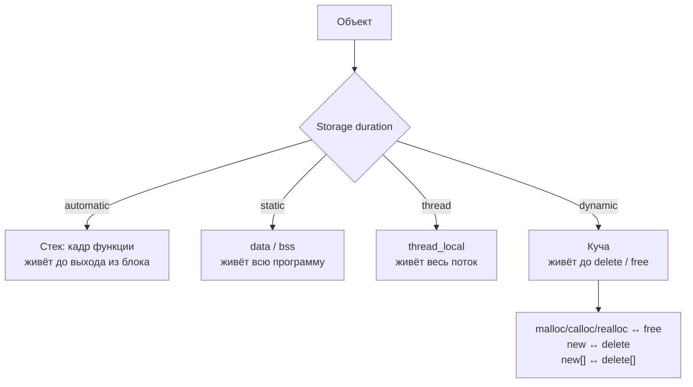

# Лекция 5: Работа с памятью

> Источник: [is-itmo-c-26.github.io — Лекция 5. Работа с памятью](https://is-itmo-c-26.github.io/lectures/lectures/05-memory.html) · [слайды](https://is-itmo-c-26.github.io/lectures/slides/lectures/05-memory.html) · [интерактивная схема вызова функции](https://is-itmo-c-26.github.io/lectures/assets/05-memory/stack-demo/index.html)

### Содержание лекции
1. **Аппаратная модель**: архитектура фон Неймана, иерархия памяти.
2. **Процессы, потоки и виртуальная память**: адресное пространство, таблицы страниц, *page fault*.
3. **Адресное пространство процесса**: сегменты `text`, `rodata`, `data`, `bss`, heap, stack; различия ОС и платформ; карта памяти запущенного процесса.
4. **Стек вызовов**: кадр стека, соглашения о вызовах, регистры x86-64, пошаговый разбор вызова функции на ассемблере.
5. **Длительность хранения (*storage duration*)**: automatic, static, thread, dynamic; `static` у локальной переменной.
6. **Куча**: `malloc` / `calloc` / `realloc` / `free`, `new` / `delete`, правила парности, *placement new*.
7. **Ошибки работы с памятью**: неопределённое поведение, `SIGSEGV`, выход за границы, *use-after-free*, *double free*, *use-after-scope*, разыменование `nullptr`, утечки, переполнение стека.
8. **Санитайзеры**: AddressSanitizer и UndefinedBehaviorSanitizer.

**Ключевые вопросы лекции:**
- Где именно в памяти лежат код, литералы, глобальные, локальные и динамические объекты и почему?
- Что происходит со стеком и регистрами при вызове функции?
- Чем отличаются время жизни объекта и область видимости имени?
- Как правильно выделять и освобождать динамическую память и какие ошибки при этом возникают?
- Почему «программа не упала» ничего не доказывает?

---

## 1. Аппаратная модель

### 1.1. Архитектура фон Неймана

> **Определение 1 (Архитектура фон Неймана)**:
> Архитектура вычислительной машины, в которой **команды и данные хранятся в одной общей памяти** и передаются процессору по общим шинам (адреса, данных, управления).

Компоненты:
- **Процессор**: устройство управления (*Control Unit*), арифметико-логическое устройство (*ALU*), регистры.
- **Общая память**: содержит и инструкции, и данные.
- **Ввод** и **вывод**.



> 💡 **Интуиция:** раз код — это тоже байты в памяти, у функции есть адрес (это пригодится в § 3.4), а защиту «код нельзя менять, данные нельзя исполнять» обеспечивают не сами байты, а **права доступа к страницам** (§ 2.2).

### 1.2. Иерархия памяти

> **Утверждение (Иерархия памяти)**: чем ближе память к ядру процессора, тем обычно **меньше её объём и задержка доступа**.

| Уровень | Примерный порядок объёма | Где находится |
|---|---|---|
| Регистры | сотни B — единицы KiB | Набор регистров одного ядра |
| Кеш L1 | десятки — сотни KiB | Обычно на ядро; команды и данные раздельно |
| Кеш L2 | сотни KiB — единицы MiB | На ядро или группу ядер |
| Кеш L3 (если есть) | единицы — сотни MiB | Общий для группы ядер или процессора |
| RAM | единицы — сотни GiB | Оперативная память компьютера |
| SSD | сотни GiB — единицы TiB | Постоянное хранилище |

---

## 2. Процессы, потоки и виртуальная память

### 2.1. Процессы и потоки

> **Определение 2 (Процесс)**:
> **Процесс** — выполняющаяся программа, обладающая **независимым адресным пространством** и собственными объектами ядра ОС (файловые дескрипторы, объекты синхронизации и т. д.).

> **Определение 3 (Поток)**:
> **Поток** (*thread*) — единица выполнения внутри процесса. Потоки одного процесса:
> - **разделяют** адресное пространство: код, глобальные данные, динамическую память;
> - имеют **собственный стек** и **контекст выполнения** (регистры, позиция выполнения).

При переключении потоков ОС **сохраняет и восстанавливает контекст**. Так, два потока одного процесса могут поочерёдно выполняться на одном ядре.

> ⚠️ **Замечание:** собственный стек потока **не изолирован** от других потоков того же процесса: имея указатель на объект в чужом стеке, другой поток может к нему обратиться. Изоляция есть только между процессами.

### 2.2. Виртуальная память и таблицы страниц

> **Определение 4 (Виртуальная память)**:
> Процесс оперирует **виртуальными адресами**, создающими «иллюзию» обладания всей памятью. Память разбита на **страницы**; ОС задаёт отображение виртуальных страниц в физические и **права доступа** к ним в **таблицах страниц** (*page tables*), а процессор использует эти таблицы для перевода виртуальных адресов в физические.

Следствия:
- Один и тот же виртуальный адрес в **двух разных процессах** может указывать на **разные** страницы RAM.
- Общая память и файлы могут отображаться **сразу в несколько процессов**.
- Соседние виртуальные страницы не обязаны быть соседними физически; часть физических страниц принадлежит другим процессам.



> ⚠️ **Замечание:** **размер адресного пространства $\neq$ объём RAM**. Часть адресов не отображена или защищена, а запрос на выделение памяти может завершиться неудачей.

### 2.3. Если страницы нет в памяти: page fault

> **Определение 5 (Page fault)**:
> **Page fault** — исключение процессора при обращении к странице, которая сейчас **недоступна** или **не допускает запрошенную операцию** (например, запись в страницу только для чтения).

ОС выясняет причину:

| Причина | Действие ОС |
|---|---|
| **Swap**: страница выгружена на диск | Возвращает её в RAM |
| **Отображение файла**: содержимое ещё не загружено | Читает нужную часть файла |
| **Ленивое выделение**: адреса зарезервированы, физическая память ещё не выдана | Предоставляет физическую страницу при первом обращении |
| **Недопустимый доступ**: нет отображения или нужного права | На Linux процесс обычно получает сигнал `SIGSEGV` |



> 💡 **Интуиция:** если ОС смогла обеспечить доступ, выполнение просто продолжается. **Page fault сам по себе не означает ошибку программы** — это штатный механизм работы виртуальной памяти.

---

## 3. Адресное пространство процесса

### 3.1. Разделение адресного пространства между ядром и пользователем

Виртуальное адресное пространство делится на **пространство ядра** и **пользовательское пространство**. Это **диапазоны виртуальных адресов, а не установленная RAM**.

| Платформа | Разделение |
|---|---|
| Linux · x86 32-bit (пример) | 3 / 1: пользователь — 3 GiB ($75\%$), ядро — 1 GiB ($25\%$) |
| Windows · x86 32-bit (по умолчанию) | 2 / 2: пользователь — 2 GiB, ядро — 2 GiB |
| Linux / Windows · x86-64 | Адреса ядра сверху, пользовательские снизу, между ними — широкий неиспользуемый промежуток |
| macOS · ARM64 | Аналогично: отдельные диапазоны адресов ядра и пользователя |

Для 32-битной архитектуры всё адресное пространство имеет размер $2^{32}\ \text{B} = 4\ \text{GiB}$; для 64-битных конкретные границы зависят от ОС и конфигурации.

### 3.2. Адресное пространство процесса Linux: 32-битная схема

Пример для Linux x86 с разделением 3 / 1 (размеры областей схематичны). Адреса растут **вверх**:

```text
0xffffffff ┌──────────────────────────────┐
           │ Kernel · 1 GiB               │  недоступно пользовательскому коду
0xc0000000 ├──────────────────────────────┤ ─┐
           │ Stack            ↓           │  │ растёт к младшим адресам
           ├──────────────────────────────┤  │
           │ (unmapped)                   │  │
           ├──────────────────────────────┤  │
           │ File and library mappings    │  │ файловые и анонимные отображения,
           │                              │  │ в т.ч. разделяемые библиотеки
           ├──────────────────────────────┤  │
           │ (unmapped)                   │  │ User space · 3 GiB
           ├──────────────────────────────┤  │
           │ Heap             ↑           │  │ растёт к старшим адресам
           ├──────────────────────────────┤  │
           │ bss    · zero-initialized    │  │ rw-: глобальные и static
           │ data   · initialized data    │  │ rw-: глобальные и static
           │ rodata · read-only data      │  │ r--: константы, строковые литералы
           │ text   · code                │  │ r-x: машинный код
           ├──────────────────────────────┤  │
           │ Unmapped                     │  │
0x00000000 └──────────────────────────────┘ ─┘
```

**Области памяти на схеме (сверху вниз):**
- **Kernel** — область ядра ОС.
- **Stack** — стек потока.
- **File and library mappings** — отображения файлов, библиотек и анонимные отображения.
- **Heap** — классическая область кучи.
- **bss** — данные с начальным нулевым значением.
- **data** — данные с заданными начальными значениями.
- **rodata** — данные только для чтения, в том числе строковые литералы.
- **text** — машинный код.
- **Unmapped** — промежутки без отображения.

**От чего зависит реальная раскладка:**
- **ОС и формат исполняемого файла**: ELF в Linux, Mach-O в macOS, PE в Windows.
- **Архитектура и ABI**: разрядность адресов, выравнивание и соглашения платформы.
- **Сборка и запуск**: компоновщик, загрузчик, библиотеки, аллокатор и ASLR (*Address Space Layout Randomization* — рандомизация расположения областей при каждом запуске).

> ⚠️ **Замечание:**
> - Стеков и областей динамической памяти может быть **несколько** (например, по стеку на поток). Аллокатор может использовать и heap, и отдельные отображения.
> - **Секции файла** (`text`, `rodata`, `data`, `bss`) и **области адресного пространства** — разные уровни описания: секции — это части исполняемого файла, а загрузчик отображает их в сегменты памяти.

### 3.3. Что где лежит: типичная схема Linux / ELF

| Объект | Пример | Область | Типичные права |
|---|---|---|---|
| Машинный код | Тело функции | `text` | `r-x` |
| Строковые литералы | `"Hello world"` | `rodata` | `r--` |
| Глобальные данные с ненулевым значением | `int counter = 42;` | `data` | `rw-` |
| Глобальные данные с начальным нулём | `int total;` | `bss` | `rw-` |
| Динамический объект | `new int{42}` | heap / анонимное отображение | `rw-` |
| Локальный объект (если он в памяти) | `int local;` | stack | `rw-` |
| Библиотеки и отображённые файлы | Результат `mmap` | Отдельные отображения | Зависит от области |

Обозначения: `r` — чтение, `w` — запись, `x` — исполнение. Права задаются **страницам**; несколько секций файла могут попасть в один сегмент.

> 💡 **Интуиция:** у глобальной переменной без инициализатора (`int total;`) значение гарантированно нулевое. Хранить нули в исполняемом файле бессмысленно, поэтому `bss` в файле описывается только размером, а загрузчик выделяет под неё обнулённые страницы.

### 3.4. Адреса объектов и функции

**Пример** (`memory-addresses.cpp`): печатаем адреса объектов из разных областей.

```cpp
#include <cstdio>
#include <print>
#include <unistd.h> // POSIX (Linux/macOS): getpid, not standard C++.

const double pi = 3.141592653589793;
int initialized_global = 42;
int zero_initialized_global;

void some_function() {}

int main() {
    int local = 0;
    const char* text = "Hello world";
    int* dynamic = new int{42};

    std::println("Process ID: {}", static_cast<long>(getpid()));
    std::println("Constant: {}", static_cast<const void*>(&pi));
    std::println("Initialized global: {}", static_cast<void*>(&initialized_global));
    std::println("Zero-initialized global: {}", static_cast<void*>(&zero_initialized_global));
    std::println("String literal: {}", static_cast<const void*>(text));
    // POSIX supports converting a function pointer to void*.
    std::println("Function: {}", reinterpret_cast<void*>(&some_function));
    std::println("Local variable: {}", static_cast<void*>(&local));
    std::println("Dynamic object: {}", static_cast<void*>(dynamic));
    std::println("Press Enter to exit.");
    std::getchar();
    delete dynamic;
}
```

> ⚠️ **Замечание:**
> - Указатель на объект приводится к `void*` через `static_cast`, а указатель на **функцию** — только через `reinterpret_cast`: стандарт C++ не гарантирует такое преобразование, но POSIX его поддерживает.
> - `std::getchar()` нужен, чтобы процесс не завершился и его карту памяти можно было посмотреть извне.

### 3.5. Карта памяти запущенного процесса

Пока программа ждёт Enter, в другом терминале по её PID (здесь $31707$) можно посмотреть карту памяти:

| ОС | Команда |
|---|---|
| Linux | `cat /proc/31707/maps` |
| macOS | `vmmap -interleaved 31707` |
| Windows | `vmmap.exe -p 31707` (утилита Sysinternals VMMap, открывает карту в окне) |

**Пример:** фрагмент карты того же запуска на Mac (ARM64):

```text
Область       Начало       Конец        Права
__TEXT        10089c000    1008c0000    r-x
__DATA        1008c4000    1008c8000    rw-
MALLOC_TINY   100f58000    101358000    rw-
Stack         16ed68000    16f564000    rw-
```

Вывод программы:

```text
Process ID: 31707
Constant: 0x1008b8a18
Initialized global: 0x1008c4000
Zero-initialized global: 0x1008c4004
String literal: 0x1008bbc96
Function: 0x10089c670
Local variable: 0x16f561bf8
Dynamic object: 0x100f69bb0
Press Enter to exit.
```

Сопоставление адресов с диапазонами $[\text{начало}, \text{конец})$ (конец не включён):

| Объект | Адрес | Диапазон |
|---|---|---|
| `some_function` | `0x10089c670` | `__TEXT` (`r-x`) |
| `pi`, строковый литерал | `0x1008b8a18`, `0x1008bbc96` | `__TEXT` (константы в Mach-O лежат в сегменте `__TEXT`, без права записи) |
| `initialized_global`, `zero_initialized_global` | `0x1008c4000`, `0x1008c4004` | `__DATA` (`rw-`) |
| `*dynamic` | `0x100f69bb0` | `MALLOC_TINY` (`rw-`) |
| `local` | `0x16f561bf8` | `Stack` (`rw-`) |

> ⚠️ **Замечание:** при новом запуске PID и адреса изменятся (в том числе из-за ASLR).

---

## 4. Стек вызовов

### 4.1. Пример: передача аргументов и результата

**Пример** (`function-call.cpp`):

```cpp
int add(int a, int b) {
    int result = a + b;
    return result;
}

int main() {
    int a = 40;
    int b = 2;
    int answer = add(a, b);
    return answer;
}
```

Ассемблер x86-64 (синтаксис Intel, без оптимизаций, Compiler Explorer):

```nasm
"add(int, int)":
        push    rbp
        mov     rbp, rsp
        mov     DWORD PTR [rbp-20], edi
        mov     DWORD PTR [rbp-24], esi
        mov     edx, DWORD PTR [rbp-20]
        mov     eax, DWORD PTR [rbp-24]
        add     eax, edx
        mov     DWORD PTR [rbp-4], eax
        mov     eax, DWORD PTR [rbp-4]
        pop     rbp
        ret
"main":
        push    rbp
        mov     rbp, rsp
        sub     rsp, 16
        mov     DWORD PTR [rbp-4], 40
        mov     DWORD PTR [rbp-8], 2
        mov     edx, DWORD PTR [rbp-8]
        mov     eax, DWORD PTR [rbp-4]
        mov     esi, edx
        mov     edi, eax
        call    "add(int, int)"
        mov     DWORD PTR [rbp-12], eax
        mov     eax, DWORD PTR [rbp-12]
        leave
        ret
```

### 4.2. Кадр стека

> **Определение 6 (Кадр стека, *stack frame*)**:
> **Кадр стека** — область стека, хранящая данные **одного вызова функции** и информацию для возврата к вызывающей функции.

| Характеристика | Описание |
|---|---|
| **Содержимое** | Локальные и временные значения, стековые аргументы, адрес возврата, служебные данные (например, сохранённые регистры) |
| **Размер** | Зависит от данных функции, выравнивания, платформы и оптимизаций |
| **Время жизни** | На время вызова; при возврате место освобождается для повторного использования |

> **Определение 7 (Соглашение о вызовах, *calling convention*)**:
> Часть ABI, определяющая, **как передаются аргументы и результат** (через регистры или стек, в каком порядке) и **кто очищает стек** от аргументов.

**Примеры для 32-битного x86 (MSVC):**

| Соглашение | Передача аргументов | Кто освобождает место под аргументы |
|---|---|---|
| `cdecl` | В стек справа налево | Вызывающая функция |
| `stdcall` | В стек справа налево | Вызываемая функция |
| `fastcall` | Первые два подходящих аргумента — через регистры, остальные в стек справа налево | Вызываемая функция |

> ⚠️ **Замечание:**
> - **Порядок передачи $\neq$ порядок вычисления** выражений аргументов: соглашение о вызовах не определяет, в каком порядке вычисляются `f(g(), h())`.
> - На x86-64 действуют другие соглашения: **System V AMD64** (Linux, macOS) и **Microsoft x64** (Windows).
> - В MSVC x86 `fastcall` «подходят» первые два аргумента размером не больше DWORD (4 байта) из допустимых категорий типов; структуры передаются через стек.
> - «Очистка» означает освобождение места под стековые аргументы (сдвиг указателя стека), а **не стирание байтов**.

### 4.3. Регистры x86-64

> **Определение 8 (Регистр)**:
> **Регистр** — небольшое хранилище внутри процессора. Префикс `R…` обозначает 64-битный регистр, `E…` — его младшие 32 бита (например, `EAX` — младшая половина `RAX`).

| Регистр | Название | Роль в нашем листинге |
|---|---|---|
| `RDI` / `EDI` | Destination Index | Первый аргумент `a = 40` |
| `RSI` / `ESI` | Source Index | Второй аргумент `b = 2` |
| `RDX` / `EDX` | Data | Временное значение: `b` в `main`, `a` в `add` |
| `RAX` / `EAX` | Accumulator | Операнд сложения и результат $42$ |
| `RSP` | Stack Pointer | Адрес текущей вершины стека |
| `RBP` | Base Pointer | Опорный адрес кадра функции |
| `RIP` | Instruction Pointer | Адрес следующей исполняемой инструкции |

Названия исторические; фактическое назначение зависит от инструкции и ABI. Здесь используется **System V AMD64**: первые два целочисленных аргумента передаются в `EDI` / `ESI`, результат типа `int` возвращается в `EAX`.

> 💡 **Интуиция:** запись в 32-битную часть (`EAX`, `EDX`, …) **обнуляет старшие 32 бита** соответствующего 64-битного регистра.

### 4.4. Вызов функции по шагам

Стек на x86-64 **растёт к младшим адресам**: `push` уменьшает `RSP` на $8$, `pop` увеличивает. Адреса ниже условные (как в интерактивной схеме лекции); в начале `RSP = 0x1008`, `RBP = 0x1080`.

**Пролог `main`:**

| Шаг | Инструкция | Эффект |
|---|---|---|
| 0 | — | Вход в `main`: адрес возврата в вызывающий код уже лежит в стеке по адресу `0x1008` |
| 1 | `push rbp` | `RSP` $\leftarrow$ `RSP` $- 8 =$ `0x1000`; прежний `RBP` (`0x1080`) сохранён в стеке |
| 2 | `mov rbp, rsp` | `RBP` $\leftarrow$ `0x1000` — опорный адрес кадра `main` |
| 3 | `sub rsp, 16` | `RSP` $\leftarrow$ `0xff0`: резерв $16$ байт под `a`, `b`, `answer` и выравнивание; значения пока не заданы |

**Тело `main` до вызова:**

| Шаг | Инструкция | Эффект |
|---|---|---|
| 4 | `mov DWORD PTR [rbp-4], 40` | `a` (адрес `0xffc`) $\leftarrow 40$ — 4 байта под `int` |
| 5 | `mov DWORD PTR [rbp-8], 2` | `b` (адрес `0xff8`) $\leftarrow 2$ |
| 6 | `mov edx, DWORD PTR [rbp-8]` | `EDX` $\leftarrow 2$ |
| 7 | `mov eax, DWORD PTR [rbp-4]` | `EAX` $\leftarrow 40$ |
| 8 | `mov esi, edx` | `ESI` $\leftarrow 2$ — второй аргумент |
| 9 | `mov edi, eax` | `EDI` $\leftarrow 40$ — первый аргумент |
| 10 | `call add` | В стек кладётся **адрес следующей инструкции** (`0xfe8`), `RSP` $\leftarrow$ `0xfe8`; управление передаётся `add` |

**Функция `add`:**

| Шаг | Инструкция | Эффект |
|---|---|---|
| 11 | `push rbp` | Сохранён `RBP` функции `main` (`0x1000`); `RSP` $\leftarrow$ `0xfe0` |
| 12 | `mov rbp, rsp` | `RBP` $\leftarrow$ `0xfe0` — опорный адрес кадра `add` |
| 13 | `mov DWORD PTR [rbp-20], edi` | Копия аргумента `a` $= 40$ по адресу `0xfcc` |
| 14 | `mov DWORD PTR [rbp-24], esi` | Копия аргумента `b` $= 2$ по адресу `0xfc8` |
| 15 | `mov edx, DWORD PTR [rbp-20]` | `EDX` $\leftarrow 40$ (здесь `EDX` хранит `a`) |
| 16 | `mov eax, DWORD PTR [rbp-24]` | `EAX` $\leftarrow 2$ (здесь `EAX` — сначала `b`) |
| 17 | `add eax, edx` | `EAX` $\leftarrow 2 + 40 = 42$ |
| 18 | `mov DWORD PTR [rbp-4], eax` | `result` (адрес `0xfdc`) $\leftarrow 42$ |
| 19 | `mov eax, DWORD PTR [rbp-4]` | `EAX` $\leftarrow 42$ — возвращаемое значение |
| 20 | `pop rbp` | `RBP` $\leftarrow$ `0x1000` (восстановлен `RBP` `main`), `RSP` $\leftarrow$ `0xfe8`; локальные слоты `add` больше не используются |
| 21 | `ret` | Адрес возврата снимается со стека, `RSP` $\leftarrow$ `0xff0`; управление возвращается в `main` |

**Завершение `main`:**

| Шаг | Инструкция | Эффект |
|---|---|---|
| 22 | `mov DWORD PTR [rbp-12], eax` | `answer` (адрес `0xff4`) $\leftarrow 42$ |
| 23 | `mov eax, DWORD PTR [rbp-12]` | `EAX` $\leftarrow 42$ — код возврата `main` |
| 24 | `leave` (1/2) | `RSP` $\leftarrow$ `RBP` $=$ `0x1000`: локальная область `main` снята со стека; **байты не обнуляются** |
| 25 | `leave` (2/2) | `RBP` $\leftarrow$ `0x1080` (как `pop rbp`), `RSP` $\leftarrow$ `0x1008` |
| 26 | `ret` | `main` возвращает $42$ через `EAX`; программа завершится с кодом $42$ |

Состояние стека после шага 18 (внутри `add`, адреса растут вверх):

```text
адрес   содержимое                           кадр
0x1008  адрес возврата из main               main
0x1000  сохранённый RBP (0x1080)             main   ← RBP(main)
0x0ffc  a = 40                               main
0x0ff8  b = 2                                main
0x0ff4  answer = ?                           main
0x0ff0  выравнивание                         main
0x0fe8  адрес возврата → «mov [rbp-12], eax» add
0x0fe0  сохранённый RBP (0x1000)             add    ← RSP = RBP(add)
0x0fdc  result = 42                          add    (red zone)
0x0fcc  a — копия аргумента = 40             add    (red zone)
0x0fc8  b — копия аргумента = 2              add    (red zone)
```

> **Определение 9 (Red zone)**:
> В ABI System V AMD64 **red zone** — область размером до $128$ байт **ниже** `RSP`, которую функция может использовать без сдвига `RSP`. Поэтому `add` (не вызывающая других функций) не выполняет `sub rsp, …`: `result` и копии аргументов лежат ниже вершины стека.

> 💡 **Интуиция:**
> - Пара `push rbp` / `mov rbp, rsp` — **пролог**, `pop rbp` (или `leave`) + `ret` — **эпилог** функции. `leave` $\equiv$ `mov rsp, rbp` + `pop rbp`.
> - Цепочка сохранённых `RBP` связывает кадры в список — так отладчик строит стек вызовов.
> - После возврата байты кадра остаются в памяти, но **объектов там больше нет**; это и есть причина ошибки *use-after-scope* (§ 7.7).

---

## 5. Длительность хранения

> **Определение 10 (Длительность хранения, *storage duration*)**:
> **Storage duration** — свойство объекта, описывающее, **как долго существует память** для него.

| Вид | Пример объявления | Как долго существует память |
|---|---|---|
| **Automatic** | Обычная локальная переменная | До выхода из её блока |
| **Static** | Глобальная переменная или локальная `static` | На протяжении работы программы |
| **Thread** | Переменная `thread_local` | На протяжении работы соответствующего потока |
| **Dynamic** | Объект, созданный обычным `new` | До освобождения выделенной памяти |

> ⚠️ **Замечание:** это **категории языка C++**. Стек и куча — лишь **типичные способы реализации** хранения: automatic $\to$ стек (или регистры), static $\to$ `data` / `bss`, dynamic $\to$ куча.

### 5.1. Область видимости и хранение

Область видимости (*scope*) — свойство **имени**, длительность хранения — свойство **объекта**; это независимые понятия.

> **Утверждение**: модификатор `static` у **локальной** переменной означает, что она **инициализируется один раз** и **сохраняет значение между вызовами** функции. При этом её **имя по-прежнему доступно только внутри блока**, где она объявлена.

**Пример** (`automatic-and-static.cpp`):

```cpp
#include <print>

void visit() {
    int automatic_count = 0;
    static int static_count = 0;
    ++automatic_count;
    ++static_count;
    std::println("{} {}", automatic_count, static_count);
}

int main() {
    visit();
    visit();
}
```

Вывод:

```text
1 1
1 2
```

`automatic_count` создаётся заново при каждом вызове, а `static_count` живёт всю программу и накапливает значение.

---

## 6. Куча (heap)

### 6.1. Зачем нужна динамическая память

> **Определение 11 (Динамический объект)**:
> Объект с **dynamic storage duration** создаётся явным запросом программы во время выполнения и существует **до явного освобождения** памяти.

Свойства:
- Динамический объект может **пережить выход из функции**, которая его создала.
- Его **размер можно выбрать во время выполнения**.
- **Освобождение должно быть предусмотрено программой** (позже изучим средства, которые берут его на себя).

> ⚠️ **Замечание:** размер объекта — **не главное** отличие: даже один `int` может требовать динамического времени жизни.

> ⚠️ **Замечание (омонимия):** **куча** (*heap*) как область динамической памяти и **куча** как структура данных (например, двоичная куча для очереди с приоритетом) — **разные понятия**. Совпадение названий не означает, что динамическая память организована в виде такой структуры.

### 6.2. Объект переживает создавшую его функцию

**Пример** (`dynamic-lifetime.cpp`):

```cpp
#include <print>

int* make_value() {
    int* value = new int{42};
    return value;
}

int main() {
    int* value = make_value();
    std::println("{}", *value);
    delete value;
}
```

Локальная **переменная-указатель** `value` в `make_value` исчезает при возврате (automatic). Созданный через `new` **объект остаётся** (dynamic); функция возвращает **копию его адреса**. Освобождение выполняет вызывающий код.

### 6.3. Функции работы с памятью из `<cstdlib>`

| Функция | Что делает |
|---|---|
| `malloc(size)` | Выделяет `size` байт **без инициализации** содержимого |
| `calloc(count, size)` | Выделяет $\text{count} \times \text{size}$ байт и **обнуляет** их |
| `realloc(pointer, size)` | Меняет размер блока; **может переместить** его |
| `free(pointer)` | Освобождает блок; `free(nullptr)` ничего не делает |

> ⚠️ **Замечание:**
> - Для ненулевого запрошенного размера **ошибка выделения** означает возврат `nullptr`.
> - Если `realloc` завершился неудачей, **старый блок остаётся выделенным**: его указатель нельзя терять. Поэтому результат `realloc` записывают во временную переменную:
>
> ```cpp
> int* bigger = static_cast<int*>(std::realloc(values, 8 * sizeof(int)));
> if (bigger == nullptr) {
>     std::free(values); // старый блок всё ещё наш
>     return 1;
> }
> values = bigger;
> ```

### 6.4. `malloc`: выделение и освобождение

**Пример** (`malloc-array.cpp`):

```cpp
#include <print>
#include <cstdlib>

int main() {
    int* values = static_cast<int*>(std::malloc(4 * sizeof(int)));
    if (values == nullptr) {
        return 1;
    }

    for (int index = 0; index < 4; ++index) {
        values[index] = index * index;
        std::println("values[{}] = {}", index, values[index]);
    }
    std::free(values);
}
```

- В C++, в отличие от C, результат `malloc` (`void*`) **явно** преобразуем в `int*`.
- Память `malloc` не инициализирована: **перед чтением элементов записываем в них значения**.

### 6.5. Правила проверки и освобождения

> **Утверждение (Правила работы с `malloc` / `free`)**:
> 1. Если выделение не удалось, `malloc` возвращает `nullptr` — результат нужно проверять.
> 2. Память освобождается через `std::free` **ровно один раз**.
> 3. `std::free(nullptr)` ничего не делает.
> 4. После освобождения указатель **нельзя разыменовывать**. Присваивание `nullptr` одной переменной **не исправляет другие копии** указателя.

### 6.6. `free` не обнуляет указатель

**Пример** (`free-and-nullptr.cpp`):

```cpp
#include <cstdlib>
#include <print>

int main() {
    int* pointer = static_cast<int*>(std::malloc(sizeof(int)));
    if (pointer == nullptr) {
        return 1;
    }
    *pointer = 42;
    std::println("Before free: {}", *pointer);

    std::free(pointer); // Releases the block; pointer is now dangling.
    pointer = nullptr;  // Explicit assignment, not an effect of free.

    std::println("pointer == nullptr: {}", pointer == nullptr);
    std::free(pointer); // free(nullptr) does nothing.
}
```

> **Определение 12 (Висячий указатель, *dangling pointer*)**:
> Указатель, хранящий адрес объекта, время жизни которого уже закончилось (память освобождена или объект вышел из области видимости).

`free` освобождает блок, но **не присваивает** переменной `pointer` значение `nullptr` и **не гарантирует обнуления байтов** блока. После `free` указатель висячий; следующей строкой мы **явно** присваиваем ему `nullptr`, после чего повторный `free` безопасен.

### 6.7. `calloc`

**Пример** (`calloc-array.cpp`):

```cpp
#include <print>
#include <cstdlib>

int main() {
    int* values = static_cast<int*>(std::calloc(4, sizeof(int)));
    if (values == nullptr) {
        return 1;
    }

    for (int index = 0; index < 4; ++index) {
        std::println("values[{}] = {}", index, values[index]);
    }
    std::free(values);
}
```

`calloc` получает **количество элементов** и **размер одного элемента**, затем обнуляет выделенные байты. Для массива `int` это даёт нулевые значения, поэтому чтение без предварительной записи здесь корректно.

### 6.8. Указатель и объект: разные адреса и размеры

**Пример** (`pointer-and-object.cpp`):

```cpp
#include <print>
#include <cstdlib>

int main() {
    int local = 0;
    int* pointer = static_cast<int*>(std::malloc(sizeof(int)));
    if (pointer == nullptr) {
        return 1;
    }
    *pointer = 42;

    std::println("local: size={}, address={}", sizeof(local), static_cast<void*>(&local));
    std::println("pointer: size={}, address={}", sizeof(pointer), static_cast<void*>(&pointer));
    std::println("*pointer: size={}, address={}", sizeof(*pointer), static_cast<void*>(pointer));
    std::println("value={}", *pointer);
    std::free(pointer);
}
```

| Выражение | Что это | Где лежит |
|---|---|---|
| `&pointer` | Адрес **переменной-указателя** | Стек |
| `pointer` | Адрес **выделенного объекта** | Куча |
| `sizeof(pointer)` | Размер указателя (обычно $8$ байт на 64-битной платформе) | — |
| `sizeof(*pointer)` | Размер объекта типа `int` (обычно $4$ байта) | — |

### 6.9. `new` и `delete`

**Пример** (`new-delete.cpp`):

```cpp
int main() {
    int* value = new int;
    delete value;

    int* array = new int[10];
    delete[] array;

    return 0;
}
```

| Выражение | Начальное значение |
|---|---|
| `new int` | Не определено; до чтения нужна запись |
| `new int{}` | $0$ |
| `new int{42}` | $42$ |

- `delete` освобождает **одиночный объект**, `delete[]` — **массив**.
- При неудаче выделения обычный `new` **не возвращает `nullptr`**, а бросает исключение `std::bad_alloc` (исключения разберём позже).

### 6.10. `new`/`delete` или `malloc`/`free`: какой способ выбрать

| Выделение | Освобождение |
|---|---|
| `malloc`, `calloc`, `realloc` | `free` |
| `new T` | `delete` |
| `new T[n]` | `delete[]` |

> **Утверждение (Правило парности)**: способ освобождения **определяется способом выделения**. Смешивание пар (`free` для `new`, `delete` для `malloc`, `delete` для `new[]` и т. п.) приводит к **неопределённому поведению**.

- `malloc` подходит, если нужен просто **блок памяти заданного размера**, без вызова конструкторов.
- `new T` **выделяет память и создаёт объект** типа `T`.
- При работе с C API способ освобождения задаёт **контракт библиотеки** (например, функция вида `lib_free(...)`).
- Для обычных задач C++ позже изучим **контейнеры** и средства **автоматического владения** памятью.

### 6.11. Placement new

> **Определение 13 (Placement new)**:
> Форма `new (address) T{...}`, которая **создаёт объект типа `T` в уже имеющейся памяти** по адресу `address`, не выделяя новую память. Требует `#include <new>`.

Сценарий: память для точек резервируем заранее; когда появляется новая точка, создаём её в выбранном слоте без отдельного выделения.

**Пример** (`placement-new.cpp`):

```cpp
#include <new>
#include <print>

struct Point {
    int x;
    int y;
};

int main() {
    alignas(Point) unsigned char pool[2 * sizeof(Point)];
    Point* first = new (pool) Point{10, 20};
    Point* second = new (pool + sizeof(Point)) Point{30, 40};
    std::println("First: ({}, {}); second: ({}, {})",
                 first->x, first->y, second->x, second->y);

    // The first point is no longer needed: reuse its slot.
    first = new (pool) Point{50, 60};
    std::println("New first: ({}, {})", first->x, first->y);
    // No delete: both objects occupy the automatic buffer pool.
}
```

`new (pool) Point{50, 60}` создаёт новую точку **на месте прежней**: память слота используется повторно.

**Размер, выравнивание и освобождение:**
- Буфер вмещает две точки: $2 \cdot \texttt{sizeof(Point)}$ байт; `alignas(Point)` обеспечивает нужное **выравнивание** (массив `unsigned char` сам по себе выровнен только на $1$).
- Второй слот начинается через `sizeof(Point)` байт после первого.
- Буфер должен **существовать всё время** использования точек.
- `delete first` и `delete second` **недопустимы**: слоты принадлежат буферу с automatic storage duration, а не выделены через `new`.
- У `Point` только поля `int`: перед повторным использованием слота отдельный вызов деструктора не требуется.

> ⚠️ **Замечание:** в полноценном пуле дополнительно учитывают свободные слоты и проверяют, что место есть. Здесь показан только механизм создания объектов в готовой памяти.

---

## 7. Ошибки работы с памятью

### 7.1. Ошибка памяти не обязана завершать программу

> **Утверждение**: выход за границы массива, использование уничтоженного объекта и разыменование `nullptr` приводят к **неопределённому поведению** (UB). При этом программа:
> - может упасть **сразу или позже**;
> - может **испортить данные** или **внешне работать правильно**;
> - результат конкретного запуска **ничего не гарантирует** для следующего.

> ⚠️ **Замечание:** **отсутствие падения не доказывает корректность.**

### 7.2. Segmentation fault

> **Определение 14 (`SIGSEGV`)**:
> **`SIGSEGV`** (*segmentation fault*) — сигнал, который ОС посылает процессу при некоторых недопустимых обращениях к памяти: например, к **неотображённой странице** или к странице **без нужных прав**.

ОС проверяет **отображения и права страниц**, но обычно **не знает границ каждого C++-объекта**. Выход за границы массива может остаться внутри доступной страницы и пройти незамеченным.

$$
\text{UB} \not\Rightarrow \texttt{SIGSEGV}, \qquad \text{ошибка памяти} \not\Rightarrow \text{обнаружена ОС}.
$$

> 💡 **Интуиция:** гранулярность защиты — страница (обычно $4$ KiB или $16$ KiB), а объекты имеют размер в единицы байт. Между «объект закончился» и «страница закончилась» лежит зона, где ошибка ничем не проявляется.

### 7.3. Запись в память только для чтения

**Пример** (`write-read-only.cpp`, намеренное UB):

```cpp
// Intentional undefined behavior: attempting to modify a string literal.
int main() {
    const char* text = "Read-only memory";
    volatile char* writable = const_cast<char*>(text);
    writable[0] = 'r'; // Typically faults on Linux/macOS.
}
```

На типичных Linux / macOS строковый литерал размещается в области **без права записи** (`rodata`); попытка записи обычно приводит к аварийному завершению.

> ⚠️ **Замечание:**
> - `const_cast` снимает ограничение **типа**, но **не меняет права страницы** и **не делает** изменение литерала допустимым.
> - `volatile` не даёт компилятору выбросить «бесполезную» запись в обычной сборке; конкретное проявление UB языком не гарантируется.
> - Изменяемый массив `char text[] = "...";` (лекция 3) хранит **отдельную копию** символов; запись в такой массив допустима.

### 7.4. Выход за границы динамического массива

**Пример** (`heap-buffer-overflow.cpp`, намеренное UB):

```cpp
#include <print>

// Intentional undefined behavior.
int main() {
    int* values = new int[3]{10, 20, 30};
    int index = 3;
    std::println("{}", values[index]); // Past the array boundary.
    delete[] values;
}
```

Допустимы индексы $0, 1, 2$. Указатель **за последним элементом** (`values + 3`) сформировать можно, но **читать элемент по нему нельзя**.
AddressSanitizer: `heap-buffer-overflow`.

### 7.5. Обращение после освобождения (use-after-free)

**Пример** (`use-after-free.cpp`, намеренное UB):

```cpp
#include <print>

// Intentional undefined behavior.
int main() {
    int* value = new int{42};
    int* alias = value;
    delete value;
    value = nullptr;
    std::println("{}", *alias); // The object no longer exists.
}
```

Присваивание `nullptr` переменной `value` **не меняет** `alias` — тот остаётся висячим.
AddressSanitizer: `heap-use-after-free`.

### 7.6. Повторное освобождение (double free)

**Пример** (`double-free.cpp`, намеренное UB):

```cpp
#include <cstdlib>

// Intentional undefined behavior.
int main() {
    void* memory = std::malloc(16);
    if (memory == nullptr) {
        return 1;
    }
    void* alias = memory;
    std::free(memory);
    std::free(alias); // The same allocation is freed twice.
}
```

Две переменные хранят адрес **одного** блока; освободить его можно **только один раз**.
AddressSanitizer: `double-free`.

### 7.7. Указатель на объект после выхода из блока (use-after-scope)

**Пример** (`use-after-scope.cpp`, намеренное UB):

```cpp
#include <print>

// Intentional undefined behavior.
int main() {
    int* pointer = nullptr;
    {
        int local = 42;
        pointer = &local;
    }
    std::println("{}", *pointer); // local's lifetime has ended.
}
```

Байты на стеке **могут ещё содержать** $42$ (стек при выходе не стирается, см. § 4.4), но **объекта `local` уже нет**.
AddressSanitizer: `stack-use-after-scope`.

### 7.8. Разыменование `nullptr`

**Пример** (`null-dereference.cpp`, намеренное UB):

```cpp
#include <print>

// Intentional undefined behavior.
int main() {
    int* pointer = nullptr;
    std::println("{}", *pointer);
}
```

`nullptr` **не указывает на объект**. UndefinedBehaviorSanitizer сообщает о чтении через нулевой указатель; возможное падение (страница с адресом $0$ обычно не отображена) — **следствие реализации, а не определённый языком результат**.

### 7.9. Сводка ошибок

| Ошибка | Пример | Диагностика ASan / UBSan |
|---|---|---|
| Запись в read-only память | Изменение строкового литерала | Обычно `SIGSEGV` |
| Выход за границы | `values[3]` при размере $3$ | `heap-buffer-overflow` |
| Обращение после освобождения | `*alias` после `delete` | `heap-use-after-free` |
| Повторное освобождение | `free(alias)` после `free(memory)` | `double-free` |
| Обращение после выхода из блока | `*pointer` на мёртвый `local` | `stack-use-after-scope` |
| Разыменование `nullptr` | `*pointer`, где `pointer == nullptr` | UBSan: null pointer |
| Утечка памяти | Потерян последний указатель на блок | Отдельные проверки (§ 7.11) |
| Переполнение стека | Огромный локальный массив | `stack-overflow` / `SIGSEGV` |

### 7.10. Санитайзеры

> **Определение 15 (Санитайзер)**:
> **Санитайзер** — инструмент, который **добавляет проверки в программу при сборке** и сообщает об ошибках **во время её выполнения**.

- **AddressSanitizer (ASan)**: выходы за границы, обращение после освобождения, повторное освобождение.
- **UndefinedBehaviorSanitizer (UBSan)**: некоторые виды UB, например разыменование `nullptr`.

**Пример** сборки и запуска (из корня репозитория курса, на примере *use-after-free*):

```bash
clang++ -std=c++23 -Wall -Wextra -pedantic -O0 -g \
  -fsanitize=address,undefined -fno-sanitize-recover=all \
  -fsanitize-address-use-after-scope -fno-omit-frame-pointer \
  examples/05-memory/use-after-free.cpp -o /tmp/memory-error
/tmp/memory-error
```

| Флаг | Назначение |
|---|---|
| `-O0 -g` | Без оптимизаций, с отладочной информацией — понятные номера строк в отчёте |
| `-fsanitize=address,undefined` | Включить ASan и UBSan |
| `-fno-sanitize-recover=all` | Завершать программу на первой найденной ошибке |
| `-fsanitize-address-use-after-scope` | Проверять обращения к объектам после выхода из блока |
| `-fno-omit-frame-pointer` | Сохранять `RBP`-цепочку кадров — точный стек вызовов в отчёте |

**Отчёт** содержит вид ошибки (`heap-use-after-free`), строку и стек вызовов; для освобождённого блока — места **выделения** и **освобождения**.

> ⚠️ **Замечание:** проверяется **только выполненный путь**. Успешный запуск под санитайзером **не доказывает отсутствие ошибок**.

### 7.11. Утечка памяти

> **Определение 16 (Утечка памяти, *memory leak*)**:
> Ситуация, когда потерян **последний доступный указатель** на выделенный блок: освободить его обычным способом уже невозможно.

**Пример** (`memory-leak.cpp`, намеренная утечка — указатель перезаписан до освобождения первого объекта):

```cpp
#include <iostream>

// Intentional memory leak: overwriting the only pointer to the first allocation.
int main() {
    int* value = new int{42};
    std::cout << *value << '\n';
    value = new int{7}; // The address of the first allocation is lost.
    std::cout << *value << '\n';
    delete value; // Frees only the second allocation.
}
```

> ⚠️ **Замечание:**
> - Утечка — **другой класс ошибки**: сама по себе она **не является UB** и не обязана приводить к немедленному падению.
> - **Повторяющиеся** утечки (в цикле, в долго работающем сервере) неограниченно увеличивают расход памяти.
> - Для поиска утечек есть отдельные проверки; их доступность зависит от платформы.

### 7.12. Большой локальный массив: риск переполнения стека

**Пример** (`large-stack-array.cpp`, опасный пример):

```cpp
#include <cstdint>
#include <print>

// Dangerous example: this array may exceed the thread's stack limit.
int main() {
    volatile std::uint64_t values[1048576];
    values[10] = 1;
    std::println("{}", static_cast<unsigned long long>(values[10]));
}
```

Размер массива:

$$
2^{20} \cdot \texttt{sizeof(std::uint64\_t)} = 2^{20} \cdot 8\ \text{B} = 2^{23}\ \text{B} = 8\ \text{MiB}.
$$

Стек потока имеет **ограниченный размер**, который задаёт ОС / среда запуска. Массив такого размера может превысить лимит стека потока; тогда обращение попадёт в неотображённую (защитную) страницу за пределами стека, и процесс получит `SIGSEGV`.

> 💡 **Вывод:** большие или заранее неизвестные по размеру буферы размещают **в куче** (`new[]` / `malloc`, позже — контейнеры), а не на стеке.

---

## Итоги



1. Процесс видит **виртуальное** адресное пространство; ОС отображает страницы в физическую память и задаёт им права `r`/`w`/`x`.
2. Код и литералы лежат в областях без права записи, глобальные — в `data`/`bss`, локальные — на стеке, динамические объекты — в куче.
3. Вызов функции создаёт **кадр стека**; аргументы и результат передаются по соглашению о вызовах (на x86-64 System V — через `EDI`, `ESI`, …, `EAX`).
4. Время жизни объекта (storage duration) и область видимости имени — **разные** понятия.
5. Динамическую память освобождают **ровно один раз** и **парной** функцией; `free`/`delete` не обнуляют указатели.
6. Ошибки памяти — это UB: они не обязаны вызывать падение. Ищем их санитайзерами, помня, что проверяется только выполненный путь.
